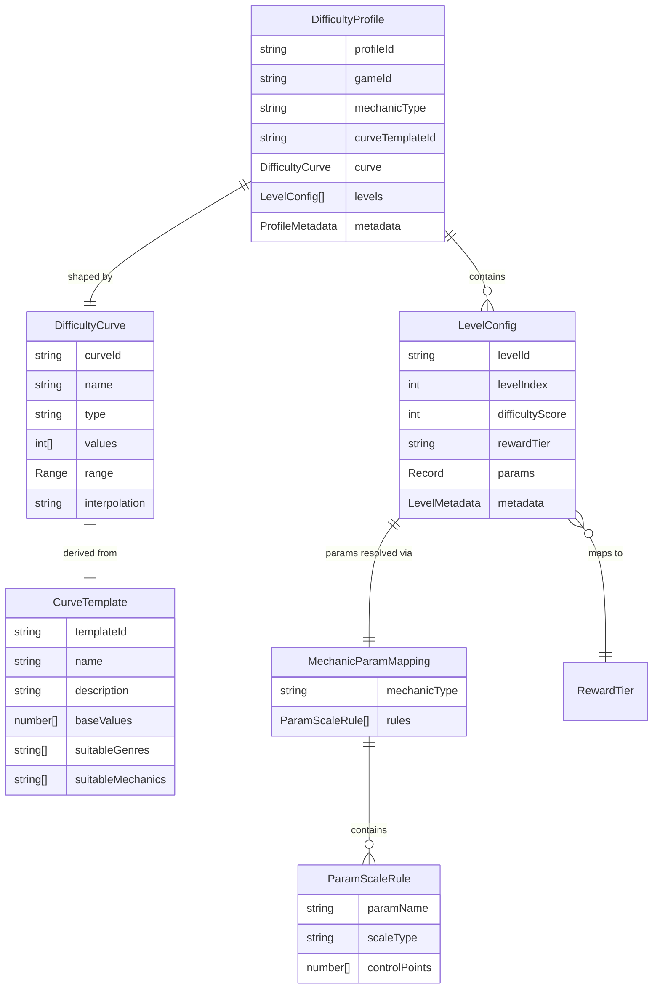
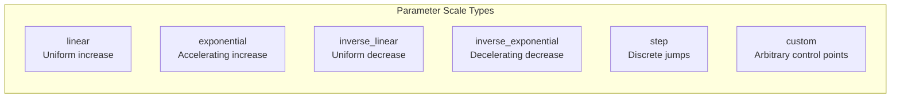

# Difficulty Vertical -- Data Models

Schema definitions for all data artifacts produced and consumed by the Difficulty Agent. All types reference shared contracts from [SharedInterfaces](../00_SharedInterfaces.md).

---

## Schema Relationship Map



---

## DifficultyProfile

The primary output artifact. A complete level sequence with difficulty data, parameters, and metadata. This is the object that downstream agents consume.

```typescript
interface DifficultyProfile {
  /** Unique identifier for this profile. */
  profileId: string;

  /** Game this profile belongs to. */
  gameId: string;

  /** Mechanic type these levels target. */
  mechanicType: string;

  /** Which curve template was used (or "custom"). */
  curveTemplateId: string;

  /** The difficulty curve that shapes this profile. */
  curve: DifficultyCurve;

  /** The complete level sequence, ordered by levelIndex. */
  levels: LevelConfig[];

  /** Parameter mapping used to resolve mechanic params from scores. */
  paramMapping: MechanicParamMapping;

  /** Generation metadata. */
  metadata: ProfileMetadata;
}

interface ProfileMetadata {
  /** When this profile was generated. */
  generatedAt: ISO8601;

  /** Agent version that produced this profile. */
  agentVersion: string;

  /** Predicted aggregate completion rate (0.0-1.0). */
  predictedCompletionRate: number;

  /** Mean difficulty score across all levels. */
  meanDifficulty: number;

  /** Standard deviation of difficulty scores. */
  stdDevDifficulty: number;

  /** Distribution of levels per reward tier. */
  tierDistribution: Record<RewardTier, number>;

  /** Whether this is an AB test variant. */
  isVariant: boolean;

  /** AB test variant identifier (null if not a variant). */
  variantId: string | null;

  /** Validation result at generation time. */
  validationPassed: boolean;
}
```

### Example DifficultyProfile (abbreviated)

```json
{
  "profileId": "dp-runner-001-v1",
  "gameId": "runner-001",
  "mechanicType": "runner",
  "curveTemplateId": "sawtooth",
  "curve": {
    "curveId": "curve-runner-001-sawtooth",
    "name": "Runner Sawtooth Curve",
    "type": "difficulty",
    "values": [1, 2, 3, 2, 3, 4, 3, 4, 5, 4, 5, 6, 5, 6, 7, 5, 6, 7, 8, 6, 7, 8, 9, 7, 8, 9, 10, 8, 9, 10],
    "range": { "min": 1, "max": 10 },
    "interpolation": "step"
  },
  "levels": [
    {
      "levelId": "runner-001-L001",
      "levelIndex": 0,
      "difficultyScore": 1,
      "rewardTier": "easy",
      "params": { "speed": 1.5, "enemyCount": 1, "timeLimit": 90 },
      "metadata": { "predictedCompletionRate": 0.95, "isFTUE": true, "isBoss": false }
    }
  ],
  "paramMapping": {
    "mechanicType": "runner",
    "rules": [
      { "paramName": "speed", "scaleType": "linear", "controlPoints": [1.0, 1.5, 2.0, 2.5, 3.5, 4.5, 5.5, 6.5, 7.5, 8.5, 10.0] },
      { "paramName": "enemyCount", "scaleType": "exponential", "controlPoints": [1, 1, 2, 3, 5, 7, 9, 12, 14, 17, 20] },
      { "paramName": "timeLimit", "scaleType": "inverse_linear", "controlPoints": [120, 90, 85, 75, 65, 55, 50, 45, 35, 25, 15] }
    ]
  },
  "metadata": {
    "generatedAt": "2026-04-09T12:00:00Z",
    "agentVersion": "1.0.0",
    "predictedCompletionRate": 0.76,
    "meanDifficulty": 5.6,
    "stdDevDifficulty": 2.5,
    "tierDistribution": { "easy": 4, "medium": 5, "hard": 7, "very_hard": 8, "extreme": 6 },
    "isVariant": false,
    "variantId": null,
    "validationPassed": true
  }
}
```

---

## LevelConfig

A single level's complete configuration. Consumed by Core Mechanics Agent via `MechanicConfig.levelSequence`.

```typescript
interface LevelConfig {
  /** Unique level identifier. Format: "{gameId}-L{index:03d}". */
  levelId: string;

  /** Zero-based position in the level sequence. */
  levelIndex: number;

  /** Difficulty score (1-10 integer). */
  difficultyScore: DifficultyScore;

  /** Reward tier derived from DIFFICULTY_REWARD_MAP. */
  rewardTier: RewardTier;

  /** Concrete mechanic parameter values for this level. */
  params: Record<string, number>;

  /** Per-level metadata. */
  metadata: LevelMetadata;
}

interface LevelMetadata {
  /** Predicted completion rate for this specific level (0.0-1.0). */
  predictedCompletionRate: number;

  /** Whether this level falls within the FTUE tutorial window. */
  isFTUE: boolean;

  /** Whether this level is designated as a boss level. */
  isBoss: boolean;

  /** Difficulty delta from previous level (0 for first level). */
  deltaFromPrevious: number;

  /** Tags for categorization (e.g., "breather", "spike", "plateau"). */
  tags: LevelTag[];
}

type LevelTag =
  | 'tutorial'       // FTUE level
  | 'breather'       // Intentionally easier than surrounding levels
  | 'spike'          // Notably harder than surrounding levels
  | 'plateau'        // Same difficulty as adjacent levels
  | 'boss'           // Designated boss/challenge level
  | 'milestone'      // Tier boundary level (e.g., transition from medium to hard)
  | 'peak';          // Maximum difficulty in a sawtooth cycle
```

### LevelConfig Field Constraints

| Field | Type | Constraint | Validated By |
|-------|------|-----------|--------------|
| `levelId` | string | Format `{gameId}-L{NNN}`, unique within profile | Schema validation |
| `levelIndex` | int | 0-based, sequential, no gaps | Schema validation |
| `difficultyScore` | int | 1-10 inclusive | `score_range` rule |
| `rewardTier` | RewardTier | Must equal `DIFFICULTY_REWARD_MAP[difficultyScore]` | `economy_sync` rule |
| `params` | Record | All values within mechanic's `ParamDefinition` min/max | `param_bounds` rule |
| `predictedCompletionRate` | float | 0.0-1.0 | Range check |
| `deltaFromPrevious` | int | abs(delta) <= 3 (or <= 6 for boss rush) | `smooth_transition` rule |

---

## DifficultyCurve

The abstract curve that defines the progression shape. References the `Curve` concept from [Concepts: Curve](../../SemanticDictionary/Concepts_Curve.md).

```typescript
interface DifficultyCurve {
  /** Unique curve identifier. */
  curveId: string;

  /** Human-readable name (e.g., "Runner Sawtooth Curve"). */
  name: string;

  /** Curve type -- always "difficulty" for this vertical. */
  type: 'difficulty';

  /** Unit of the x-axis. */
  unit: 'level';

  /** Array of difficulty scores, one per level. Length equals level count. */
  values: DifficultyScore[];

  /** Valid score range. */
  range: {
    min: DifficultyScore;   // Typically 1
    max: DifficultyScore;   // Typically 10
  };

  /** Interpolation method between discrete level points. */
  interpolation: 'linear' | 'smooth' | 'step';

  /** ID of the CurveTemplate this was derived from (or "custom"). */
  sourceTemplateId: string;
}
```

### Interpolation Methods

| Method | Behavior | When to Use |
|--------|----------|-------------|
| `step` | Difficulty is exactly the value at each level; no interpolation | Standard for level-based games (most common) |
| `linear` | Linearly interpolate between defined control points | When levels are generated dynamically and density varies |
| `smooth` | Cubic spline interpolation for organic-feeling curves | Continuous difficulty systems (time-based, not level-based) |

---

## CurveTemplate

A predefined curve shape that can be stretched, compressed, and range-adjusted to produce a `DifficultyCurve`. See [CurveTemplates.md](./CurveTemplates.md) for the full library.

```typescript
interface CurveTemplate {
  /** Unique template identifier (e.g., "sawtooth", "boss_rush"). */
  templateId: string;

  /** Human-readable name. */
  name: string;

  /** Description of the curve pattern. */
  description: string;

  /** Visual category for grouping. */
  category: 'progressive' | 'cyclic' | 'event' | 'specialty';

  /**
   * Base values normalized to 30 levels, range 1-10.
   * The generator stretches/compresses these to the target level count.
   */
  baseValues: DifficultyScore[];

  /** Genres this template works well with. */
  suitableGenres: string[];

  /** Mechanic types this template pairs well with. */
  suitableMechanics: string[];

  /** Player audience this template targets. */
  suitableAudiences: ('casual' | 'midcore' | 'hardcore')[];

  /** Strengths of this curve shape. */
  strengths: string[];

  /** Weaknesses or risks. */
  weaknesses: string[];

  /** Whether this template allows boss-level spikes (delta > 3). */
  allowsBossSpikes: boolean;
}
```

### Template Categories

| Category | Templates | Characteristics |
|----------|-----------|-----------------|
| `progressive` | Linear Ramp, Exponential, Staircase | Monotonically increasing overall trend |
| `cyclic` | Sawtooth, Gentle Wave, Sprint-Rest | Repeating rise-and-fall patterns |
| `event` | Inverted U | Ramps up then ramps down (finite duration) |
| `specialty` | Boss Rush | Unique pattern for specific use cases |

---

## MechanicParamMapping

Defines how abstract `DifficultyScore` values translate into concrete mechanic parameters for a specific mechanic type.

```typescript
interface MechanicParamMapping {
  /** The mechanic type this mapping applies to. */
  mechanicType: string;

  /** One rule per adjustable parameter. */
  rules: ParamScaleRule[];
}

interface ParamScaleRule {
  /** Parameter name (must match a ParamDefinition.name). */
  paramName: string;

  /** How the parameter scales with difficulty. */
  scaleType: 'linear' | 'exponential' | 'inverse_linear' | 'inverse_exponential' | 'step' | 'custom';

  /**
   * Control points: 11 values mapping difficulty 0-10 to param values.
   * Index 0 = difficulty 0 (unused, placeholder), index 1 = difficulty 1, ..., index 10 = difficulty 10.
   */
  controlPoints: number[];

  /** Weight of this parameter in the overall difficulty calculation (0.0-1.0). */
  difficultyWeight: number;
}
```

### Scale Types



| Scale Type | Formula (conceptual) | Example Parameter |
|------------|---------------------|-------------------|
| `linear` | `min + (max - min) * (score / 10)` | Player speed |
| `exponential` | `min + (max - min) * (score / 10)^2` | Enemy count (ramps up faster at high difficulty) |
| `inverse_linear` | `max - (max - min) * (score / 10)` | Time limit (decreases with difficulty) |
| `inverse_exponential` | `max - (max - min) * (score / 10)^2` | Hint frequency (drops off quickly) |
| `step` | Discrete jumps at defined thresholds | Number of mechanics active simultaneously |
| `custom` | Arbitrary values per score | Any parameter needing hand-tuned breakpoints |

### Example Mappings by Mechanic Type

#### Runner Mechanic

| Parameter | Scale Type | Weight | Score 1 | Score 5 | Score 10 |
|-----------|-----------|--------|---------|---------|----------|
| speed | linear | 0.35 | 1.5 | 4.5 | 10.0 |
| enemyCount | exponential | 0.40 | 1 | 7 | 20 |
| timeLimit | inverse_linear | 0.25 | 90 | 55 | 15 |

#### Match-3 Mechanic

| Parameter | Scale Type | Weight | Score 1 | Score 5 | Score 10 |
|-----------|-----------|--------|---------|---------|----------|
| boardSize | step | 0.20 | 5 | 7 | 9 |
| moveLimit | inverse_linear | 0.30 | 30 | 18 | 8 |
| colorCount | linear | 0.25 | 3 | 5 | 7 |
| targetScore | exponential | 0.25 | 500 | 3000 | 15000 |

#### Merge Mechanic

| Parameter | Scale Type | Weight | Score 1 | Score 5 | Score 10 |
|-----------|-----------|--------|---------|---------|----------|
| gridSize | step | 0.15 | 4 | 6 | 8 |
| itemTypes | linear | 0.30 | 3 | 6 | 10 |
| targetLevel | exponential | 0.35 | 3 | 7 | 15 |
| timeLimit | inverse_linear | 0.20 | 300 | 150 | 60 |

---

## Derived Types

Types computed from the core schemas above, used internally by the Difficulty Agent.

```typescript
/** Summary of a level's position in the curve. */
interface LevelCurvePosition {
  levelIndex: number;
  score: DifficultyScore;
  rewardTier: RewardTier;
  isLocalMax: boolean;          // Higher than both neighbors
  isLocalMin: boolean;          // Lower than both neighbors
  cycleIndex: number;           // Which sawtooth/wave cycle this level belongs to
  positionInCycle: 'rising' | 'peak' | 'falling' | 'trough';
}

/** Comparison between two DifficultyProfiles (for AB testing). */
interface ProfileComparison {
  profileA: string;             // profileId
  profileB: string;             // profileId
  meanDifficultyDelta: number;  // A.mean - B.mean
  completionRateDelta: number;  // A.predicted - B.predicted
  tierDistributionDiff: Record<RewardTier, number>;
  curveCorrelation: number;     // Pearson correlation of the two curves (0-1)
}

/** Result of extending a profile with additional levels. */
interface ProfileExtension {
  originalProfileId: string;
  extendedProfileId: string;
  originalLevelCount: number;
  newLevelCount: number;
  appendedLevels: LevelConfig[];
  transitionSmooth: boolean;    // Whether the junction between old and new levels is smooth
}
```

---

## Serialization

All data models serialize to JSON. The canonical format uses camelCase keys and ISO 8601 timestamps.

| Model | Typical Size (JSON) | Storage |
|-------|---------------------|---------|
| `DifficultyProfile` (30 levels) | ~8 KB | Game config database |
| `LevelConfig` (single) | ~250 bytes | Embedded in profile |
| `DifficultyCurve` | ~400 bytes | Embedded in profile |
| `CurveTemplate` | ~600 bytes | Template library (read-only) |
| `MechanicParamMapping` | ~500 bytes | Embedded in profile |

---

## Related Documents

- [SharedInterfaces](../00_SharedInterfaces.md) -- `DifficultyScore`, `RewardTier`, `ParamDefinition`, `MechanicConfig`, `LevelCompletePayload`
- [Spec](./Spec.md) -- Difficulty vertical specification
- [Interfaces](./Interfaces.md) -- APIs that produce and consume these models
- [AgentResponsibilities](./AgentResponsibilities.md) -- Who decides what values go in these models
- [CurveTemplates](./CurveTemplates.md) -- Full template library with base value arrays
- [Concepts: Curve](../../SemanticDictionary/Concepts_Curve.md) -- Curve concept and types
