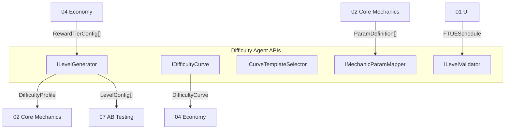
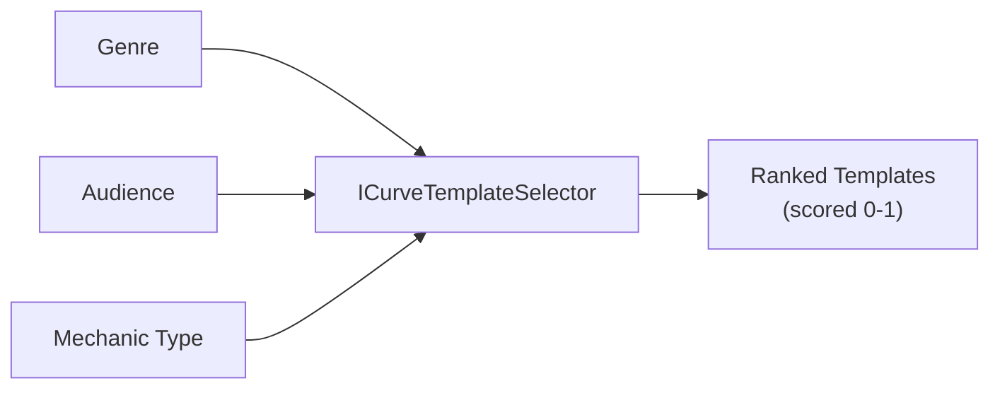
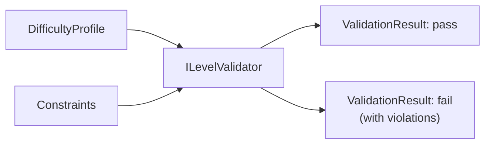

# Difficulty Vertical -- Interfaces

APIs exposed by the Difficulty Agent and consumed by other verticals. All interfaces reference types from [SharedInterfaces](../00_SharedInterfaces.md).

---

## Interface Map



---

## ILevelGenerator

The primary API. Accepts game configuration and produces a complete `DifficultyProfile`.

```typescript
interface ILevelGenerator {
  /**
   * Generate a complete level sequence for a game.
   *
   * @param request - Generation parameters including mechanic config, economy table, and constraints.
   * @returns A DifficultyProfile containing the full level sequence, curve data, and metadata.
   */
  generate(request: LevelGenerationRequest): DifficultyProfile;

  /**
   * Generate multiple curve variants for AB testing.
   * Each variant uses a different curve template but the same mechanic config.
   *
   * @param request - Base generation parameters.
   * @param variantCount - Number of variants to produce (2-5).
   * @returns Array of DifficultyProfiles, one per variant.
   */
  generateVariants(request: LevelGenerationRequest, variantCount: number): DifficultyProfile[];

  /**
   * Extend an existing profile with additional levels.
   * Used when content updates add more levels to a game.
   *
   * @param existing - The current DifficultyProfile.
   * @param additionalLevels - How many levels to append.
   * @returns A new DifficultyProfile with the appended levels. Original is not mutated.
   */
  extend(existing: DifficultyProfile, additionalLevels: number): DifficultyProfile;
}

interface LevelGenerationRequest {
  gameId: string;
  mechanicType: string;                    // "runner", "merge", "pvp", etc.
  adjustableParams: ParamDefinition[];     // From IMechanic.getAdjustableParams()
  economyTable: RewardTierConfig[];        // Reward multipliers per tier
  targetLevelCount: number;                // Desired number of levels (min 10)
  curveTemplateId?: string;                // Optional: force a specific template
  ftueWindow?: { startLevel: number; endLevel: number };  // Tutorial levels
  constraints?: GenerationConstraints;     // Override default constraints
}

interface GenerationConstraints {
  maxAdjacentDelta: number;                // Max difficulty change between adjacent levels (default: 3)
  allowAdjacentMax: boolean;               // Allow two adjacent score-10 levels (default: false)
  targetCompletionRate: { min: number; max: number };  // Default: { min: 0.70, max: 0.85 }
  ftueDifficultycap: DifficultyScore;     // Max difficulty during FTUE (default: 3)
  bossPositions?: number[];               // Level indices designated as boss levels
}
```

### Usage Example

```typescript
// Core Mechanics Agent provides its adjustable parameters
const params: ParamDefinition[] = [
  { name: 'speed', type: 'float', min: 1.0, max: 10.0, default: 3.0, description: 'Player run speed' },
  { name: 'enemyCount', type: 'int', min: 1, max: 20, default: 3, description: 'Enemies per level' },
  { name: 'timeLimit', type: 'int', min: 15, max: 120, default: 60, description: 'Seconds to complete' },
];

const profile = levelGenerator.generate({
  gameId: 'runner-001',
  mechanicType: 'runner',
  adjustableParams: params,
  economyTable: rewardTierConfigs,
  targetLevelCount: 30,
  ftueWindow: { startLevel: 1, endLevel: 5 },
});

// profile.levels[0].difficultyScore === 1
// profile.levels[0].params === { speed: 1.5, enemyCount: 1, timeLimit: 90 }
// profile.levels[0].rewardTier === 'easy'
```

---

## IDifficultyCurve

API for creating, querying, and manipulating difficulty curves.

```typescript
interface IDifficultyCurve {
  /**
   * Create a curve from a template, stretched to the target level count.
   *
   * @param templateId - ID of the curve template (e.g., "sawtooth", "staircase").
   * @param levelCount - Number of levels the curve should span.
   * @param scoreRange - Min and max difficulty scores to map to.
   * @returns A new DifficultyCurve instance.
   */
  createFromTemplate(
    templateId: string,
    levelCount: number,
    scoreRange: { min: DifficultyScore; max: DifficultyScore }
  ): DifficultyCurve;

  /**
   * Create a custom curve from raw values.
   *
   * @param name - Human-readable curve name.
   * @param values - Array of difficulty scores, one per level.
   * @param interpolation - How to interpolate between points.
   * @returns A new DifficultyCurve instance.
   */
  createCustom(
    name: string,
    values: DifficultyScore[],
    interpolation: 'linear' | 'smooth' | 'step'
  ): DifficultyCurve;

  /**
   * Get the difficulty score at a specific level index.
   *
   * @param curve - The curve to query.
   * @param levelIndex - Zero-based level index.
   * @returns The DifficultyScore at that level.
   */
  getScoreAtLevel(curve: DifficultyCurve, levelIndex: number): DifficultyScore;

  /**
   * Get the RewardTier for a level index based on the curve's score.
   *
   * @param curve - The curve to query.
   * @param levelIndex - Zero-based level index.
   * @returns The RewardTier from DIFFICULTY_REWARD_MAP.
   */
  getRewardTierAtLevel(curve: DifficultyCurve, levelIndex: number): RewardTier;

  /**
   * Compute statistics about a curve: mean, median, std dev, tier distribution.
   */
  getStatistics(curve: DifficultyCurve): CurveStatistics;
}

interface CurveStatistics {
  mean: number;
  median: number;
  stdDev: number;
  min: DifficultyScore;
  max: DifficultyScore;
  tierDistribution: Record<RewardTier, number>;  // Count of levels per tier
  maxDelta: number;                               // Largest adjacent level delta
  predictedCompletionRate: number;                // Aggregate predicted rate
}
```

---

## ICurveTemplateSelector

Recommends curve templates based on game parameters.



```typescript
interface ICurveTemplateSelector {
  /**
   * Get all available curve templates.
   */
  listTemplates(): CurveTemplate[];

  /**
   * Get a specific template by ID.
   */
  getTemplate(templateId: string): CurveTemplate | null;

  /**
   * Recommend templates ranked by suitability for the given context.
   *
   * @param context - Game genre, mechanic type, audience, level count.
   * @returns Templates ranked by suitability score (0-1), highest first.
   */
  recommend(context: TemplateSelectionContext): RankedTemplate[];
}

interface TemplateSelectionContext {
  genre: string;                           // "casual", "action", "puzzle", "strategy"
  mechanicType: string;                    // "runner", "merge", "match3", "pvp"
  audience: 'casual' | 'midcore' | 'hardcore';
  targetLevelCount: number;
  hasBossLevels: boolean;
  sessionLengthMinutes: number;            // Average target session length
}

interface RankedTemplate {
  template: CurveTemplate;
  suitabilityScore: number;                // 0.0-1.0
  reasoning: string;                       // Why this template fits or doesn't
}
```

### Template Selection Matrix

| Genre | Audience | Recommended Templates | Reasoning |
|-------|----------|----------------------|-----------|
| Casual puzzle | Casual | Gentle Wave, Staircase | Low frustration, clear milestones |
| Casual puzzle | Midcore | Sawtooth, Staircase | Breather levels, satisfying plateaus |
| Action runner | Casual | Linear Ramp, Gentle Wave | Predictable, low stress |
| Action runner | Midcore | Sawtooth, Sprint-Rest | Tension and relief cycles |
| Action runner | Hardcore | Exponential, Boss Rush | Intense challenge escalation |
| Strategy | Midcore | Staircase, Linear Ramp | Complexity grows in steps |
| PvP arena | Hardcore | Sprint-Rest, Inverted U | Burst intensity, recovery windows |

---

## IMechanicParamMapper

Maps abstract difficulty scores to concrete mechanic parameters.

```typescript
interface IMechanicParamMapper {
  /**
   * Create a mapping configuration for a mechanic type.
   *
   * @param mechanicType - The mechanic identifier.
   * @param params - Available adjustable parameters from the mechanic.
   * @returns A MechanicParamMapping that defines how scores translate to param values.
   */
  createMapping(
    mechanicType: string,
    params: ParamDefinition[]
  ): MechanicParamMapping;

  /**
   * Given a difficulty score and a mapping, compute concrete parameter values.
   *
   * @param score - The DifficultyScore (1-10).
   * @param mapping - The MechanicParamMapping to use.
   * @returns Record of parameter name to concrete value.
   */
  resolveParams(
    score: DifficultyScore,
    mapping: MechanicParamMapping
  ): Record<string, number>;

  /**
   * Validate that resolved params fall within the mechanic's min/max bounds.
   */
  validateParams(
    params: Record<string, number>,
    definitions: ParamDefinition[]
  ): ValidationResult;
}

interface ValidationResult {
  valid: boolean;
  violations: ParamViolation[];
}

interface ParamViolation {
  paramName: string;
  value: number;
  min: number;
  max: number;
  message: string;
}
```

### Parameter Mapping Example

For a "runner" mechanic with three adjustable parameters:

| DifficultyScore | speed | enemyCount | timeLimit |
|-----------------|-------|------------|-----------|
| 1 | 1.5 | 1 | 90 |
| 2 | 2.0 | 2 | 85 |
| 3 | 2.5 | 3 | 75 |
| 4 | 3.5 | 5 | 65 |
| 5 | 4.5 | 7 | 55 |
| 6 | 5.5 | 9 | 50 |
| 7 | 6.5 | 12 | 45 |
| 8 | 7.5 | 14 | 35 |
| 9 | 8.5 | 17 | 25 |
| 10 | 10.0 | 20 | 15 |

Each parameter scales independently. Some scale linearly (speed), others exponentially (enemyCount), others inversely (timeLimit decreases as difficulty rises).

---

## ILevelValidator

Validates a `DifficultyProfile` against all constraints before it is published.



```typescript
interface ILevelValidator {
  /**
   * Run all validation rules against a DifficultyProfile.
   *
   * @param profile - The profile to validate.
   * @param constraints - Constraints to check against (or use defaults).
   * @returns Validation result with pass/fail and detailed violations.
   */
  validate(
    profile: DifficultyProfile,
    constraints?: GenerationConstraints
  ): ProfileValidationResult;

  /**
   * Validate a single level's parameters against mechanic bounds.
   */
  validateLevel(
    level: LevelConfig,
    paramDefinitions: ParamDefinition[]
  ): ValidationResult;

  /**
   * Check economy synchronization -- every level's reward tier matches DIFFICULTY_REWARD_MAP.
   */
  validateEconomySync(profile: DifficultyProfile): ValidationResult;
}

interface ProfileValidationResult {
  valid: boolean;
  violations: ProfileViolation[];
  statistics: CurveStatistics;
  recommendation: string;        // Suggested fix if invalid
}

interface ProfileViolation {
  rule: ValidationRule;
  severity: 'error' | 'warning';
  levelIndex?: number;           // Which level triggered the violation (if applicable)
  message: string;
  suggestedFix?: string;
}

type ValidationRule =
  | 'adjacent_max_difficulty'
  | 'completion_rate_range'
  | 'economy_sync'
  | 'score_range'
  | 'smooth_transition'
  | 'ftue_cap'
  | 'minimum_level_count'
  | 'param_bounds'
  | 'tier_variety';
```

### Validation Rules Summary

| Rule | Severity | Description |
|------|----------|-------------|
| `adjacent_max_difficulty` | error | No two adjacent levels at `DifficultyScore === 10` |
| `completion_rate_range` | error | Aggregate predicted completion rate must be 70-85% |
| `economy_sync` | error | Every level's `rewardTier` must match `DIFFICULTY_REWARD_MAP[difficultyScore]` |
| `score_range` | error | All scores must be integers 1-10 |
| `smooth_transition` | warning | Adjacent level delta should not exceed 3 (6 for boss rush) |
| `ftue_cap` | error | FTUE window levels must have score <= `ftueDifficultyyCap` |
| `minimum_level_count` | error | Profile must contain >= 10 levels |
| `param_bounds` | error | All parameter values within mechanic min/max |
| `tier_variety` | warning | At least 3 distinct tiers should appear in any 10-level window |

---

## Event Integration

The Difficulty Agent emits standard analytics events per [SharedInterfaces](../00_SharedInterfaces.md):

```typescript
// Emitted when a DifficultyProfile is generated
interface DifficultyProfileGenerated {
  gameId: string;
  levelCount: number;
  curveTemplateId: string;
  meanDifficulty: number;
  predictedCompletionRate: number;
  tierDistribution: Record<RewardTier, number>;
}

// Standard events consumed from Core Mechanics
// level_start: { level_id, difficulty: DifficultyScore }
// level_complete: LevelCompletePayload (includes difficulty, rewardTier)
// level_fail: { level_id, cause, attempt }
```

---

## Related Documents

- [SharedInterfaces](../00_SharedInterfaces.md) -- `DifficultyScore`, `RewardTier`, `DIFFICULTY_REWARD_MAP`, `ParamDefinition`, `IMechanic`
- [Spec](./Spec.md) -- Difficulty vertical specification
- [DataModels](./DataModels.md) -- Schema definitions for all data types
- [AgentResponsibilities](./AgentResponsibilities.md) -- Decision boundaries
- [CurveTemplates](./CurveTemplates.md) -- Template library with data arrays
- [Concepts: Curve](../../SemanticDictionary/Concepts_Curve.md) -- Curve concept
