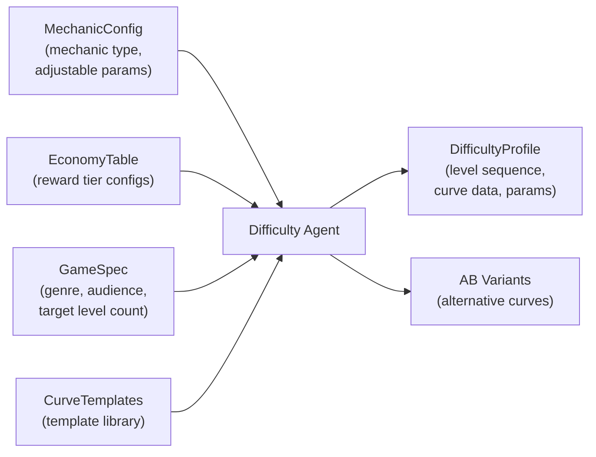
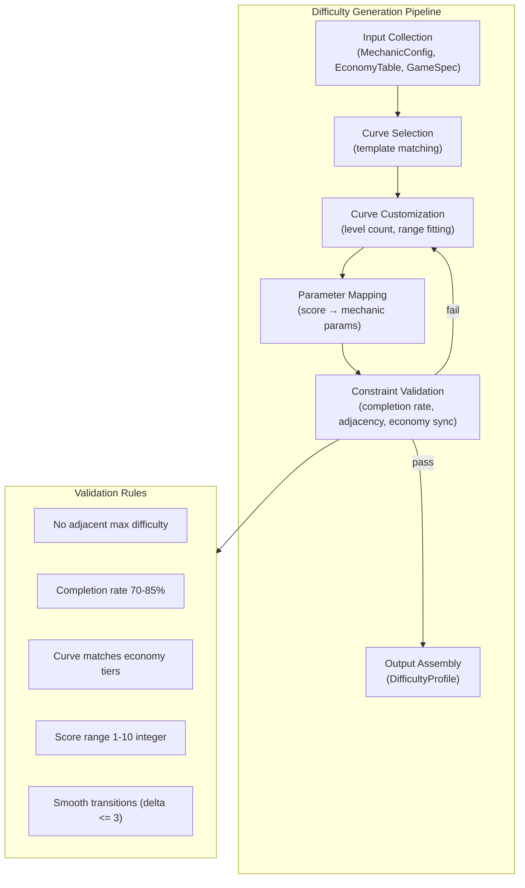
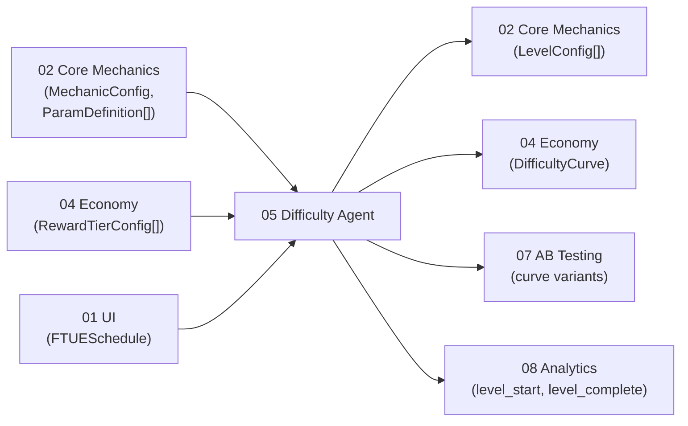
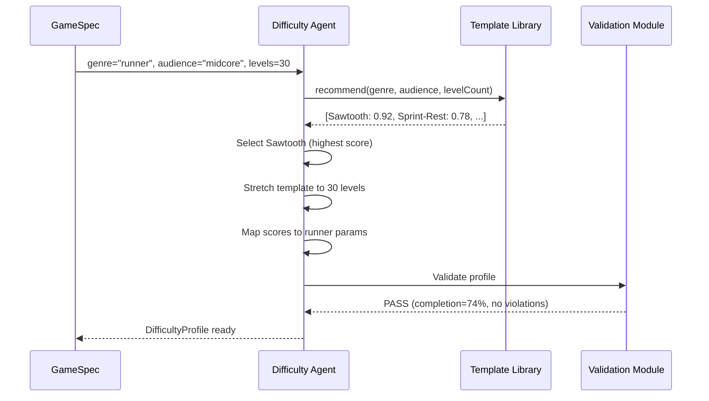

# Difficulty Vertical Specification

The Difficulty vertical owns **AI-generated levels and difficulty curves**. The agent creates level sequences with adjustable parameters per mechanic type, fits them to curve templates, and synchronizes difficulty scores with the Economy vertical's reward tiers via the `DIFFICULTY_REWARD_MAP` in [SharedInterfaces](../00_SharedInterfaces.md).

---

## Purpose

Generate level sequences with smooth, engaging difficulty progression that:

1. Keep players in the **70-85% completion rate** sweet spot (challenged but not frustrated).
2. Map every level to a `DifficultyScore` (1-10) that determines its `RewardTier`.
3. Adapt curve shape to the game's genre and mechanic type.
4. Prevent frustration spikes (no two adjacent levels at max difficulty).

Without an explicit difficulty system, level design is ad hoc -- either hand-tuned (slow, expensive) or random (unplayable). The Difficulty Agent automates the entire pipeline: select a curve shape, map it to mechanic-specific parameters, validate constraints, and output a ready-to-consume `DifficultyProfile`.

---

## Scope

### In Scope

| Area | Description |
|------|-------------|
| **Level Generation** | Produce a complete `LevelConfig[]` sequence with per-level parameters |
| **Difficulty Curves** | Select, customize, and validate curve templates that control progression |
| **Parameter Tuning** | Map abstract difficulty scores (1-10) to concrete mechanic parameters (speed, enemy count, time limit) |
| **Curve Templates** | Library of reusable curve shapes (sawtooth, staircase, boss rush, etc.) |
| **Constraint Validation** | Enforce completion rate targets, adjacent-max rules, economy sync |
| **AB Variant Generation** | Produce curve variants for the same level range for experimentation |

### Out of Scope

| Area | Owner |
|------|-------|
| Core mechanic implementation | Core Mechanics Agent (02) |
| Reward amounts and currency balance | Economy Agent (04) |
| Player-facing UI (level select, stars) | UI Agent (01) |
| Adaptive difficulty at runtime | Core Mechanics Agent (uses `setDifficultyParams`) |
| AB test assignment and analysis | AB Testing Agent (07) |
| Asset generation for levels | Asset Agent (09) |

---

## Inputs and Outputs



### Inputs

| Input | Source | Description |
|-------|--------|-------------|
| `MechanicConfig` | Core Mechanics Agent (02) | Mechanic type and its `ParamDefinition[]` -- the adjustable parameters |
| `EconomyTable` | Economy Agent (04) | `RewardTierConfig[]` with multipliers per tier |
| `GameSpec` | Pipeline entry | Genre, target audience, desired level count, session length targets |
| `CurveTemplates` | Internal library | Predefined curve shapes -- see [CurveTemplates.md](./CurveTemplates.md) |
| `FTUESchedule` | UI Agent (01) | Tutorial window (which levels are onboarding) |

### Outputs

| Output | Consumer | Description |
|--------|----------|-------------|
| `DifficultyProfile` | Core Mechanics, Economy, Analytics | Complete level sequence with parameters and curve data |
| `LevelConfig[]` | Core Mechanics Agent | Per-level difficulty scores and mechanic parameter values |
| `DifficultyCurve` | Economy Agent | Curve data for reward tier synchronization |
| AB Curve Variants | AB Testing Agent (07) | Alternative curve shapes for experimentation |

---

## Architecture



### Pipeline Steps

1. **Input Collection** -- Gather mechanic parameters, economy tiers, game spec, and FTUE schedule.
2. **Curve Selection** -- Match genre and audience to a curve template. See [CurveTemplates.md](./CurveTemplates.md) for selection criteria.
3. **Curve Customization** -- Stretch/compress the template to the target level count, adjust range to match economy tiers.
4. **Parameter Mapping** -- Convert each level's `DifficultyScore` into concrete mechanic parameters using `MechanicParamMapping`.
5. **Constraint Validation** -- Check all hard constraints. If violated, re-enter customization with adjusted parameters.
6. **Output Assembly** -- Package into `DifficultyProfile` and emit to consumers.

---

## Difficulty Score to Reward Tier Mapping

From [SharedInterfaces](../00_SharedInterfaces.md):

```typescript
const DIFFICULTY_REWARD_MAP: Record<DifficultyScore, RewardTier> = {
  1: 'easy', 2: 'easy',
  3: 'medium', 4: 'medium',
  5: 'hard', 6: 'hard',
  7: 'very_hard', 8: 'very_hard',
  9: 'extreme', 10: 'extreme',
};
```

| DifficultyScore | RewardTier | Basic Currency Multiplier | Expected Completion Rate |
|-----------------|------------|--------------------------|--------------------------|
| 1-2 | easy | 1.0x | 90-95% |
| 3-4 | medium | 1.5x | 80-90% |
| 5-6 | hard | 2.0x | 70-80% |
| 7-8 | very_hard | 3.0x | 55-70% |
| 9-10 | extreme | 5.0x | 40-55% |

The weighted average across all levels must produce an aggregate completion rate of **70-85%**.

---

## Constraints

1. **No adjacent max difficulty.** Two consecutive levels cannot both have `DifficultyScore === 10`. Players need relief after peak challenge. At least one level between any two score-10 levels must be score 7 or lower.
2. **Completion rate target 70-85%.** The predicted aggregate completion rate across all levels must fall within this range. Individual levels may fall outside (extreme levels target 40-55%).
3. **Economy synchronization.** Every `DifficultyScore` maps to exactly one `RewardTier` via `DIFFICULTY_REWARD_MAP`. The Difficulty Agent must not invent tiers or bypass the mapping.
4. **Score range 1-10 integer.** No fractional scores. No scores outside the range.
5. **Smooth transitions.** The difficulty delta between adjacent levels must not exceed 3 (e.g., level N=3, level N+1 can be 1-6 but not 7+). Exception: Boss Rush templates may have intentional spikes with delta up to 6 at designated boss positions.
6. **FTUE window.** Levels within the FTUE schedule (typically levels 1-5) must have `DifficultyScore <= 3` to avoid overwhelming new players.
7. **Minimum level count.** A `DifficultyProfile` must contain at least 10 levels.

---

## Success Criteria

| Criterion | Measurement |
|-----------|-------------|
| All levels have valid `DifficultyScore` (1-10 integer) | Schema validation |
| No adjacent max-difficulty violation | Adjacency check on `DifficultyProfile.levels` |
| Aggregate completion rate within 70-85% | Predicted completion rate model |
| Every `DifficultyScore` maps to correct `RewardTier` | Mapping validation against `DIFFICULTY_REWARD_MAP` |
| Curve is smooth (delta <= 3, except boss rush) | Delta analysis on curve values |
| FTUE levels are difficulty <= 3 | FTUE window check |
| Parameter values within mechanic min/max bounds | Range validation against `ParamDefinition` |
| Economy tiers are represented (not all levels the same tier) | Tier distribution check |
| At least 3 distinct difficulty scores used in any 10-level window | Variety check |

---

## Dependencies



| Dependency | Direction | What Flows |
|-----------|-----------|------------|
| Core Mechanics (02) | Upstream to Difficulty | `MechanicConfig`, `ParamDefinition[]` (what can be tuned) |
| Economy (04) | Upstream to Difficulty | `RewardTierConfig[]` (reward multipliers per tier) |
| UI (01) | Upstream to Difficulty | `FTUESchedule` (tutorial level window) |
| Core Mechanics (02) | Difficulty to downstream | `LevelConfig[]` (per-level parameters) |
| Economy (04) | Difficulty to downstream | `DifficultyCurve` (for reward sync) |
| AB Testing (07) | Difficulty to downstream | Alternative curve variants for experiments |
| Analytics (08) | Difficulty to downstream | Level difficulty data for funnel analysis |

---

## Generation Algorithm

The Difficulty Agent follows a deterministic pipeline to produce a `DifficultyProfile`. Each step is idempotent -- the same inputs always produce the same output (excluding AB variants, which use a seeded PRNG).

### Step-by-Step Walkthrough



### Detailed Algorithm

```typescript
function generateProfile(request: LevelGenerationRequest): DifficultyProfile {
  // Step 1: Select curve template
  const ranked = curveTemplateSelector.recommend({
    genre: request.gameSpec.genre,
    mechanicType: request.mechanicType,
    audience: request.gameSpec.audience,
    targetLevelCount: request.targetLevelCount,
    hasBossLevels: (request.constraints?.bossPositions?.length ?? 0) > 0,
    sessionLengthMinutes: request.gameSpec.sessionLength,
  });
  const template = ranked[0].template;

  // Step 2: Create curve from template
  const curve = difficultyCurve.createFromTemplate(
    template.templateId,
    request.targetLevelCount,
    { min: 1, max: 10 }
  );

  // Step 3: Create parameter mapping
  const mapping = paramMapper.createMapping(
    request.mechanicType,
    request.adjustableParams
  );

  // Step 4: Build level configs
  const levels: LevelConfig[] = curve.values.map((score, index) => ({
    levelId: `${request.gameId}-L${String(index + 1).padStart(3, '0')}`,
    levelIndex: index,
    difficultyScore: score,
    rewardTier: DIFFICULTY_REWARD_MAP[score],
    params: paramMapper.resolveParams(score, mapping),
    metadata: computeLevelMetadata(score, index, curve, request),
  }));

  // Step 5: Assemble profile
  const profile: DifficultyProfile = {
    profileId: `dp-${request.gameId}-v1`,
    gameId: request.gameId,
    mechanicType: request.mechanicType,
    curveTemplateId: template.templateId,
    curve,
    levels,
    paramMapping: mapping,
    metadata: computeProfileMetadata(levels, curve),
  };

  // Step 6: Validate
  const result = levelValidator.validate(profile, request.constraints);
  if (!result.valid) {
    return retryWithAdjustments(profile, result, request);
  }

  return profile;
}
```

### Example: Runner Game, 30 Levels, Sawtooth Curve

**Input:**
- Genre: action-runner
- Mechanic: runner (params: speed, enemyCount, timeLimit)
- Audience: midcore
- Target levels: 30

**Selected template:** Sawtooth (suitability score: 0.92)

**Generated curve (first 10 levels):**

| Level | Score | Tier | speed | enemyCount | timeLimit | Completion |
|-------|-------|------|-------|------------|-----------|------------|
| 1 | 1 | easy | 1.5 | 1 | 90 | 95% |
| 2 | 2 | easy | 2.0 | 2 | 85 | 92% |
| 3 | 3 | medium | 2.5 | 3 | 75 | 87% |
| 4 | 2 | easy | 2.0 | 2 | 85 | 92% |
| 5 | 3 | medium | 2.5 | 3 | 75 | 87% |
| 6 | 4 | medium | 3.5 | 5 | 65 | 83% |
| 7 | 3 | medium | 2.5 | 3 | 75 | 87% |
| 8 | 4 | medium | 3.5 | 5 | 65 | 83% |
| 9 | 5 | hard | 4.5 | 7 | 55 | 78% |
| 10 | 4 | medium | 3.5 | 5 | 65 | 83% |

**Validation result:** PASS

- Aggregate completion rate: 74% (within 70-85%)
- Max adjacent delta: 2 (within limit of 3)
- No adjacent max-difficulty violations
- FTUE levels (1-5) all score <= 3
- All params within mechanic bounds

---

## Completion Rate Model

The predicted completion rate per difficulty score is calibrated from industry benchmarks for mobile free-to-play games:

```typescript
const COMPLETION_RATE_MODEL: Record<DifficultyScore, number> = {
  1: 0.95,
  2: 0.92,
  3: 0.87,
  4: 0.83,
  5: 0.78,
  6: 0.72,
  7: 0.64,
  8: 0.57,
  9: 0.48,
  10: 0.40,
};

function predictAggregateCompletion(levels: LevelConfig[]): number {
  const sum = levels.reduce(
    (acc, level) => acc + COMPLETION_RATE_MODEL[level.difficultyScore],
    0
  );
  return sum / levels.length;
}
```

### Completion Rate by Curve Template

| Template | Predicted Aggregate Rate | Rating |
|----------|------------------------|--------|
| Exponential | 79% | Highest (easy-heavy) |
| Gentle Wave | 78% | High (low ceiling) |
| Sawtooth | 74% | Balanced |
| Linear Ramp | 73% | Balanced |
| Boss Rush | 73% | Balanced (spikes offset by easy base) |
| Inverted U | 73% | Balanced |
| Sprint-Rest | 73% | Balanced (bimodal) |
| Staircase | 72% | Lowest (no relief levels) |

---

## Performance Budgets

| Metric | Budget | Rationale |
|--------|--------|-----------|
| Profile generation time | < 500ms | Must not block game startup |
| Per-level param resolution | < 1ms | Called per level load |
| Validation pass | < 100ms | Run after every generation |
| Template library load | < 50ms | Loaded once at init |
| AB variant generation (5 variants) | < 2s | Background task, not blocking |
| Profile JSON size (30 levels) | < 10 KB | Stored in game config DB |
| Profile JSON size (100 levels) | < 30 KB | Larger games |

---

## Glossary

| Term | Definition |
|------|-----------|
| **DifficultyScore** | Integer 1-10 representing a level's challenge rating |
| **RewardTier** | Economy category (easy/medium/hard/very_hard/extreme) linked to a DifficultyScore range |
| **DifficultyCurve** | Array of DifficultyScores defining the progression shape across all levels |
| **CurveTemplate** | Predefined 30-level curve pattern that can be stretched and range-adjusted |
| **MechanicParamMapping** | Rules for converting a DifficultyScore into concrete mechanic parameter values |
| **DifficultyProfile** | The complete output artifact: levels, curve, params, and metadata |
| **Breather level** | A level intentionally easier than its neighbors, providing relief after challenge |
| **Boss spike** | A dramatic difficulty increase at a designated boss position |
| **Completion rate** | Percentage of players who finish a level on their first attempt |
| **Adjacent delta** | Absolute difference in DifficultyScore between two consecutive levels |

---

## Related Documents

- [SharedInterfaces](../00_SharedInterfaces.md) -- `DIFFICULTY_REWARD_MAP`, `DifficultyScore`, `RewardTier`, `ParamDefinition`
- [Interfaces](./Interfaces.md) -- Level generator and curve APIs
- [DataModels](./DataModels.md) -- `DifficultyProfile`, `LevelConfig`, `DifficultyCurve` schemas
- [AgentResponsibilities](./AgentResponsibilities.md) -- Autonomous vs coordinated decisions
- [CurveTemplates](./CurveTemplates.md) -- Standard curve shapes with data
- [Concepts: Curve](../../SemanticDictionary/Concepts_Curve.md) -- Curve concept deep dive
- [Economy Spec](../04_Economy/Spec.md) -- Economy curve and reward tiers
