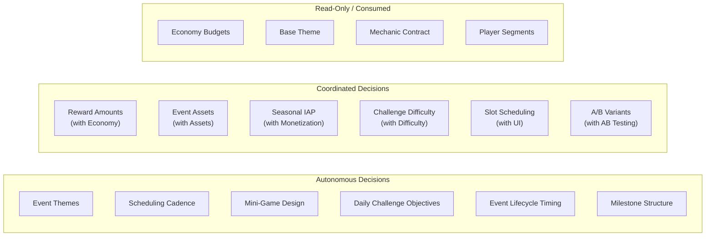
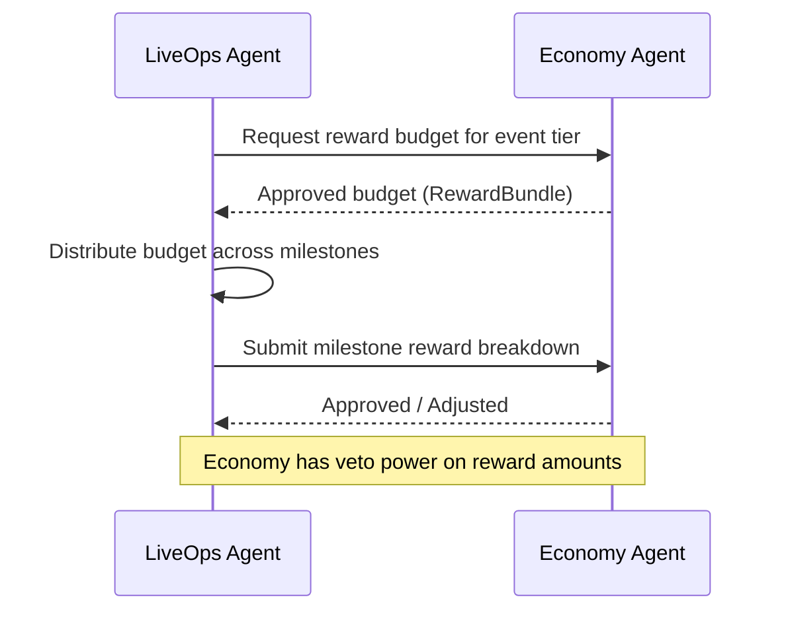
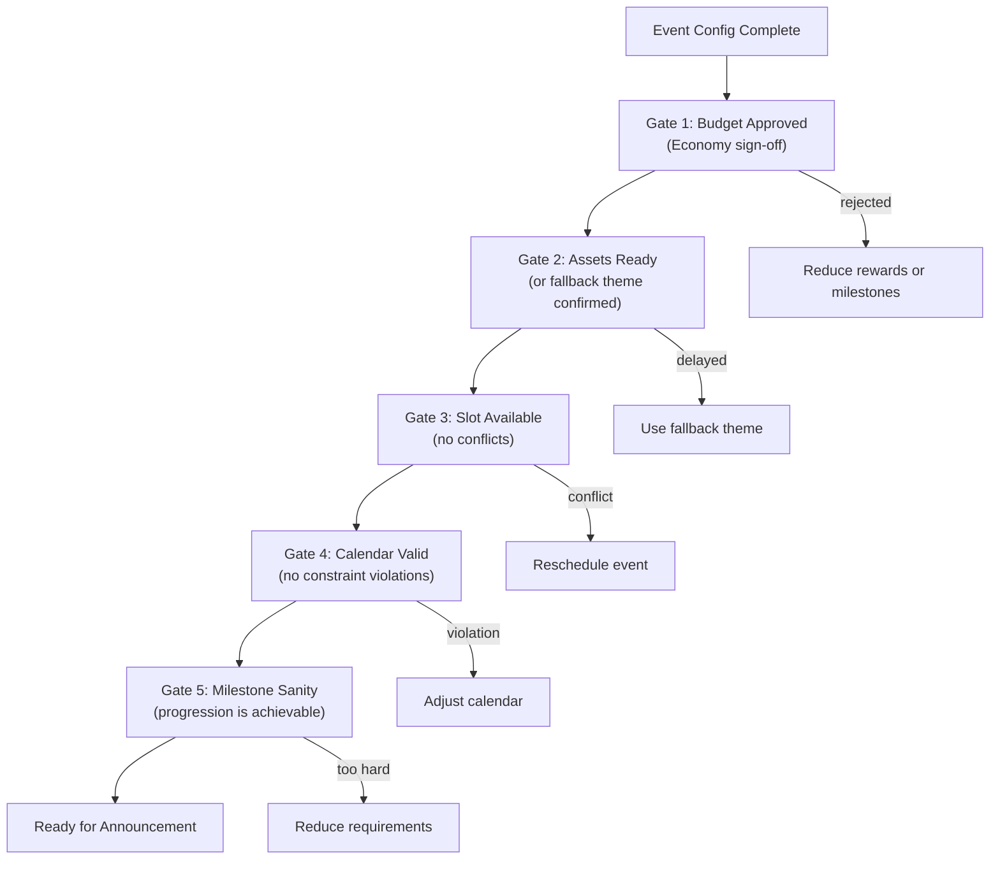
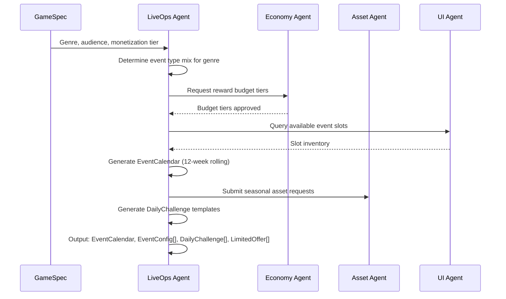

# LiveOps Agent Responsibilities

Defines the autonomy boundaries, coordination requirements, quality criteria, and failure modes for the LiveOps Agent. The agent generates time-limited content that fills predefined [event slots](./Spec.md) in the UI shell.

---

## Decision Authority Matrix

---

## Autonomous Decisions

The LiveOps Agent makes these decisions independently, without requiring approval from other agents.

### Event Themes and Narrative

| Decision | Scope | Constraints |
|----------|-------|-------------|
| Seasonal event theme selection | Choose which holidays/seasons to celebrate | Must align with target audience geography |
| Event naming and descriptions | All player-facing event copy | Must be family-friendly, culturally appropriate |
| Theme color palettes | Seasonal palette overrides | Must maintain text readability (WCAG AA contrast) |
| Particle effects and ambiance | Snow, confetti, leaves, etc. | Performance budget: max 200 particles on screen |
| Event narrative arc | Story framing for seasonal events | Coherent within a season; no cross-season continuity required |

### Scheduling Cadence

| Decision | Scope | Constraints |
|----------|-------|-------------|
| Event placement on calendar | Which days events start and end | Max 2 concurrent (excl. dailies); 1-day gap between majors |
| Event type rotation | Order of challenge, mini-game, seasonal | No same type back-to-back |
| Calendar density | How many events per week | Coverage target > 80% of days |
| Seasonal anchoring | When seasonal events begin relative to real-world dates | Start 1-3 days before the real holiday period |
| Gap filling | What to schedule in low-activity periods | Prefer challenges or mini-games as fillers |

### Mini-Game Design

| Decision | Scope | Constraints |
|----------|-------|-------------|
| Mini-game mechanic type | Spinner, match-3, runner, trivia, etc. | Must be implementable via [`IMechanic`](../00_SharedInterfaces.md) contract |
| Level count and structure | Number of levels, progression curve | 5-15 levels per mini-game |
| Session length | How long one play session lasts | 30 seconds to 4 minutes |
| Energy/ticket system | Sessions per day, refill mechanics | Max 5 free sessions/day; additional via premium currency |
| Scoring rules | How points are calculated | Must map to event milestone progress |

### Daily Challenge Objectives

| Decision | Scope | Constraints |
|----------|-------|-------------|
| Objective selection | Which objectives appear each day | 3-5 per day; no duplicates; 3-day repetition guard |
| Difficulty distribution | Easy/medium/hard mix | At least one easy (1-3), at most one hard (7+) |
| Objective text | Player-facing descriptions | Clear, measurable, achievable in one session |
| Completion bonus structure | Bonus for finishing all objectives | Equal to sum of 2 average objective rewards |
| Objective type variety | Which `ObjectiveType` values to use | Rotate across all available types weekly |

### Event Lifecycle Timing

| Decision | Scope | Constraints |
|----------|-------|-------------|
| Announcement lead time | When "Coming Soon" banner appears | 24 hours before start (standard) |
| Winding-down trigger | When urgency messaging begins | 24 hours before end (standard) |
| Grace period duration | How long unclaimed rewards remain | 24 hours after end (standard) |
| Force-end decisions | When to emergency-stop an event | Only if participation < 5% after 48h or critical bugs |

### Milestone Structure

| Decision | Scope | Constraints |
|----------|-------|-------------|
| Milestone count | How many milestones per event | 3-10 per event |
| Progress curve | How requirement values escalate | Roughly geometric: each milestone ~1.5x the previous |
| Milestone tiering | Which milestones are minor/major/grand | Last milestone always grand; first always minor |
| Progress unit | What players do to advance | Must map to existing analytics events |

---

## Coordinated Decisions

These decisions require input from or approval by other agents. The LiveOps Agent proposes; the partner agent approves or adjusts.

### Reward Amounts (with Economy Agent)

| Aspect | LiveOps Proposes | Economy Approves |
|--------|-----------------|-----------------|
| Total event reward budget | Based on event type and duration | Validates against faucet rate limits |
| Per-milestone reward split | Distribution across milestones | Checks no single milestone is inflationary |
| Daily challenge rewards | Per-objective and completion bonus | Validates daily faucet doesn't exceed cap |
| Mini-game session rewards | Per-session reward amount | Validates against hourly earn rate limits |
| Bonus/premium rewards | Premium currency in milestone rewards | Controls premium currency supply |

**Escalation:** If Economy rejects a budget, LiveOps must either reduce rewards or reduce milestone count. LiveOps cannot override Economy on reward amounts.

### Event Assets (with Asset Agent)

| Aspect | LiveOps Defines | Assets Delivers |
|--------|----------------|----------------|
| Seasonal theme brief | Color palette, mood, reference images | Sprites, backgrounds, particle textures |
| Event banner art | Layout requirements, text overlay areas | Banner image assets |
| Mini-game visuals | Mechanic type, theme, visual style | Game-specific sprites and animations |
| Icon badges | Seasonal badge concept | Badge asset files |

**Lead time:** LiveOps must submit asset requests >= 2 weeks before event start. Asset Agent prioritizes by event start date.

**Fallback:** If assets are delayed, LiveOps uses base game theme with color palette overrides only. Events must never be delayed for missing assets.

### Seasonal IAP (with Monetization Agent)

| Aspect | LiveOps Controls | Monetization Controls |
|--------|-----------------|---------------------|
| Offer timing | When offers appear, duration | -- |
| Offer trigger conditions | What player actions trigger the offer | -- |
| Bundle contents suggestion | Proposed items/currencies in the bundle | Final bundle composition |
| -- | -- | Price points |
| -- | -- | Discount percentages |
| -- | -- | Revenue targets |
| Offer badge/visual treatment | Badge type (flash_sale, limited, etc.) | -- |

**Coordination protocol:** LiveOps sends `LimitedOffer` configs to Monetization with `actualPrice` set to null. Monetization fills in pricing and returns the completed offer.

### Challenge Difficulty (with Difficulty Agent)

| Aspect | LiveOps Proposes | Difficulty Approves |
|--------|-----------------|-------------------|
| Difficulty parameter overrides | Modified params for challenge levels | Validates params are within safe ranges |
| Challenge target scores | Score thresholds for milestones | Confirms achievability at given difficulty |
| Time limits | Per-level time constraints | Validates against average completion times |

### Slot Scheduling (with UI Agent)

| Aspect | LiveOps Controls | UI Controls |
|--------|-----------------|-------------|
| Which events fill which slots | Event-to-slot mapping | Slot layout, positioning, visual treatment |
| Slot reservation timing | When slots are claimed/released | -- |
| -- | -- | Slot animation transitions |
| -- | -- | Slot fallback states (empty slot display) |

### A/B Test Variants (with AB Testing Agent)

| Aspect | LiveOps Proposes | AB Testing Controls |
|--------|-----------------|-------------------|
| What to test | Event duration, milestone count, theme | -- |
| Variant configs | 2-4 variant EventConfigs | Sample size, statistical rigor |
| -- | -- | Variant assignment |
| -- | -- | Winner selection criteria |
| Success metrics | Participation rate, completion rate | Metric collection and significance |

---

## Quality Criteria

### Primary Metrics

| Metric | Target | Measurement Frequency | Alert Threshold |
|--------|--------|----------------------|-----------------|
| Event participation rate | > 40% of DAU | Per event | < 25% triggers review |
| Event completion rate | > 20% of participants | Per event | < 10% triggers difficulty review |
| Daily challenge engagement | > 30% of DAU | Daily | < 15% triggers objective redesign |
| Content freshness | < 7 days since last new event | Weekly | > 10 days triggers calendar review |
| Calendar coverage | > 80% of days with events | Monthly | < 60% triggers scheduling review |

### Secondary Metrics

| Metric | Target | Purpose |
|--------|--------|---------|
| D7 retention during events | > 15% lift vs. baseline | Measures retention impact |
| Event revenue per participant | Positive ROI vs. reward cost | Measures monetization health |
| Mini-game session count | > 2 sessions/day for participants | Measures mini-game stickiness |
| Offer conversion rate | > 5% for limited offers | Measures offer appeal |
| Time to first event entry | < 2 sessions for new events | Measures discoverability |

### Quality Gates

Every event must pass these gates before moving from Scheduled to Announced:

---

## Failure Modes

### Event Fatigue

**Symptom:** Participation rate declining across consecutive events despite fresh content.

**Root causes:**
- Calendar too dense (events overlap constantly, no breathing room)
- Reward amounts too low relative to effort
- Event types not rotating (three challenges in a row)
- Milestone requirements too high (players can't complete)

**Detection:**
- Participation rate trending down > 10% week-over-week for 3+ weeks
- Event completion rate < 10%
- Session count declining during active events

**Mitigation:**
1. Increase gap between major events to 2-3 days
2. Reduce milestone requirements by 20%
3. Enforce strict type rotation
4. Add "light" event days with daily challenges only

### Reward Inflation

**Symptom:** Economy Agent reports faucet rates exceeding sustainable levels during events.

**Root causes:**
- Reward budgets set too high relative to event duration
- Multiple concurrent events with overlapping reward tracks
- Mini-game session rewards not accounting for play frequency
- Daily challenge rewards stacking with event rewards

**Detection:**
- Economy Agent flags budget overshoot
- Basic currency earn rate > 2x baseline during events
- Premium currency distribution exceeding planned supply

**Mitigation:**
1. Reduce per-event reward budgets by the overshoot percentage
2. Cap total daily earnings across all sources (event + daily + mini-game)
3. Shift rewards from currency to cosmetic/non-inflationary items
4. Extend event duration to spread the same budget over more days

### Asset Delivery Delays

**Symptom:** Seasonal events launch without themed assets, falling back to base theme.

**Root causes:**
- Asset requests submitted too late (< 2 weeks before event)
- Asset Agent overloaded with requests from multiple verticals
- Theme brief too vague, requiring revision cycles
- Asset format or resolution not matching requirements

**Detection:**
- Asset request status still "pending" at T-48h before event start
- Theme validation fails (missing required overrides)

**Mitigation:**
1. Always submit asset requests >= 4 weeks before seasonal events
2. Maintain a library of reusable seasonal assets from prior years
3. Design events to degrade gracefully (color palette + base assets)
4. Prioritize banner art and reward icons; background art is optional

### Mini-Game Technical Failures

**Symptom:** Mini-game mechanic fails to initialize or crashes during play.

**Root causes:**
- MiniGameConfig parameters outside mechanic's valid range
- Mechanic type not supported by Core Mechanics Agent
- Slot handoff sequence fails (core mechanic doesn't pause cleanly)

**Detection:**
- `IMechanic.init()` throws error
- Player session count for mini-game is 0 despite event being active
- Error rate in mini-game analytics events > 5%

**Mitigation:**
1. Validate all MiniGameConfig params against `getAdjustableParams()` before scheduling
2. Maintain a whitelist of tested mechanic types for mini-games
3. Implement a dry-run initialization during the Scheduled state
4. If mini-game fails at activation, fall back to challenge event type

### Low Daily Challenge Engagement

**Symptom:** < 15% of DAU engaging with daily challenges.

**Root causes:**
- Objectives too difficult or unclear
- Rewards not compelling enough
- Objectives require gameplay patterns players don't enjoy
- Challenge UI not prominent enough on main menu

**Detection:**
- Daily challenge objective completion rates < 20%
- Players view but don't attempt objectives
- Session count on challenge days matches non-challenge baseline

**Mitigation:**
1. Shift objective mix toward easier, collection-based tasks
2. Increase completion bonus to incentivize full-set completion
3. Add "streak" bonuses for consecutive days of full completion
4. Coordinate with UI Agent to increase daily challenge slot prominence

---

## Cross-Agent Communication Summary

| Partner Agent | LiveOps Sends | LiveOps Receives | Frequency |
|--------------|---------------|-----------------|-----------|
| Economy (04) | Reward budget requests, milestone breakdowns | Approved budgets, faucet rate limits | Per event creation |
| Core Mechanics (02) | MiniGameConfig, difficulty overrides | Mechanic state, adjustable params | Per mini-game/challenge |
| Asset (09) | Theme briefs, asset requests | Seasonal assets, themed sprites | Per seasonal event |
| UI (01) | EventConfig, slot reservations | Base theme, slot availability | Per event lifecycle transition |
| Monetization (03) | LimitedOffer (sans pricing), timing | Priced offers, revenue data | Per offer creation |
| Difficulty (05) | Challenge difficulty proposals | Validated params, achievability data | Per challenge event |
| AB Testing (07) | Variant configs, success metrics | Variant assignments, test results | Per experiment |
| Analytics (08) | Event lifecycle events | Participation data, retention cohorts | Continuous |

---

## Agent Initialization Sequence

When the LiveOps Agent starts processing for a new game:

---

## Related Documents

- [LiveOps Spec](./Spec.md) -- Full specification with constraints and success criteria
- [LiveOps Interfaces](./Interfaces.md) -- API contracts
- [LiveOps Data Models](./DataModels.md) -- Schema definitions
- [Shared Interfaces](../00_SharedInterfaces.md) -- Cross-vertical contracts
- [Concepts: LiveOps](../../SemanticDictionary/Concepts_LiveOps.md) -- Deep concept definition
- [Economy Spec](../04_Economy/Spec.md) -- Reward budget process
- [Core Mechanics Spec](../02_CoreMechanics/Spec.md) -- Mechanic slot and `IMechanic`
- [UI Spec](../01_UI/Spec.md) -- Shell slot definitions
- [Monetization Spec](../03_Monetization/Spec.md) -- IAP pricing ownership
