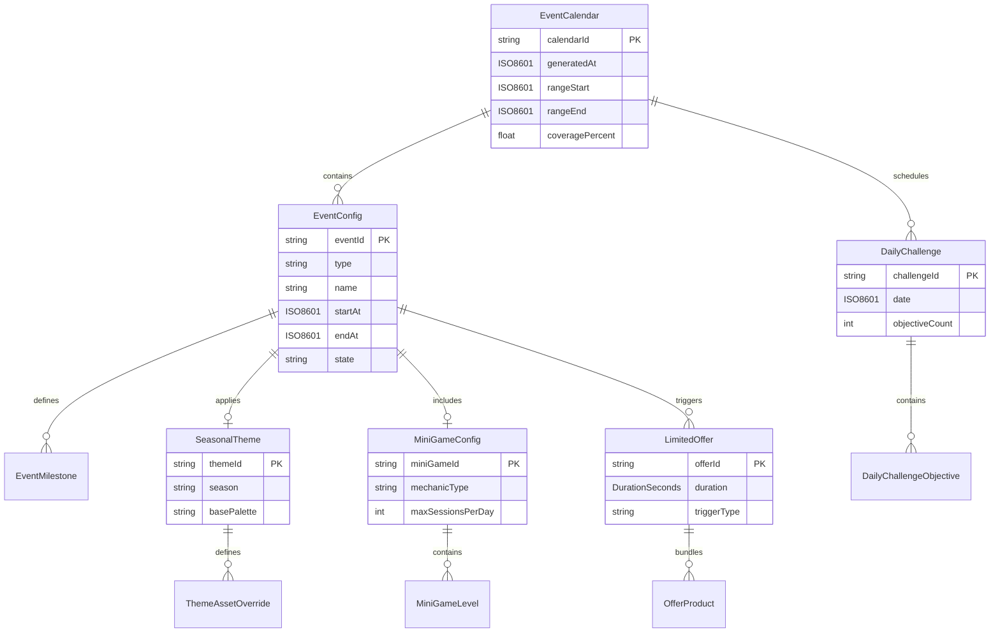

# LiveOps Data Models

Schema definitions for all artifacts produced by the LiveOps Agent. All types reference the core types defined in [SharedInterfaces](../00_SharedInterfaces.md): `RewardBundle`, `CurrencyAmount`, `ISO8601`, `DurationSeconds`, `DifficultyScore`, `Theme`, `AssetRef`.

---

## Schema Relationships



---

## 1. EventCalendar

The primary output artifact. A rolling schedule of all events with their configurations.

```typescript
interface EventCalendar {
  /** Unique calendar version identifier */
  calendarId: string;

  /** When this calendar was generated */
  generatedAt: ISO8601;

  /** Calendar window start (inclusive) */
  rangeStart: ISO8601;

  /** Calendar window end (inclusive) */
  rangeEnd: ISO8601;

  /** All non-daily events in the window */
  events: EventConfig[];

  /** Daily challenges for each day in the window */
  dailyChallenges: DailyChallenge[];

  /** Limited-time offers scheduled in the window */
  limitedOffers: LimitedOffer[];

  /** Percentage of days with at least one active non-daily event */
  coveragePercent: number;

  /** Total reward budget allocated across all events */
  totalRewardBudget: RewardBundle;

  /** Validation status of the calendar */
  validation: CalendarValidationSummary;
}

interface CalendarValidationSummary {
  valid: boolean;
  concurrencyViolations: number;
  gapViolations: number;
  budgetViolations: number;
  rotationViolations: number;
  warnings: string[];
}
```

### Example EventCalendar

```json
{
  "calendarId": "cal_2026_q4_v3",
  "generatedAt": "2026-09-15T10:00:00Z",
  "rangeStart": "2026-10-01T00:00:00Z",
  "rangeEnd": "2026-12-31T23:59:59Z",
  "events": [
    {
      "eventId": "evt_halloween_2026",
      "type": "seasonal",
      "name": "Halloween Havoc",
      "startAt": "2026-10-15T00:00:00Z",
      "endAt": "2026-11-01T00:00:00Z"
    }
  ],
  "coveragePercent": 0.87,
  "validation": {
    "valid": true,
    "concurrencyViolations": 0,
    "gapViolations": 0,
    "budgetViolations": 0,
    "rotationViolations": 0,
    "warnings": ["Low coverage Dec 25-31 (holiday wind-down)"]
  }
}
```

---

## 2. EventConfig

Per-event configuration. Extends the [`EventConfig`](../00_SharedInterfaces.md) from SharedInterfaces with additional LiveOps-specific fields.

```typescript
interface EventConfig {
  /** Unique event identifier */
  eventId: string;

  /** Event classification */
  type: 'seasonal' | 'challenge' | 'limited_offer' | 'mini_game' | 'daily_challenge';

  /** Player-facing event name */
  name: string;

  /** Player-facing event description */
  description: string;

  /** Event start time (UTC) */
  startAt: ISO8601;

  /** Event end time (UTC) */
  endAt: ISO8601;

  /** Computed duration in seconds */
  durationSeconds: DurationSeconds;

  /** Current lifecycle state */
  state: EventLifecycleState;

  /** Theme overlay for this event (null = base game theme) */
  theme: Theme;

  /** Seasonal theme metadata (only for seasonal events) */
  seasonalTheme: SeasonalTheme | null;

  /** Ordered milestone progression */
  milestones: EventMilestone[];

  /** Total reward budget for this event (Economy-approved) */
  rewardBudget: RewardBundle;

  /** Rewards distributed so far (runtime tracking) */
  rewardsDistributed: RewardBundle;

  /** Mini-game config (only for mini_game type) */
  miniGameConfig: MiniGameConfig | null;

  /** Difficulty overrides (only for challenge type) */
  difficultyOverrides: Record<string, number> | null;

  /** Which shell slots this event occupies */
  slotAssignments: EventSlotAssignment[];

  /** Tags for filtering and analytics */
  tags: string[];

  /** Priority for slot conflict resolution (higher = wins) */
  priority: number;

  /** AB test variant ID if this config is part of an experiment */
  experimentVariantId: string | null;
}

type EventLifecycleState =
  | 'scheduled'
  | 'announced'
  | 'active'
  | 'winding_down'
  | 'ended'
  | 'archived';

interface EventMilestone {
  /** Unique milestone identifier within the event */
  id: string;

  /** Player-facing milestone name */
  name: string;

  /** Progress points required to reach this milestone */
  requirement: number;

  /** Reward granted when milestone is reached */
  reward: RewardBundle;

  /** Milestone tier for UI treatment */
  tier: 'minor' | 'major' | 'grand';

  /** Optional icon override for this milestone */
  icon: AssetRef | null;
}

interface EventSlotAssignment {
  slotId: string;
  required: boolean;
  reservedFrom: ISO8601;
  reservedUntil: ISO8601;
}
```

### EventConfig Field Constraints

| Field | Constraint | Enforced By |
|-------|-----------|-------------|
| `type` | Must be one of 5 enum values | Schema validation |
| `startAt` / `endAt` | endAt > startAt; duration within type limits | Calendar API |
| `milestones` | 3-10 milestones; requirements strictly increasing | Event Creation API |
| `rewardBudget` | Must match Economy-approved budget for event tier | Reward Distribution API |
| `slotAssignments` | Must match registered slot mapping for event type | Slot Registry API |
| `priority` | 1-100; seasonal = 90+, challenge = 50-89, mini_game = 30-49 | Calendar validation |
| `difficultyOverrides` | Only non-null when type = 'challenge' | Event Creation API |
| `miniGameConfig` | Only non-null when type = 'mini_game' | Event Creation API |

### Duration Limits by Type

| Event Type | Minimum | Maximum |
|-----------|---------|---------|
| `seasonal` | 7 days | 28 days |
| `challenge` | 3 days | 7 days |
| `mini_game` | 1 day | 7 days |
| `limited_offer` | 24 hours | 72 hours |
| `daily_challenge` | 24 hours | 24 hours |

---

## 3. SeasonalTheme

Defines the visual overlay applied during a seasonal event. Extends the base [`Theme`](../00_SharedInterfaces.md) with seasonal-specific assets.

```typescript
interface SeasonalTheme {
  /** Unique theme identifier */
  themeId: string;

  /** Season/holiday this theme represents */
  season: string;

  /** Human-readable theme name */
  name: string;

  /** Date range this theme is active */
  activeFrom: ISO8601;
  activeUntil: ISO8601;

  /** Color modifications applied on top of base theme */
  paletteOverrides: Partial<Theme['palette']>;

  /** Asset overrides for seasonal visuals */
  assetOverrides: ThemeAssetOverride[];

  /** Background replacement for main menu */
  backgroundAsset: AssetRef | null;

  /** Particle effect overlay (snow, leaves, confetti) */
  particleEffect: ParticleConfig | null;

  /** Music track override */
  musicOverride: AssetRef | null;

  /** Loading screen replacement */
  loadingScreenAsset: AssetRef | null;

  /** Icon badge overlay (e.g., Santa hat on app icon) */
  iconBadge: AssetRef | null;
}

interface ThemeAssetOverride {
  /** Which base asset to replace */
  originalAssetId: string;

  /** The seasonal replacement asset */
  replacementAsset: AssetRef;

  /** Where this override applies */
  scope: 'global' | 'event_screen' | 'main_menu' | 'shop';
}

interface ParticleConfig {
  /** Particle type */
  type: 'snow' | 'leaves' | 'confetti' | 'hearts' | 'fireworks' | 'custom';

  /** Custom particle sprite (only for 'custom' type) */
  customSprite: AssetRef | null;

  /** Particles per second */
  emissionRate: number;

  /** Particle lifetime in seconds */
  lifetime: number;

  /** Wind direction and strength */
  wind: { x: number; y: number };

  /** Screens where particles appear */
  activeScreens: string[];
}
```

### Common Seasonal Themes

| Season | Palette Overrides | Particle | Background |
|--------|------------------|----------|------------|
| Halloween | orange accent, dark background | none | Haunted scene |
| Winter Holiday | red/green accent, snow white surface | snow | Winter wonderland |
| Lunar New Year | red/gold palette | fireworks | Lantern scene |
| Valentine's Day | pink/red palette | hearts | none |
| Summer | bright yellow accent, sky blue background | none | Beach scene |
| Spring | pastel palette, green accent | leaves | Garden scene |

---

## 4. MiniGameConfig

Simplified mechanic configuration for temporary mini-game experiences. A subset of [`MechanicConfig`](../00_SharedInterfaces.md) tailored for short-lived event gameplay.

```typescript
interface MiniGameConfig {
  /** Unique mini-game identifier */
  miniGameId: string;

  /** Parent event that owns this mini-game */
  eventId: string;

  /** Mechanic type for the Core Mechanics Agent to instantiate */
  mechanicType: string;

  /** Theme applied to the mini-game (inherits from event or seasonal theme) */
  theme: Theme;

  /** Simplified difficulty parameters */
  difficulty: Record<string, number>;

  /** Level sequence (mini-games use short level lists) */
  levels: MiniGameLevel[];

  /** Maximum play sessions per day (energy system) */
  maxSessionsPerDay: number;

  /** Cost to play one session (null = free) */
  sessionCost: CurrencyAmount | null;

  /** Reward per completed session */
  sessionReward: RewardBundle;

  /** Bonus reward for completing all levels */
  completionBonus: RewardBundle;

  /** Whether the mini-game has a leaderboard */
  hasLeaderboard: boolean;

  /** Score multiplier for event milestone progress */
  milestoneProgressMultiplier: number;
}

interface MiniGameLevel {
  /** Level identifier */
  levelId: string;

  /** Level display name */
  name: string;

  /** Difficulty score (1-10) */
  difficulty: DifficultyScore;

  /** Target score for completion */
  targetScore: number;

  /** Time limit in seconds (0 = unlimited) */
  timeLimitSeconds: number;

  /** Level-specific parameter overrides */
  paramOverrides: Record<string, number>;
}
```

### Mini-Game Type Catalog

| Mechanic Type | Description | Typical Duration | Session Length |
|--------------|-------------|-----------------|---------------|
| `spinner` | Spin-the-wheel with prize segments | 3-5 days | 30 seconds |
| `match3_mini` | Simplified match-3 with 10 levels | 5-7 days | 2-3 minutes |
| `endless_runner` | One-button runner, score-based | 3-5 days | 1-2 minutes |
| `trivia` | Question-and-answer rounds | 3-7 days | 1-2 minutes |
| `puzzle_slide` | Sliding tile puzzle | 3-5 days | 2-4 minutes |
| `card_flip` | Memory card matching | 1-3 days | 1-2 minutes |

---

## 5. DailyChallenge

Recurring 24-hour objective sets that drive daily session frequency.

```typescript
interface DailyChallenge {
  /** Unique challenge identifier */
  challengeId: string;

  /** The date this challenge is active (UTC, date only) */
  date: ISO8601;

  /** Ordered list of objectives (3-5) */
  objectives: DailyChallengeObjective[];

  /** Reward for completing individual objectives */
  objectiveRewards: RewardBundle[];

  /** Bonus reward for completing ALL objectives in a single day */
  completionBonus: RewardBundle;

  /** Total reward value (sum of objective rewards + completion bonus) */
  totalRewardValue: RewardBundle;

  /** Difficulty distribution across objectives */
  difficultySpread: DifficultyScore[];

  /** Whether this challenge was auto-generated or manually curated */
  source: 'generated' | 'curated';

  /** Tags for categorization (e.g., "collection", "combat", "social") */
  tags: string[];

  /** Expiry time (always end of day UTC) */
  expiresAt: ISO8601;
}

interface DailyChallengeObjective {
  /** Unique objective identifier */
  objectiveId: string;

  /** Player-facing objective text */
  description: string;

  /** Objective type for tracking */
  type: ObjectiveType;

  /** Target value to complete the objective */
  target: number;

  /** Current progress (runtime, starts at 0) */
  progress: number;

  /** Whether this objective is complete */
  completed: boolean;

  /** Difficulty rating of this objective */
  difficulty: DifficultyScore;

  /** Icon for this objective */
  icon: AssetRef;
}

type ObjectiveType =
  | 'collect_currency'       // Collect N coins/gems
  | 'complete_levels'        // Complete N levels
  | 'achieve_score'          // Reach score N in a single level
  | 'earn_stars'             // Earn N stars across any levels
  | 'play_sessions'          // Play N sessions
  | 'spend_currency'         // Spend N currency
  | 'win_streak'             // Win N levels in a row
  | 'no_fail_clear'          // Complete N levels without failing
  | 'time_challenge'         // Complete a level in under N seconds
  | 'event_participate';     // Participate in an active event
```

### Daily Challenge Generation Rules

| Rule | Constraint | Rationale |
|------|-----------|-----------|
| Objective count | 3-5 per day | Achievable in one session |
| Difficulty spread | At least one easy (1-3), at most one hard (7+) | Accessible to all players |
| Type variety | No duplicate `ObjectiveType` in same day | Variety of engagement |
| Reward scaling | Hard objectives reward 2-3x easy objectives | Fair effort-to-reward ratio |
| Completion bonus | Equal to sum of 2 average objective rewards | Incentivizes full completion |
| Repetition guard | Same objective text cannot repeat within 3 days | Freshness perception |

---

## 6. LimitedOffer

Time-bound special offers shown to players based on trigger conditions. Pricing is set by the Monetization Agent; LiveOps controls timing and triggers.

```typescript
interface LimitedOffer {
  /** Unique offer identifier */
  offerId: string;

  /** Player-facing offer name */
  name: string;

  /** Player-facing description */
  description: string;

  /** Offer duration in seconds (24-72 hours) */
  durationSeconds: DurationSeconds;

  /** When this offer becomes available */
  availableFrom: ISO8601;

  /** When this offer expires */
  availableUntil: ISO8601;

  /** Products included in this offer */
  products: OfferProduct[];

  /** Total value displayed to player (for "X% off" messaging) */
  displayedValue: Price;

  /** Actual price of the offer */
  actualPrice: Price;

  /** Discount percentage shown to player */
  discountPercent: number;

  /** Condition that triggers the offer to appear */
  trigger: OfferTrigger;

  /** Maximum number of times a player can purchase this offer */
  maxPurchasesPerPlayer: number;

  /** Maximum global inventory (null = unlimited) */
  globalInventory: number | null;

  /** Visual treatment */
  badge: 'flash_sale' | 'best_value' | 'limited' | 'starter' | 'comeback';

  /** Associated event (null if standalone) */
  eventId: string | null;

  /** Priority for display ordering */
  priority: number;
}

interface OfferProduct {
  /** What the player receives */
  type: 'currency' | 'item' | 'bundle';

  /** Currency amount (for currency type) */
  currencyAmount: CurrencyAmount | null;

  /** Item details (for item type) */
  itemId: string | null;
  itemQuantity: number;

  /** Display icon */
  icon: AssetRef;

  /** Display name */
  displayName: string;
}

interface OfferTrigger {
  /** Trigger type */
  type: OfferTriggerType;

  /** Trigger-specific parameters */
  params: Record<string, string | number | boolean>;
}

type OfferTriggerType =
  | 'schedule'               // Shows at a fixed time
  | 'level_complete'         // Shows after completing level N
  | 'level_fail'             // Shows after failing level N times
  | 'session_start'          // Shows on Nth session
  | 'currency_low'           // Shows when currency drops below threshold
  | 'event_enter'            // Shows when player enters an event
  | 'event_milestone'        // Shows when player reaches a milestone
  | 'days_since_purchase'    // Shows N days after last IAP
  | 'comeback'               // Shows when a churned player returns
  | 'segment_match';         // Shows for specific player segments
```

### Offer Trigger Examples

| Trigger Type | Params | Use Case |
|-------------|--------|----------|
| `level_fail` | `{ level: 15, failCount: 3 }` | "Stuck? Get a power-up bundle!" |
| `currency_low` | `{ currency: "basic", threshold: 100 }` | "Running low? Coin sale!" |
| `comeback` | `{ minDaysAbsent: 7 }` | "Welcome back! Special deal!" |
| `event_milestone` | `{ eventId: "evt_halloween", milestone: "m3" }` | "Unlock the next tier faster!" |
| `segment_match` | `{ spending: "dolphin", lifecycle: "engaged" }` | Targeted value pack |

---

## Type Reference Summary

| Schema | Primary Key | Produced By | Consumed By |
|--------|------------|-------------|-------------|
| `EventCalendar` | `calendarId` | LiveOps Agent | UI Agent, Analytics Agent |
| `EventConfig` | `eventId` | LiveOps Agent | UI Agent (via `IEvent`) |
| `SeasonalTheme` | `themeId` | LiveOps Agent | UI Agent, Asset Agent |
| `MiniGameConfig` | `miniGameId` | LiveOps Agent | Core Mechanics Agent |
| `DailyChallenge` | `challengeId` | LiveOps Agent | UI Agent |
| `LimitedOffer` | `offerId` | LiveOps Agent | Monetization Agent, UI Agent |

---

## Related Documents

- [LiveOps Spec](./Spec.md) -- Constraints and success criteria
- [LiveOps Interfaces](./Interfaces.md) -- API contracts that produce/consume these schemas
- [LiveOps Agent Responsibilities](./AgentResponsibilities.md) -- Autonomy boundaries
- [Shared Interfaces](../00_SharedInterfaces.md) -- Core types: `RewardBundle`, `Theme`, `AssetRef`, `EventConfig`
- [Concepts: LiveOps](../../SemanticDictionary/Concepts_LiveOps.md) -- Deep concept definitions
