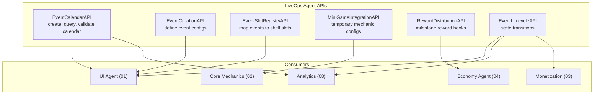
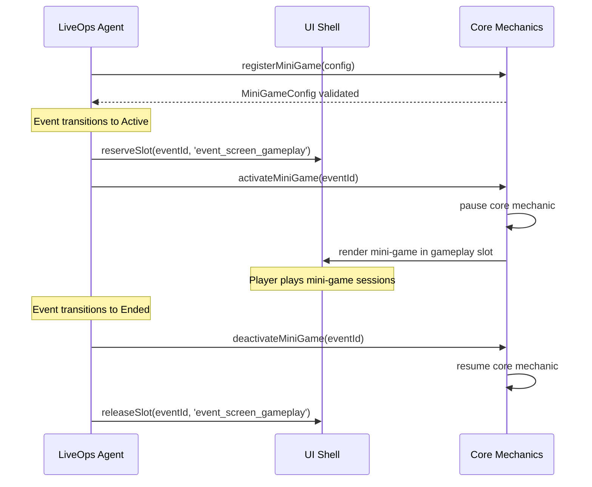
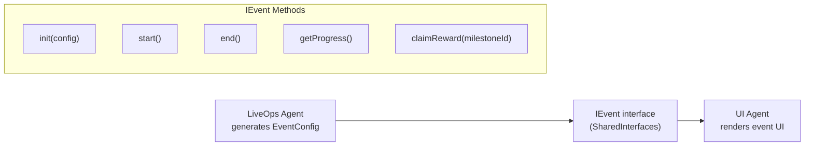

# LiveOps Interfaces

API contracts for the LiveOps vertical. All interfaces build on the [`IEvent`](../00_SharedInterfaces.md) contract defined in SharedInterfaces. Cross-module communication uses the [`GameEvent<T>`](../00_SharedInterfaces.md) pub/sub pattern -- no direct method calls across vertical boundaries.

---

## Interface Overview



---

## 1. Event Creation API

Defines how new events are authored. Every event config conforms to [`EventConfig`](../00_SharedInterfaces.md) from SharedInterfaces.

```typescript
interface EventCreationAPI {
  /**
   * Create a new event configuration.
   * Validates against constraints (concurrent limit, gap rules, budget).
   * Returns the finalized EventConfig with generated eventId.
   */
  createEvent(params: CreateEventParams): EventConfig;

  /**
   * Create a batch of events for a seasonal period.
   * Automatically spaces events per calendar constraints.
   */
  createSeasonalPack(params: SeasonalPackParams): EventConfig[];

  /**
   * Generate daily challenge sets for a date range.
   * Produces one DailyChallenge per day with 3-5 objectives.
   */
  generateDailyChallenges(params: DailyChallengeGenParams): DailyChallenge[];

  /**
   * Create a limited-time offer definition.
   * Requires coordination with Monetization for pricing.
   */
  createLimitedOffer(params: CreateOfferParams): LimitedOffer;

  /**
   * Validate an event config against all constraints.
   * Returns validation errors without persisting.
   */
  validateEvent(config: EventConfig): ValidationResult;
}

interface CreateEventParams {
  type: EventConfig['type'];
  name: string;
  duration: DurationSeconds;
  theme: SeasonalTheme | null;       // null = use base game theme
  milestoneCount: number;            // Agent distributes rewards across milestones
  rewardBudget: RewardBundle;        // Must be within Economy-approved limits
  difficultyOverrides?: Record<string, number>;  // For challenge events
  miniGameMechanic?: string;         // For mini-game events: mechanic type
}

interface SeasonalPackParams {
  season: string;                    // "halloween_2026", "lunar_new_year_2027"
  startDate: ISO8601;
  endDate: ISO8601;
  theme: SeasonalTheme;
  eventMix: {                        // How many of each type within the season
    challenges: number;
    miniGames: number;
    limitedOffers: number;
  };
  totalRewardBudget: RewardBundle;   // Split across all events in the pack
}

interface DailyChallengeGenParams {
  startDate: ISO8601;
  endDate: ISO8601;
  objectivePool: ObjectiveTemplate[];  // Templates to draw from
  rewardPerDay: RewardBundle;
  completionBonusPerDay: RewardBundle; // Bonus for completing all objectives
}

interface CreateOfferParams {
  name: string;
  duration: DurationSeconds;         // 24-72 hours
  products: OfferProduct[];          // Items/bundles on offer
  triggerCondition: OfferTrigger;    // When to show the offer
}

interface ValidationResult {
  valid: boolean;
  errors: ValidationError[];
  warnings: ValidationWarning[];
}

interface ValidationError {
  code: 'CONCURRENT_LIMIT' | 'GAP_VIOLATION' | 'BUDGET_EXCEEDED'
      | 'INVALID_DURATION' | 'MISSING_ASSETS' | 'SLOT_CONFLICT';
  message: string;
  field: string;
}

interface ValidationWarning {
  code: 'LOW_REWARD_DENSITY' | 'ASSET_PENDING' | 'OVERLAP_ADVISORY';
  message: string;
}
```

---

## 2. Calendar Scheduling API

Manages the rolling event calendar. The calendar is the primary output artifact of the LiveOps Agent.

```typescript
interface EventCalendarAPI {
  /**
   * Add an event to the calendar at a specific time slot.
   * Fails if placement violates constraints.
   */
  scheduleEvent(eventId: string, startAt: ISO8601, endAt: ISO8601): ScheduleResult;

  /**
   * Reschedule an event that hasn't started yet.
   * Re-validates all constraints against the new window.
   */
  rescheduleEvent(eventId: string, newStartAt: ISO8601, newEndAt: ISO8601): ScheduleResult;

  /**
   * Remove an event from the calendar.
   * Only allowed for Scheduled or Announced states.
   */
  unscheduleEvent(eventId: string): void;

  /**
   * Query the calendar for a date range.
   * Returns all events (including dailies) in the window.
   */
  getCalendar(from: ISO8601, to: ISO8601): CalendarView;

  /**
   * Find the next available slot for an event of a given type and duration.
   * Respects all constraints (concurrency, gap, rotation).
   */
  findNextSlot(type: EventConfig['type'], durationDays: number): ISO8601 | null;

  /**
   * Validate the entire calendar for constraint violations.
   * Use after batch scheduling or manual edits.
   */
  validateCalendar(): CalendarValidationResult;
}

interface ScheduleResult {
  success: boolean;
  eventId: string;
  scheduledStart: ISO8601;
  scheduledEnd: ISO8601;
  conflicts?: string[];              // IDs of conflicting events
}

interface CalendarView {
  from: ISO8601;
  to: ISO8601;
  events: CalendarEntry[];
  dailyChallenges: DailyChallenge[];
  coverage: number;                  // Percentage of days with active events
}

interface CalendarEntry {
  eventId: string;
  type: EventConfig['type'];
  name: string;
  startAt: ISO8601;
  endAt: ISO8601;
  state: EventLifecycleState;
  slots: EventSlotId[];              // Which shell slots this event occupies
}

type EventLifecycleState =
  | 'scheduled'
  | 'announced'
  | 'active'
  | 'winding_down'
  | 'ended'
  | 'archived';

interface CalendarValidationResult {
  valid: boolean;
  violations: CalendarViolation[];
}

interface CalendarViolation {
  type: 'concurrent_exceeded' | 'gap_missing' | 'type_repeat' | 'coverage_low';
  eventIds: string[];
  message: string;
}
```

---

## 3. Event Slot Registration API

Maps event types to UI shell slots. The shell defines the slots (see [UI Spec](../01_UI/Spec.md)); this API declares which slots each event type fills.

```typescript
interface EventSlotRegistryAPI {
  /**
   * Register which shell slots an event type can fill.
   * Called during agent initialization.
   */
  registerSlotMapping(mapping: SlotMapping): void;

  /**
   * Query which slots are currently occupied and by which events.
   */
  getOccupiedSlots(): OccupiedSlot[];

  /**
   * Check if a slot is available for a given time window.
   */
  isSlotAvailable(slotId: EventSlotId, from: ISO8601, to: ISO8601): boolean;

  /**
   * Reserve a slot for an event. Called when event transitions to Announced.
   */
  reserveSlot(eventId: string, slotId: EventSlotId): void;

  /**
   * Release a slot. Called when event transitions to Ended.
   */
  releaseSlot(eventId: string, slotId: EventSlotId): void;
}

type EventSlotId =
  | 'main_menu_event_banner'
  | 'main_menu_daily_challenge'
  | 'main_menu_limited_offer'
  | 'event_screen_gameplay'
  | 'event_screen_reward_track'
  | 'event_screen_leaderboard'
  | 'shop_event_section';

interface SlotMapping {
  eventType: EventConfig['type'];
  requiredSlots: EventSlotId[];      // Must be available for event to run
  optionalSlots: EventSlotId[];      // Used if available, event works without them
}

/** Default slot mappings */
const DEFAULT_SLOT_MAPPINGS: SlotMapping[] = [
  {
    eventType: 'seasonal',
    requiredSlots: ['main_menu_event_banner', 'event_screen_gameplay', 'event_screen_reward_track'],
    optionalSlots: ['shop_event_section'],
  },
  {
    eventType: 'challenge',
    requiredSlots: ['main_menu_event_banner', 'event_screen_gameplay', 'event_screen_reward_track'],
    optionalSlots: ['event_screen_leaderboard'],
  },
  {
    eventType: 'mini_game',
    requiredSlots: ['main_menu_event_banner', 'event_screen_gameplay', 'event_screen_reward_track'],
    optionalSlots: [],
  },
  {
    eventType: 'daily_challenge',
    requiredSlots: ['main_menu_daily_challenge'],
    optionalSlots: [],
  },
  {
    eventType: 'limited_offer',
    requiredSlots: ['main_menu_limited_offer'],
    optionalSlots: ['shop_event_section'],
  },
];

interface OccupiedSlot {
  slotId: EventSlotId;
  eventId: string;
  eventType: EventConfig['type'];
  occupiedUntil: ISO8601;
}
```

---

## 4. Mini-Game Integration API

Mini-games temporarily borrow the mechanic slot to run alternate gameplay. They use a simplified subset of [`IMechanic`](../00_SharedInterfaces.md) and must cleanly yield the slot when the event ends.

```typescript
interface MiniGameIntegrationAPI {
  /**
   * Register a mini-game mechanic for an event.
   * Produces a MiniGameConfig that the Core Mechanics Agent can instantiate.
   */
  registerMiniGame(params: RegisterMiniGameParams): MiniGameConfig;

  /**
   * Activate the mini-game, swapping the mechanic slot content.
   * Only valid when the parent event is in Active state.
   */
  activateMiniGame(eventId: string): void;

  /**
   * Deactivate the mini-game and restore the core mechanic.
   * Called automatically when event transitions to Ended.
   */
  deactivateMiniGame(eventId: string): void;

  /**
   * Query the current mini-game state.
   */
  getMiniGameState(eventId: string): MiniGameState;
}

interface RegisterMiniGameParams {
  eventId: string;
  mechanicType: string;              // "spinner", "match3_mini", "endless_runner"
  difficulty: Record<string, number>; // Simplified difficulty params
  maxSessionsPerDay: number;         // Energy/ticket limit
  sessionReward: RewardBundle;       // Reward per completed session
}

interface MiniGameState {
  eventId: string;
  active: boolean;
  sessionsPlayedToday: number;
  sessionsRemaining: number;
  totalSessionsPlayed: number;
}
```

### Mechanic Slot Handoff Sequence



---

## 5. Reward Distribution Hooks

Events distribute rewards at milestones. All rewards flow through Economy-approved channels. These hooks allow the Economy Agent to audit and gate reward distribution.

```typescript
interface RewardDistributionAPI {
  /**
   * Request reward distribution for a milestone.
   * Economy Agent validates the reward is within budget before approval.
   */
  requestRewardDistribution(params: RewardDistributionRequest): RewardApproval;

  /**
   * Claim a milestone reward for a player.
   * Delegates to IEvent.claimReward() after Economy approval.
   */
  claimMilestoneReward(
    eventId: string,
    milestoneId: string,
    playerId: string
  ): RewardBundle;

  /**
   * Subscribe to reward distribution events for audit/analytics.
   */
  readonly events: {
    onRewardRequested: GameEvent<RewardDistributionRequest>;
    onRewardApproved: GameEvent<RewardApproval>;
    onRewardClaimed: GameEvent<RewardClaimEvent>;
    onRewardBudgetExhausted: GameEvent<{ eventId: string; remaining: RewardBundle }>;
  };
}

interface RewardDistributionRequest {
  eventId: string;
  milestoneId: string;
  reward: RewardBundle;
  budgetRemaining: RewardBundle;     // How much of the event budget is left
}

interface RewardApproval {
  approved: boolean;
  eventId: string;
  milestoneId: string;
  adjustedReward?: RewardBundle;     // Economy may adjust amounts
  reason?: string;                   // If denied
}

interface RewardClaimEvent {
  playerId: string;
  eventId: string;
  milestoneId: string;
  reward: RewardBundle;
  timestamp: ISO8601;
}
```

---

## 6. Event Lifecycle Management API

Controls state transitions for events. Implements the lifecycle state machine defined in the [Spec](./Spec.md).

```typescript
interface EventLifecycleAPI {
  /**
   * Transition an event to the next state.
   * Validates preconditions for each transition.
   */
  transitionState(eventId: string, targetState: EventLifecycleState): TransitionResult;

  /**
   * Force-end an event (emergency only).
   * Skips WindingDown, moves directly to Ended.
   */
  forceEnd(eventId: string, reason: string): void;

  /**
   * Get current state and time-to-next-transition.
   */
  getLifecycleStatus(eventId: string): LifecycleStatus;

  /**
   * Subscribe to lifecycle events for cross-agent coordination.
   */
  readonly events: {
    onStateChanged: GameEvent<StateChangeEvent>;
    onEventAnnounced: GameEvent<{ eventId: string; startsAt: ISO8601 }>;
    onEventActivated: GameEvent<{ eventId: string; config: EventConfig }>;
    onEventWindingDown: GameEvent<{ eventId: string; endsAt: ISO8601 }>;
    onEventEnded: GameEvent<{ eventId: string; stats: EventStats }>;
    onEventArchived: GameEvent<{ eventId: string }>;
  };
}

interface TransitionResult {
  success: boolean;
  previousState: EventLifecycleState;
  newState: EventLifecycleState;
  error?: string;
}

interface LifecycleStatus {
  eventId: string;
  currentState: EventLifecycleState;
  enteredStateAt: ISO8601;
  nextTransitionAt: ISO8601 | null;  // null if archived
  nextState: EventLifecycleState | null;
}

interface StateChangeEvent {
  eventId: string;
  previousState: EventLifecycleState;
  newState: EventLifecycleState;
  timestamp: ISO8601;
  triggeredBy: 'schedule' | 'manual' | 'force';
}

interface EventStats {
  eventId: string;
  totalParticipants: number;
  completionRate: number;            // 0.0-1.0
  totalRewardsDistributed: RewardBundle;
  revenueGenerated: number;          // cents
}
```

### Lifecycle Transition Rules

| From | To | Precondition | Side Effects |
|------|----|-------------|--------------|
| Scheduled | Announced | T-24h reached, assets loaded | Banner slot reserved, notification queued |
| Announced | Active | startAt reached | All required slots occupied, gameplay enabled |
| Active | WindingDown | T-24h before endAt | Urgency messaging enabled, countdown shown |
| WindingDown | Ended | endAt reached | Slots released, reward claim window opens |
| Ended | Archived | 24h grace period elapsed | Unclaimed rewards forfeited, data archived |
| Any | Ended | forceEnd() called | Emergency stop, immediate slot release |

---

## IEvent Implementation Reference

The LiveOps Agent generates `EventConfig` objects consumed by the UI shell via the [`IEvent`](../00_SharedInterfaces.md) interface. The relationship:



LiveOps generates the *data*. The UI shell implements the *interface*. The shell calls `init(config)` with the LiveOps-generated `EventConfig`, then manages the player-facing lifecycle via `start()`, `end()`, `getProgress()`, and `claimReward()`.

---

## Related Documents

- [LiveOps Spec](./Spec.md) -- Constraints, scope, success criteria
- [LiveOps Data Models](./DataModels.md) -- Full schema definitions
- [LiveOps Agent Responsibilities](./AgentResponsibilities.md) -- Autonomy boundaries
- [Shared Interfaces](../00_SharedInterfaces.md) -- `IEvent`, `EventConfig`, `RewardBundle`, `GameEvent<T>`
- [UI Spec](../01_UI/Spec.md) -- Shell slot definitions
- [Economy Spec](../04_Economy/Spec.md) -- Reward budget approval process
- [Core Mechanics Spec](../02_CoreMechanics/Spec.md) -- `IMechanic` and mechanic slot
