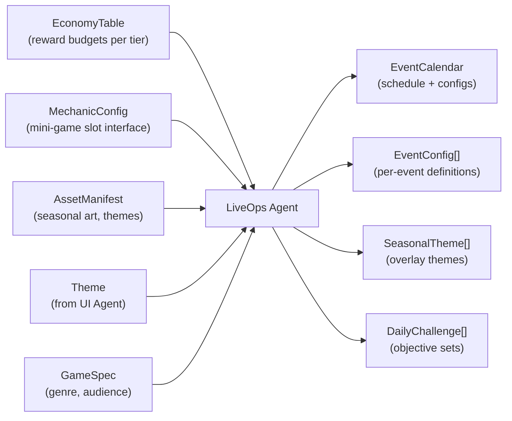
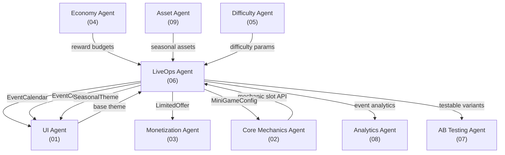
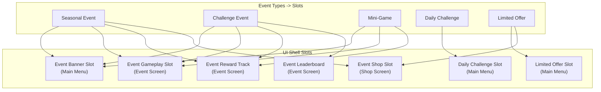
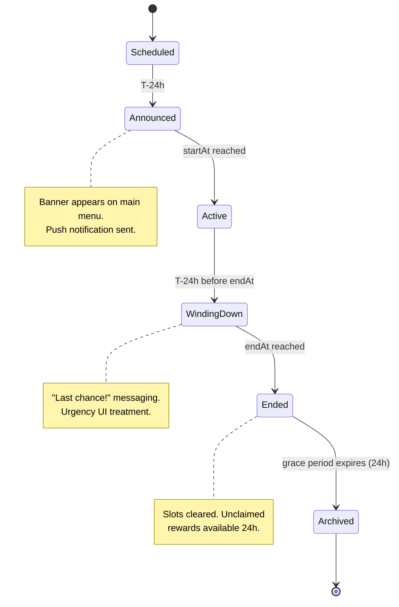

# LiveOps Vertical Specification

The LiveOps vertical owns **time-limited content** -- seasonal events, challenge events, mini-games, daily challenges, and limited-time offers. These content pieces drop into predefined event slots in the UI shell to drive player retention, re-engagement, and revenue without requiring app updates.

---

## Purpose

Generate and schedule time-limited content that keeps the game feeling fresh. Players who exhaust static content churn; LiveOps creates a rolling calendar of reasons to return. Every event has a clear lifecycle (announce, activate, wind down, archive), a reward budget approved by Economy, and themed assets sourced from the Asset Agent.

---

## Scope

### In Scope

| Area | Description |
|------|-------------|
| **Seasonal Events** | 2-4 week themed events tied to real-world holidays/seasons |
| **Challenge Events** | 3-7 day skill-based events with modified difficulty parameters |
| **Mini-Games** | 1-7 day alternate gameplay experiences using the mechanic slot temporarily |
| **Daily Challenges** | Recurring 24-hour objective sets (3-5 objectives per day) |
| **Limited-Time Offers** | 24-72 hour flash sales and value bundles |
| **Event Calendar** | Rolling schedule of all events with cadence and overlap rules |
| **Event Lifecycle** | State machine: Scheduled -> Announced -> Active -> WindingDown -> Ended -> Archived |
| **Reward Budgets** | Per-event reward allocation within Economy-approved limits |
| **Seasonal Themes** | Theme overlays (palette, assets) applied to event UI during seasonal events |

### Out of Scope

| Area | Owner |
|------|-------|
| Reward currency balancing | Economy Agent (04) |
| Core gameplay mechanics | Core Mechanics Agent (02) |
| Event UI rendering | UI Agent (01) -- consumes `IEvent` |
| IAP pricing and product catalog | Monetization Agent (03) |
| Event asset creation (art, audio) | Asset Agent (09) |
| A/B testing event variants | AB Testing Agent (07) |
| Event analytics dashboards | Analytics Agent (08) |

---

## Inputs and Outputs

### Inputs

| Input | Source | Description |
|-------|--------|-------------|
| `EconomyTable` | Economy Agent (04) | Reward budgets per event tier; max faucet rates for event rewards |
| `MechanicConfig` | [SharedInterfaces](../00_SharedInterfaces.md) `IMechanic` | Interface contract for mini-game slot; adjustable params for challenge events |
| `AssetManifest` | Asset Agent (09) | Available seasonal art, theme overlays, event-specific sprites |
| `Theme` | UI Agent (01) | Base game theme; seasonal themes extend this |
| `GameSpec` | Pipeline entry | Genre, target audience, monetization tier -- influences event type mix |

### Outputs

| Output | Consumer | Description |
|--------|----------|-------------|
| `EventCalendar` | UI Agent, Analytics Agent | Rolling schedule of all events with start/end times and slot assignments |
| `EventConfig[]` | UI Agent (via `IEvent`) | Per-event configuration: type, duration, milestones, rewards, theme |
| `SeasonalTheme[]` | UI Agent, Asset Agent | Theme overlays applied during seasonal events |
| `DailyChallenge[]` | UI Agent | Daily objective sets with reward bundles |
| `LimitedOffer[]` | Monetization Agent, UI Agent | Time-bound special offers with trigger conditions |
| `MiniGameConfig[]` | Core Mechanics Agent | Simplified mechanic configs for temporary mini-game experiences |

---

## Dependencies

| Dependency | Type | What LiveOps Needs |
|------------|------|-------------------|
| Economy (04) | **Hard** | Reward budgets must be approved before event configs are finalized |
| Core Mechanics (02) | **Hard** | Mini-games require a valid `MechanicConfig`; challenges need `setDifficultyParams` |
| Assets (09) | **Soft** | Seasonal themes degrade gracefully to base theme if assets are delayed |
| UI (01) | **Soft** | Base `Theme` used for consistency; LiveOps can generate events without it |
| Difficulty (05) | **Soft** | Challenge events reference difficulty params but can use defaults |
| Monetization (03) | **Coordinated** | Limited-time offers and seasonal IAP require joint pricing decisions |

---

## Constraints

| Constraint | Rule | Rationale |
|------------|------|-----------|
| **Concurrent event limit** | Max 2 concurrent events (excluding daily challenges) | Avoids player overwhelm and UI clutter |
| **Major event gap** | Min 1 calendar day between major event end and next major event start | Prevents event fatigue |
| **Reward budget cap** | Every event reward total must be <= Economy-approved budget for that tier | Prevents inflation |
| **Mini-game duration** | 1-7 days maximum | Mini-games are ephemeral; longer durations dilute core mechanic engagement |
| **Daily challenge count** | 3-5 objectives per day, no more | Keeps daily engagement achievable in a single session |
| **Seasonal anchoring** | Seasonal events planned >= 4 weeks in advance | Asset Agent needs lead time for themed art |
| **Event type rotation** | No same event type back-to-back (excluding dailies) | Variety sustains interest |

---

## Event Slot Mapping

Events fill predefined slots in the UI shell. The LiveOps Agent does not create new UI surfaces -- it populates existing ones.

---

## Event Lifecycle State Machine

Every event follows this lifecycle, implemented via the [`IEvent`](../00_SharedInterfaces.md) contract:

| State | Duration | Player-Visible | Actions |
|-------|----------|---------------|---------|
| Scheduled | Until T-24h | No | Internal scheduling, asset preloading |
| Announced | 24 hours | Yes (banner only) | Teaser banner, notification |
| Active | Event duration | Yes (full) | All event slots populated, gameplay available |
| WindingDown | Last 24 hours | Yes (urgency) | "Last chance" badge, countdown timer |
| Ended | 24 hours | Yes (claim only) | Slots cleared, unclaimed reward window |
| Archived | Permanent | No | Data archived for analytics, assets released |

---

## Success Criteria

| Metric | Target | Measurement |
|--------|--------|-------------|
| **Event participation rate** | > 40% of DAU enters at least one active event | `event_entered` / DAU |
| **Content freshness** | < 7 days since last new event launched | Calendar gap analysis |
| **Daily challenge completion** | > 30% of DAU completes at least one daily objective | `event_milestone` where type = daily |
| **Event completion rate** | > 20% of participants reach final milestone | `event_completed` / `event_entered` |
| **Re-engagement lift** | > 15% D7 retention improvement during events vs. no-event baseline | Cohort analysis |
| **Reward budget adherence** | 100% of events within Economy-approved budgets | Budget vs. actual audit |
| **Calendar coverage** | > 80% of days have at least one active event (excluding dailies) | Calendar fill rate |

---

## Related Documents

- [LiveOps Interfaces](./Interfaces.md) -- API contracts for event creation and scheduling
- [LiveOps Data Models](./DataModels.md) -- Schema definitions for all LiveOps artifacts
- [LiveOps Agent Responsibilities](./AgentResponsibilities.md) -- Autonomy boundaries
- [Shared Interfaces](../00_SharedInterfaces.md) -- `IEvent`, `EventConfig`, `EventMilestone`, `EventProgress`
- [Concepts: LiveOps](../../SemanticDictionary/Concepts_LiveOps.md) -- Deep concept definition
- [Economy Spec](../04_Economy/Spec.md) -- Reward budget ownership
- [Core Mechanics Spec](../02_CoreMechanics/Spec.md) -- Mechanic slot contract
- [UI Spec](../01_UI/Spec.md) -- Shell slot definitions
