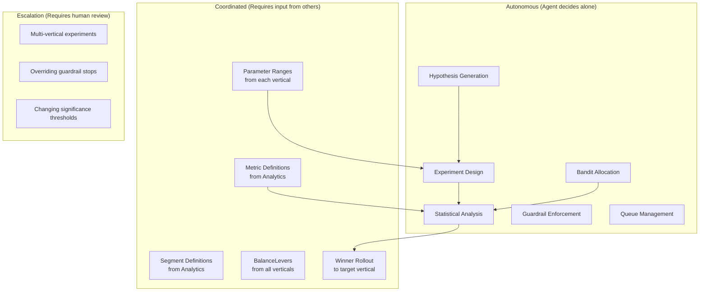
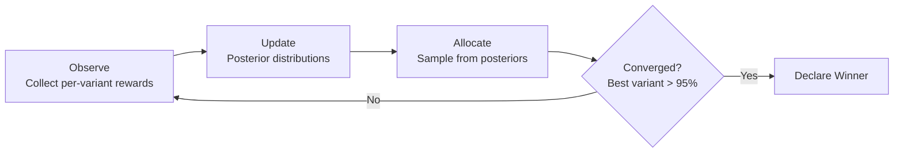
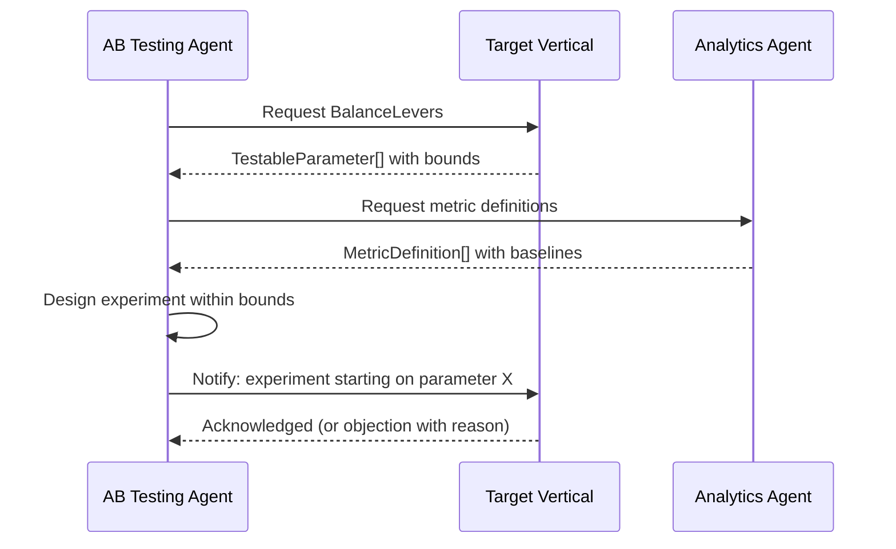
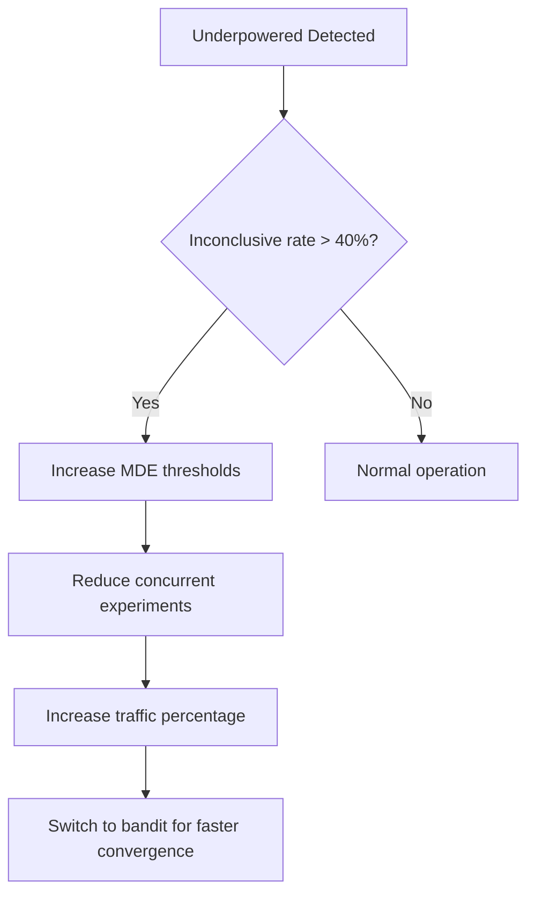

# AB Testing Vertical -- Agent Responsibilities

> **Owner:** AB Testing Agent
> **Version:** 1.0.0
> **Status:** Draft

---

## Overview

The AB Testing Agent is the experimentation engine of the AI Game Engine. It autonomously generates hypotheses, designs experiments, monitors results, and propagates winning configurations. This document defines what the agent decides alone, what requires coordination, quality criteria, and failure modes.

---

## Decision Authority Matrix



---

## Autonomous Responsibilities

The AB Testing Agent makes these decisions independently, without approval from other agents or human operators.

### 1. Hypothesis Generation

The agent continuously generates hypotheses from multiple data sources:

| Source | How It Works | Example |
|--------|-------------|---------|
| Analytics anomalies | Detects metric drops/spikes and proposes corrective experiments | "D3 retention dropped 2% after level 5 difficulty increase -- test reverting" |
| Prior experiment results | Extends winning insights to adjacent parameters | "Higher ad rewards worked for level 10-20; test for 20-30" |
| Domain heuristics | Applies game design principles as testable hypotheses | "Sawtooth difficulty curves reduce frustration-driven churn" |
| Cross-game learnings | Ports successful experiments from prior games | "In Game A, $2.99 starters converted 2x better than $4.99" |
| Seasonal patterns | Generates hypotheses for seasonal optimization | "Holiday event reward multiplier of 2x vs 1.5x vs 3x" |

**Quality bar:** Every hypothesis must follow the [If/Then/Because format](../../SemanticDictionary/Concepts_Hypothesis.md) and reference a measurable metric.

### 2. Experiment Design

The agent autonomously converts hypotheses into runnable experiments:

- Selects the number of variants (2-4 total including control)
- Calculates minimum sample size for desired MDE and power
- Chooses allocation strategy (fixed split vs. bandit) based on metric latency
- Sets experiment duration bounds (min 7 days, max 28 days)
- Assigns guardrail metrics from the [default set](DataModels.md) plus experiment-specific additions
- Validates no parameter conflicts with running experiments

```typescript
// Decision logic for allocation strategy selection
function selectAllocationStrategy(experiment: Experiment): AllocationStrategy {
  const metricLatency = getMetricLatency(experiment.metric);
  const riskTolerance = getRiskTolerance(experiment.targetVertical);

  if (metricLatency === 'immediate' && riskTolerance === 'high') {
    // Monetization experiments with immediate signal
    return {
      type: 'thompson_sampling',
      priorAlpha: 1,
      priorBeta: 1,
      minExploration: 0.05,
      updateIntervalMinutes: 60,
    };
  }

  if (metricLatency === 'immediate' && riskTolerance === 'low') {
    return {
      type: 'ucb',
      explorationParam: 2.0,
      minExploration: 0.10,
      updateIntervalMinutes: 120,
    };
  }

  // Retention, engagement, or any delayed metric
  const variantCount = 1 + experiment.treatments.length;
  const equalWeight = 1.0 / variantCount;
  return {
    type: 'fixed_split',
    weights: Array.from({ length: variantCount }, () => equalWeight),
  };
}
```

### 3. Statistical Analysis

The agent runs all statistical tests and declares outcomes:

| Test Type | When Used | Implementation |
|-----------|-----------|---------------|
| Two-proportion z-test | Binary metrics (conversion rates, retention) | Standard z-test with Bonferroni correction for multi-variant |
| Welch's t-test | Continuous metrics (revenue, session length) | Unequal variance t-test |
| Mann-Whitney U | Non-normal distributions (skewed revenue data) | Non-parametric alternative |
| Sequential ratio test | Early stopping decisions | O'Brien-Fleming alpha spending |

**Decision rules:**
- **Winner:** Treatment beats control with p < 0.05 AND all guardrails pass AND effect size > MDE
- **Control wins:** Control beats all treatments with p < 0.05
- **Inconclusive:** Max duration reached, no significant result
- **Futility stop:** Conditional power < 10% at midpoint

### 4. Bandit Allocation Updates

For experiments using multi-armed bandit strategies, the agent autonomously adjusts traffic:



**Thompson Sampling procedure:**
1. Maintain Beta(alpha, beta) distribution per variant
2. On each allocation cycle: sample from each variant's posterior
3. Assign new traffic proportional to sampled values
4. Update alpha/beta with observed successes/failures
5. Enforce minimum exploration floor (5% per variant)

### 5. Guardrail Enforcement

The agent monitors guardrails and takes automatic action:

| Guardrail Status | Agent Action |
|-----------------|-------------|
| All clear | Continue experiment |
| Warning threshold crossed | Log warning, increase check frequency |
| Violation on `action: 'warn'` | Alert, continue with monitoring |
| Violation on `action: 'pause'` | Auto-pause experiment, await review |
| Violation on `action: 'stop'` | Emergency stop, revert all traffic to control |

**Zero tolerance:** Guardrail stops are never overridden autonomously. A stopped experiment requires explicit re-authorization.

### 6. Queue Management

The agent maintains the hypothesis queue autonomously:

- Re-scores all hypotheses when new analytics data arrives
- Promotes highest-priority hypotheses to experiments when slots are available
- Expires hypotheses older than 30 days without action
- Marks hypotheses as `superseded` when a better one targets the same parameter
- Maintains minimum queue depth of 10 hypotheses at all times

---

## Coordinated Responsibilities

These decisions require input from other agents or verticals.

### Parameter Ranges (from each vertical)

Each vertical exposes its tunable parameters via `BalanceLevers`. The AB Testing Agent must respect:

| Constraint | Source | Example |
|------------|--------|---------|
| Min/max bounds | Vertical's `ParamDefinition` | Difficulty score must be 1-10 |
| Sensitivity level | Vertical's `TestableParameter` | High-sensitivity params need smaller MDE |
| Forbidden combinations | Vertical's business rules | Cannot test price below cost |
| Seasonal locks | LiveOps calendar | Don't change event rewards during active events |



### Metric Definitions (from Analytics)

The AB Testing Agent depends on the Analytics vertical for:

- Metric computation formulas (how D7 retention is calculated)
- Baseline metric values (current D7 retention = 28%)
- Metric latency (D7 retention takes 7 days to observe)
- Segment definitions (how "whale" vs "minnow" is defined)

### Winner Rollout (to target vertical)

When an experiment concludes with a winner:

1. AB Testing Agent packages the winning configuration
2. Sends `WinningConfig` to the target vertical
3. Target vertical validates and applies the new default
4. AB Testing Agent verifies the rollout via metric monitoring
5. Old baseline is archived in experiment history

---

## Quality Criteria

### Statistical Rigor

| Criterion | Minimum Standard | How Verified |
|-----------|-----------------|-------------|
| Pre-experiment power | > 80% | Power calculation before launch |
| Multiple comparison correction | Bonferroni or FDR | Applied when > 2 variants |
| Sample ratio mismatch | < 1% deviation from expected | Chi-squared test on allocation |
| Novelty/primacy effects | 7-day burn-in period | Exclude first 24h of data |
| Simpson's paradox check | Segment-level validation | Run analysis overall AND per segment |

### Experiment Velocity

| Metric | Target | Recovery Action |
|--------|--------|----------------|
| Experiments concluded per week | > 3 | Reduce MDE requirements, increase traffic % |
| Queue depth | > 10 hypotheses | Trigger additional hypothesis generation |
| Time-to-conclusion (median) | < 14 days | Evaluate if MDE is too small |
| Slot utilization | > 80% | Promote from queue more aggressively |

### No Guardrail Violations

- Target: 0 guardrail breaches that reach players
- Leading indicator: guardrail warning rate < 5% of experiments
- Root cause analysis required for every guardrail stop

---

## Failure Modes

### 1. Underpowered Tests

**Symptom:** Experiments consistently end as "inconclusive" (> 40% inconclusive rate).

**Root causes:**
- MDE set too small for available traffic
- High variance in target metric
- Insufficient DAU for the number of concurrent experiments

**Recovery:**


### 2. Guardrail Breach

**Symptom:** An experiment degrades a guardrail metric beyond its threshold.

**Root causes:**
- Variant has unexpected negative interaction with another system
- Check frequency too low (degradation occurred between checks)
- Guardrail threshold set too loose

**Recovery:**
1. Emergency stop the experiment (automatic)
2. Revert all traffic to control (automatic)
3. Root cause analysis: which variant caused the breach and why
4. Tighten guardrail thresholds if needed
5. Adjust check frequency (reduce from 60min to 15min for similar experiments)
6. Generate a "post-mortem" hypothesis about why the variant failed

### 3. Experiment Interaction Effects

**Symptom:** An experiment's results are confounded by another running experiment.

**Root causes:**
- Two experiments modify related parameters (e.g., difficulty + rewards)
- Segment overlap between targeted experiments
- Shared metric is affected by multiple experiments

**Recovery:**
1. Detect via sample ratio mismatch or unexpected variance
2. Pause the lower-priority experiment
3. Retroactively analyze for confounding
4. Implement stricter overlap detection rules
5. Consider sequential rather than parallel execution for related parameters

### 4. Infinite Optimization Loops

**Symptom:** The agent keeps testing the same parameter with diminishing returns.

**Root causes:**
- Previous winner was marginal (1-2% improvement)
- Agent generates follow-up hypothesis on same parameter
- Each iteration yields smaller and smaller improvements

**Recovery:**
```typescript
// Diminishing returns detection
function shouldTestParameter(
  parameter: string,
  history: readonly ExperimentResult[]
): boolean {
  const priorTests = history.filter(r =>
    r.experimentId.includes(parameter)
  );

  // Rule 1: Max 3 consecutive tests on same parameter
  if (priorTests.length >= 3) {
    const lastThreeWon = priorTests
      .slice(-3)
      .every(r => r.outcome === 'winner_found');
    if (!lastThreeWon) return false;
  }

  // Rule 2: Last improvement must be > 1% to justify another test
  const lastResult = priorTests[priorTests.length - 1];
  if (lastResult) {
    const lastLift = lastResult.primaryMetric
      .comparisons[0]?.relativeDifference ?? 0;
    if (Math.abs(lastLift) < 0.01) return false;
  }

  // Rule 3: Cooldown period after concluding a test on this parameter
  const lastEndDate = lastResult?.analyzedAt;
  if (lastEndDate) {
    const daysSince = daysBetween(lastEndDate, now());
    if (daysSince < 14) return false;
  }

  return true;
}
```

### 5. Bandit Premature Convergence

**Symptom:** Bandit declares a winner before collecting enough data, leading to a false positive.

**Root causes:**
- Prior parameters too aggressive (overconfident initial beliefs)
- Exploration floor too low
- Update interval too short for metric variance

**Recovery:**
- Increase `minExploration` from 5% to 10%
- Lengthen update interval (hourly to daily)
- Require minimum of 1000 observations per variant before convergence
- Cross-validate bandit winner with a brief fixed-split confirmation phase

### 6. Hypothesis Starvation

**Symptom:** Queue depth falls below 10, experiment velocity drops.

**Root causes:**
- Analytics data is stale or incomplete
- All high-impact parameters have been recently tested
- Agent is overly conservative in hypothesis generation

**Recovery:**
1. Broaden hypothesis sources (include cross-game learnings)
2. Re-examine previously inconclusive experiments with new data
3. Request anomaly reports from Analytics Agent
4. Lower the confidence threshold for hypothesis generation (not for analysis)
5. Introduce "exploration mode" -- test low-confidence but high-impact hypotheses

---

## Agent Communication Protocol

### Inbound Messages

| From | Message Type | Content |
|------|-------------|---------|
| Analytics | `metric_anomaly` | Metric name, direction, magnitude, affected segments |
| Analytics | `segment_update` | New or modified segment definitions |
| Any vertical | `parameter_registered` | New testable parameter available |
| Any vertical | `parameter_locked` | Parameter temporarily unavailable for testing |
| Runtime | `experiment_event` | Assignment and exposure events from live traffic |

### Outbound Messages

| To | Message Type | Content |
|----|-------------|---------|
| Runtime | `experiment_deploy` | Experiment config with variant assignments |
| Runtime | `experiment_stop` | Emergency stop with rollback instructions |
| Target vertical | `winning_config` | Parameter value to adopt as new default |
| Analytics | `experiment_concluded` | Full result for dashboard and reporting |
| Self (queue) | `hypothesis_generated` | New hypothesis for queue |

---

## Related Documents

- [Spec](Spec.md) -- Vertical specification and constraints
- [Interfaces](Interfaces.md) -- API contracts
- [Data Models](DataModels.md) -- Schema definitions
- [Feedback Loop](FeedbackLoop.md) -- The complete optimization cycle
- [Shared Interfaces](../00_SharedInterfaces.md) -- Cross-vertical contracts
- [Concepts: Hypothesis](../../SemanticDictionary/Concepts_Hypothesis.md) -- Hypothesis lifecycle and scoring
