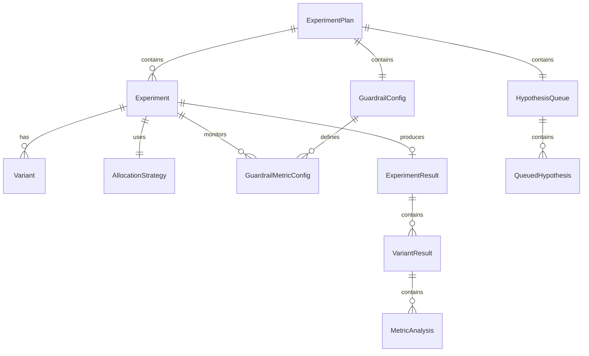
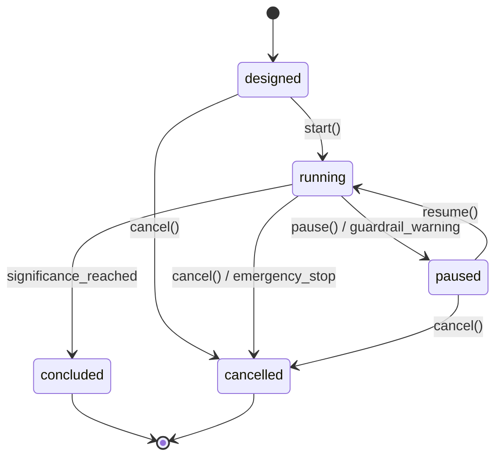
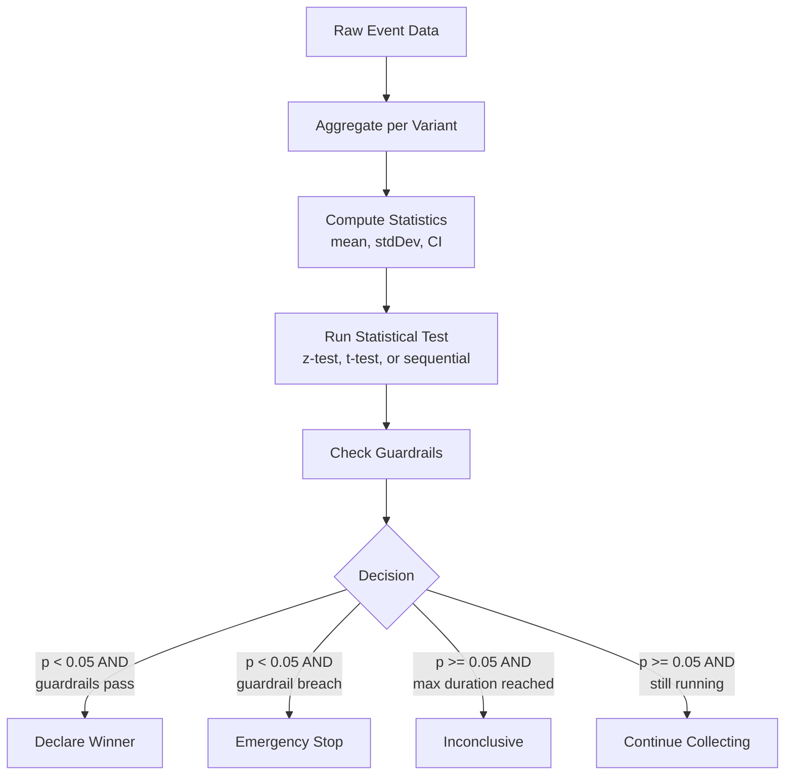
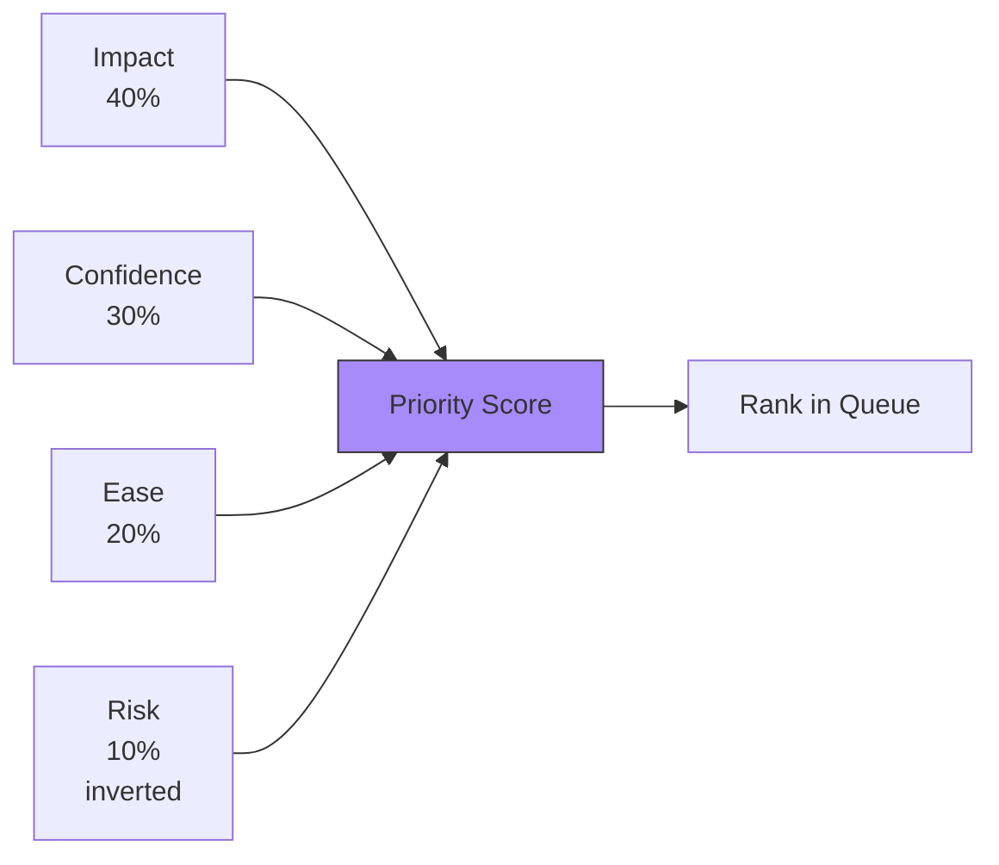
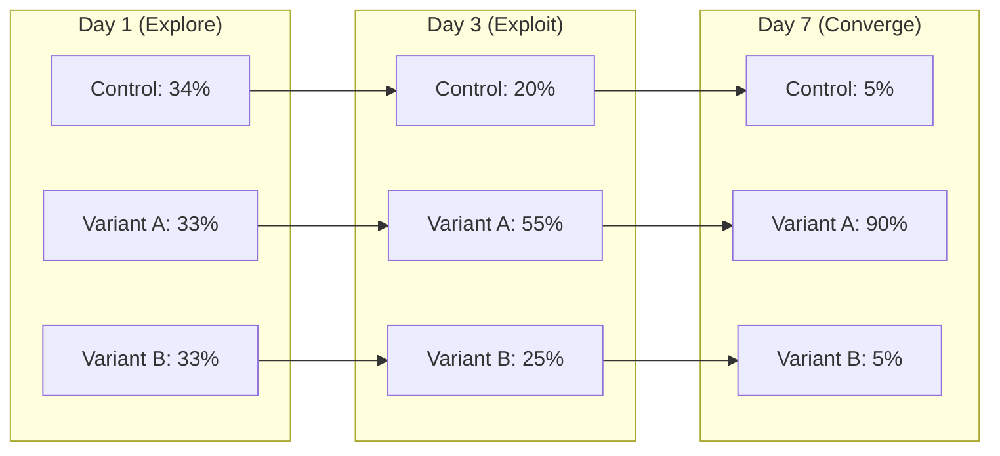

# AB Testing Vertical -- Data Models

> **Owner:** AB Testing Agent
> **Version:** 1.0.0
> **Status:** Draft

---

## Overview

This document defines the data schemas for the AB Testing vertical. All types reference the shared types defined in [SharedInterfaces.md](../00_SharedInterfaces.md) (`ISO8601`, `DurationSeconds`, `PlayerContext`, `CurrencyAmount`). The hypothesis format follows [Concepts_Hypothesis.md](../../SemanticDictionary/Concepts_Hypothesis.md).

---

## ExperimentPlan Schema

The primary output artifact of the AB Testing Agent. Contains all active experiments, the hypothesis queue, and guardrail configuration.

```typescript
interface ExperimentPlan {
  readonly id: string;
  readonly version: number;                       // Incremented on every plan update
  readonly generatedAt: ISO8601;
  readonly activeExperiments: readonly Experiment[];
  readonly hypothesisQueue: HypothesisQueue;
  readonly guardrailConfig: GuardrailConfig;
  readonly concurrencyBudget: ConcurrencyBudget;
}

interface ConcurrencyBudget {
  readonly maxConcurrentExperiments: number;       // Default: 5
  readonly maxTrafficPercentInExperiments: number; // Default: 0.30
  readonly currentUtilization: number;             // 0.0-1.0
  readonly availableSlots: number;
  readonly reservedParameters: readonly string[];  // Parameters locked by running experiments
}
```

### Entity Relationship



---

## Experiment Schema

A single experiment testing one hypothesis with one or more variants against a control.

```typescript
interface Experiment {
  readonly id: ExperimentId;
  readonly name: string;                          // Human-readable name
  readonly description: string;
  readonly status: ExperimentStatus;
  readonly hypothesis: HypothesisStatement;

  // What is being tested
  readonly targetVertical: VerticalId;
  readonly parameter: string;                     // The parameter being varied
  readonly metric: MetricId;                      // Primary success metric

  // Variants
  readonly control: Variant;
  readonly treatments: readonly Variant[];        // 1-3 treatment variants

  // Traffic
  readonly allocationStrategy: AllocationStrategy;
  readonly targetSegments: readonly SegmentId[];  // Empty = all players
  readonly trafficPercentage: number;             // % of eligible traffic (0.0-1.0)

  // Timing
  readonly designedAt: ISO8601;
  readonly startedAt?: ISO8601;
  readonly endedAt?: ISO8601;
  readonly minDurationDays: number;               // Default: 7
  readonly maxDurationDays: number;               // Default: 28

  // Statistical design
  readonly minimumDetectableEffect: number;       // Relative (e.g., 0.05 = 5%)
  readonly significanceLevel: number;             // Default: 0.05
  readonly statisticalPower: number;              // Default: 0.80
  readonly minimumSampleSizePerVariant: number;   // Calculated from above
  readonly testType: StatisticalTestType;

  // Guardrails
  readonly guardrailMetrics: readonly GuardrailMetricConfig[];

  // Results (populated after conclusion)
  readonly result?: ExperimentResult;

  // Metadata
  readonly tags: readonly string[];               // e.g., ["monetization", "ad_reward"]
  readonly createdBy: string;                     // "agent" or "manual"
  readonly notes: string;
}

type ExperimentStatus =
  | 'designed'      // Experiment spec created, not yet running
  | 'running'       // Traffic allocated, collecting data
  | 'paused'        // Temporarily halted (manual or guardrail warning)
  | 'concluded'     // Analysis complete, winner declared
  | 'cancelled';    // Terminated before conclusion

type StatisticalTestType =
  | 'two_proportion_z'     // Binary metrics (conversion rates)
  | 'welch_t'              // Continuous metrics (revenue, session length)
  | 'mann_whitney_u'       // Non-normal distributions
  | 'sequential_ratio';    // Sequential testing for early stopping

type MetricId = string;
type SegmentId = string;
type VariantId = string;
type ExperimentId = string;
```

### Experiment Lifecycle States



---

## Variant Schema

A single variant within an experiment, defining the parameter override and per-variant tracking.

```typescript
interface Variant {
  readonly id: VariantId;
  readonly name: string;                          // e.g., "control", "high_reward", "low_price"
  readonly isControl: boolean;
  readonly parameterOverrides: readonly ParameterOverride[];
  readonly description: string;                   // Human-readable explanation
}

interface ParameterOverride {
  readonly parameter: string;                     // Fully qualified: "economy.dailyLoginReward"
  readonly value: ParameterValue;                 // The override value for this variant
  readonly baselineValue: ParameterValue;         // The current production value
}

type ParameterValue = number | string | boolean | readonly number[];
```

### Variant Examples

| Experiment | Control | Treatment A | Treatment B |
|-----------|---------|-------------|-------------|
| Ad reward value | `rewardedAdCoinValue: 20` | `rewardedAdCoinValue: 40` | `rewardedAdCoinValue: 60` |
| Difficulty curve | `difficultySlope: 1.0` | `difficultySlope: 0.8` | -- |
| Starter bundle | `starterBundlePrice: 4.99` | `starterBundlePrice: 2.99` | `starterBundlePrice: 1.99` |
| Shop button | `shopButtonPosition: "top_right"` | `shopButtonPosition: "bottom_center"` | -- |

---

## ExperimentResult Schema

The complete statistical analysis of a concluded experiment.

```typescript
interface ExperimentResult {
  readonly experimentId: ExperimentId;
  readonly analyzedAt: ISO8601;
  readonly outcome: ExperimentOutcome;
  readonly winningVariantId?: VariantId;           // Undefined if inconclusive/stopped

  // Per-variant results
  readonly variantResults: readonly VariantResult[];

  // Primary metric analysis
  readonly primaryMetric: MetricAnalysis;

  // Guardrail results
  readonly guardrailResults: readonly GuardrailAnalysis[];

  // Bandit-specific results (if applicable)
  readonly banditHistory?: readonly BanditSnapshot[];

  // Meta
  readonly totalSampleSize: number;
  readonly actualDurationDays: number;
  readonly recommendations: readonly string[];     // Agent-generated next steps
  readonly insightsGenerated: readonly string[];   // Learnings for future hypotheses
}

type ExperimentOutcome =
  | 'winner_found'        // A treatment variant beat the control
  | 'control_wins'        // Control was best
  | 'inconclusive'        // No significant difference after max duration
  | 'stopped_guardrail'   // Emergency stop due to guardrail violation
  | 'stopped_futility';   // Early stop -- no chance of reaching significance

interface VariantResult {
  readonly variantId: VariantId;
  readonly isControl: boolean;
  readonly sampleSize: number;
  readonly metrics: readonly MetricAnalysis[];
  readonly exposureRate: number;                   // % of assigned players actually exposed
}

interface MetricAnalysis {
  readonly metricId: MetricId;
  readonly metricName: string;
  readonly metricType: 'binary' | 'continuous' | 'revenue';

  // Per-variant statistics
  readonly perVariant: readonly VariantMetricStats[];

  // Comparison (treatment vs. control)
  readonly comparisons: readonly PairwiseComparison[];

  // Overall
  readonly bestVariant: VariantId;
  readonly isSignificant: boolean;
}

interface VariantMetricStats {
  readonly variantId: VariantId;
  readonly mean: number;
  readonly median: number;
  readonly stdDev: number;
  readonly sampleSize: number;
  readonly confidenceInterval: ConfidenceInterval;
  readonly percentiles: {
    readonly p5: number;
    readonly p25: number;
    readonly p75: number;
    readonly p95: number;
  };
}

interface PairwiseComparison {
  readonly controlId: VariantId;
  readonly treatmentId: VariantId;
  readonly absoluteDifference: number;
  readonly relativeDifference: number;             // (treatment - control) / control
  readonly confidenceInterval: ConfidenceInterval;
  readonly pValue: number;
  readonly isSignificant: boolean;                 // pValue < significanceLevel
  readonly effectSize: number;                     // Cohen's d
  readonly statisticalPower: number;               // Observed power
  readonly testUsed: StatisticalTestType;
}

interface ConfidenceInterval {
  readonly lower: number;
  readonly upper: number;
  readonly level: number;                          // e.g., 0.95 for 95% CI
}
```

### Result Analysis Flow



---

## HypothesisQueue Schema

The prioritized backlog of hypotheses awaiting experimentation.

```typescript
interface HypothesisQueue {
  readonly hypotheses: readonly QueuedHypothesis[];
  readonly lastRescoredAt: ISO8601;
  readonly stats: QueueStats;
}

interface QueuedHypothesis {
  readonly id: HypothesisId;
  readonly hypothesis: HypothesisStatement;
  readonly priorityScore: number;                  // 0-100, higher = more urgent
  readonly enqueuedAt: ISO8601;
  readonly estimatedSampleSize: number;
  readonly estimatedDurationDays: number;
  readonly targetVertical: VerticalId;
  readonly parameter: string;
  readonly relatedExperiments: readonly ExperimentId[];
  readonly status: HypothesisStatus;
}

type HypothesisStatus =
  | 'queued'            // Waiting for an experiment slot
  | 'blocked'           // Parameter locked by another experiment
  | 'ready'             // Can be promoted to experiment
  | 'expired'           // Analytics data no longer supports this hypothesis
  | 'superseded';       // A better hypothesis replaced this one

type HypothesisId = string;

/** Scoring factors per Concepts_Hypothesis.md */
interface HypothesisPriorityFactors {
  readonly expectedImpact: number;                 // 1-10, weight: 40%
  readonly confidence: number;                     // 1-10, weight: 30%
  readonly easeOfImplementation: number;           // 1-10, weight: 20%
  readonly risk: number;                           // 1-10 (inverted), weight: 10%
}

interface QueueStats {
  readonly depth: number;
  readonly avgPriorityScore: number;
  readonly oldestHypothesisAgeDays: number;
  readonly hypothesesByVertical: Record<VerticalId, number>;
  readonly hypothesesBySource: Record<HypothesisSource, number>;
  readonly hypothesesByStatus: Record<HypothesisStatus, number>;
}
```

### Priority Scoring



**Formula:** `priorityScore = (impact * 0.4 + confidence * 0.3 + ease * 0.2 + (10 - risk) * 0.1) * 10`

---

## GuardrailConfig Schema

Defines the metrics that must not degrade during experimentation.

```typescript
interface GuardrailConfig {
  readonly defaultGuardrails: readonly GuardrailMetricConfig[];
  readonly perExperimentOverrides: Record<ExperimentId, readonly GuardrailMetricConfig[]>;
}

interface GuardrailMetricConfig {
  readonly metricId: MetricId;
  readonly metricName: string;
  readonly maxDegradation: number;
  readonly degradationType: 'absolute' | 'relative';
  readonly warningThreshold: number;               // % of max before warning (e.g., 0.7)
  readonly action: GuardrailAction;
  readonly checkFrequencyMinutes: number;          // How often to check (default: 60)
  readonly minSampleBeforeCheck: number;           // Don't check until this many samples
}

type GuardrailAction =
  | 'warn'     // Alert the agent, continue experiment
  | 'pause'    // Auto-pause, await manual review
  | 'stop';    // Emergency stop, revert all traffic to control
```

### Default Guardrails

| Metric | Max Degradation | Type | Action |
|--------|----------------|------|--------|
| D1 retention | -1.0% | absolute | stop |
| D7 retention | -0.5% | absolute | stop |
| ARPDAU | -5.0% | relative | pause |
| Crash rate | +0.1% | absolute | stop |
| Session length | -10.0% | relative | warn |
| Payer conversion | -2.0% | relative | pause |

---

## Bandit-Specific Schemas

Additional schemas used when experiments run in multi-armed bandit mode.

```typescript
interface BanditSnapshot {
  readonly timestamp: ISO8601;
  readonly weights: readonly BanditVariantState[];
  readonly totalPulls: number;                     // Total assignments so far
  readonly explorationRatio: number;               // Current explore vs exploit
}

interface BanditVariantState {
  readonly variantId: VariantId;
  readonly weight: number;                         // Current allocation weight
  readonly pulls: number;                          // Times this variant was shown
  readonly successes: number;                      // Conversions / positive outcomes
  readonly estimatedReward: number;                // Running reward estimate
  readonly upperConfidenceBound: number;           // UCB value (if UCB strategy)
  readonly thompsonSample?: number;                // Last Thompson sample (if TS strategy)
  readonly alpha?: number;                         // Beta distribution alpha (if TS)
  readonly beta?: number;                          // Beta distribution beta (if TS)
}
```

### Bandit Convergence Visualization



---

## Schema Versioning

All schemas are versioned. Breaking changes require a major version bump and migration path.

| Schema | Current Version | Last Changed |
|--------|----------------|-------------|
| ExperimentPlan | 1.0.0 | Initial |
| Experiment | 1.0.0 | Initial |
| Variant | 1.0.0 | Initial |
| ExperimentResult | 1.0.0 | Initial |
| HypothesisQueue | 1.0.0 | Initial |
| GuardrailConfig | 1.0.0 | Initial |
| BanditSnapshot | 1.0.0 | Initial |

---

## Related Documents

- [Spec](Spec.md) -- Vertical specification
- [Interfaces](Interfaces.md) -- API contracts using these schemas
- [Agent Responsibilities](AgentResponsibilities.md) -- Decision authority
- [Feedback Loop](FeedbackLoop.md) -- How results feed back into hypotheses
- [Shared Interfaces](../00_SharedInterfaces.md) -- Cross-vertical type definitions
- [Concepts: Hypothesis](../../SemanticDictionary/Concepts_Hypothesis.md) -- Hypothesis format and lifecycle
