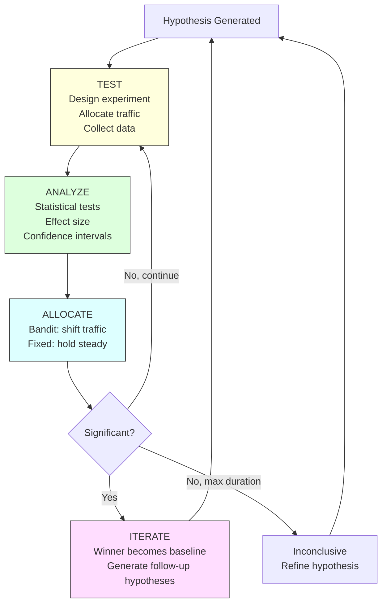
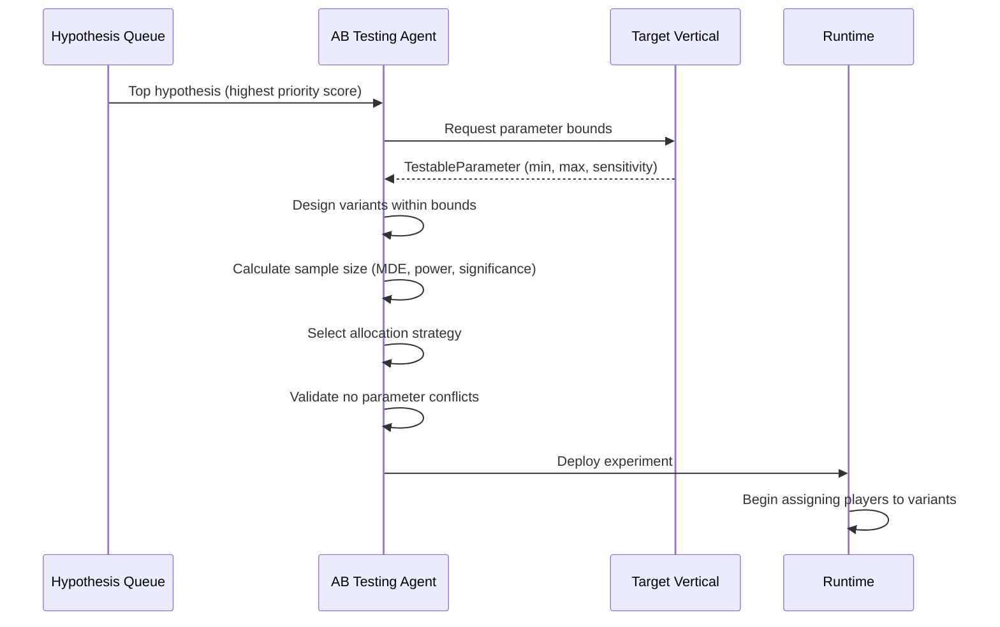
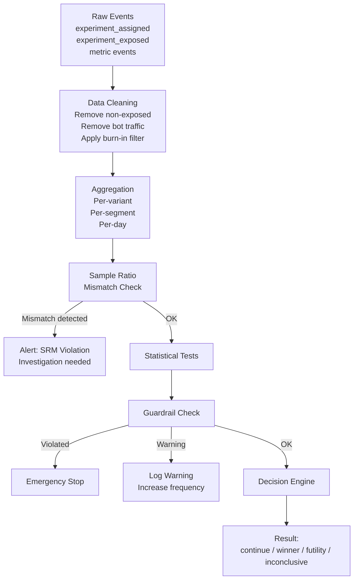
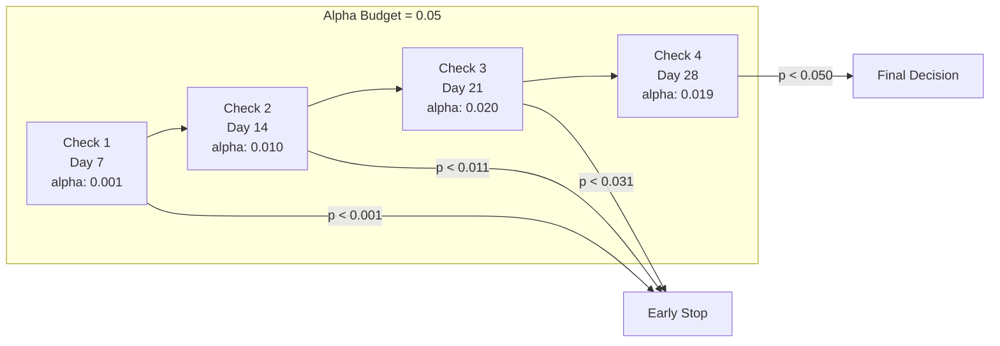
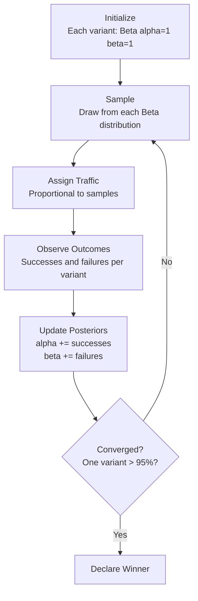
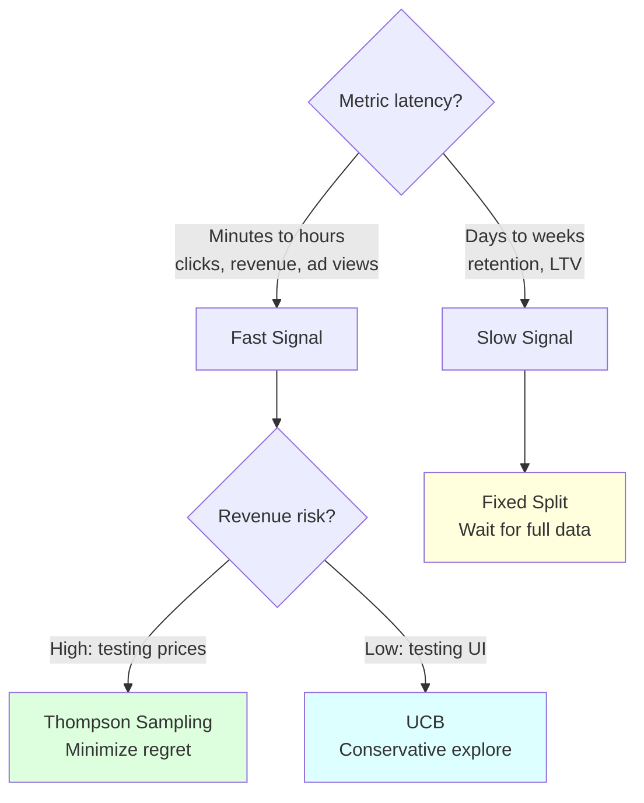
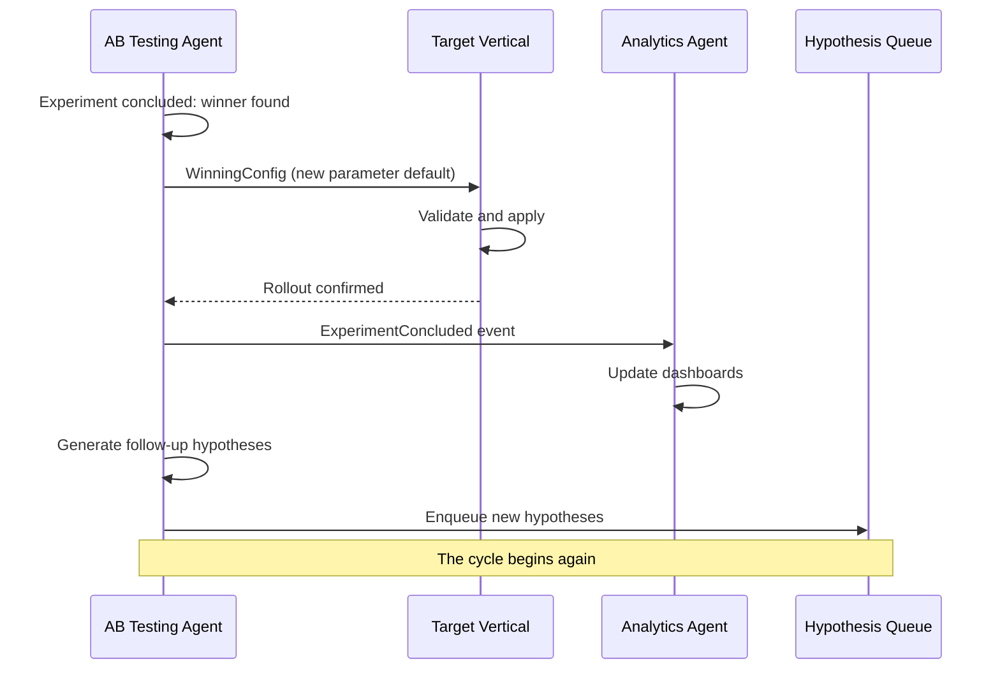
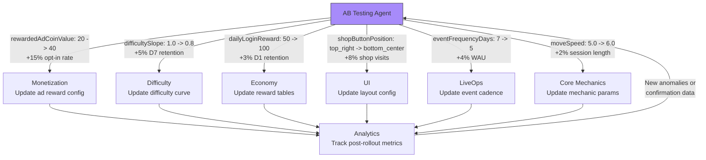
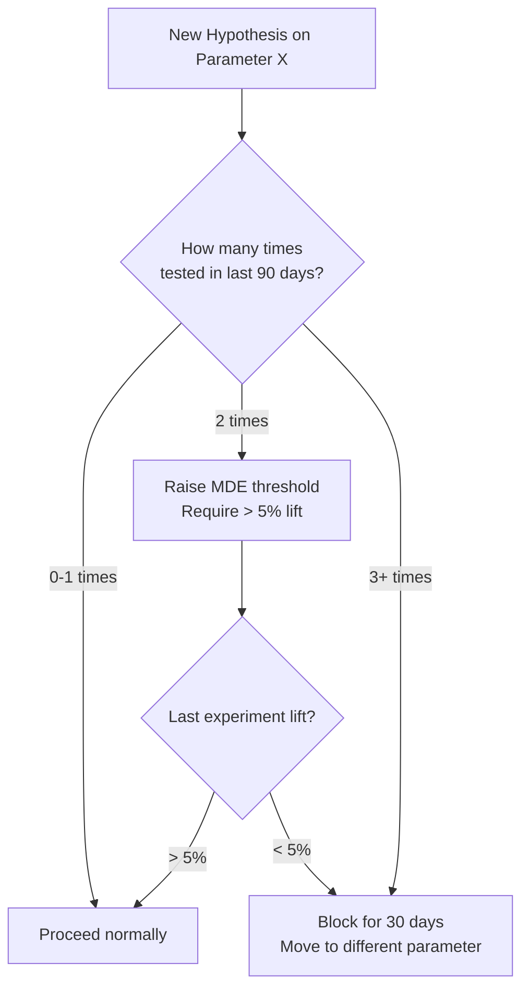

# AB Testing Vertical -- Feedback Loop

> **Owner:** AB Testing Agent
> **Version:** 1.0.0
> **Status:** Draft

---

## Overview

The AB Testing feedback loop is a continuous cycle: **Test --> Analyze --> Allocate --> Iterate**. Every experiment generates data that feeds back into hypothesis generation, creating a self-improving optimization engine. This document walks through each step, the multi-armed bandit algorithm, cross-vertical feedback, and safeguards against infinite optimization loops.

---

## The Complete Cycle



### Cycle Timing

| Phase | Duration | Trigger |
|-------|----------|---------|
| Test (data collection) | 7-28 days | Experiment start |
| Analyze | Continuous (every check cycle) | New data batch |
| Allocate | Per update interval (bandit) or once (fixed) | Analysis result |
| Iterate | 1-2 days | Experiment conclusion |
| Full cycle (hypothesis to production) | 10-30 days | Depends on metric latency |

---

## Step 1: Test

Hypotheses become experiments, variants are designed, and traffic is split.

### Hypothesis to Experiment



### Variant Design Rules

The agent designs variants based on the hypothesis magnitude and parameter sensitivity:

```typescript
function designVariants(
  hypothesis: HypothesisStatement,
  param: TestableParameter
): readonly Variant[] {
  const control: Variant = {
    id: 'control',
    name: 'control',
    isControl: true,
    parameterOverrides: [],
    description: 'Current production value',
  };

  // For high-sensitivity parameters: test one variant close to hypothesis
  if (param.sensitivity === 'high') {
    return [
      control,
      createVariant('treatment_a', hypothesis.proposedValue, param),
    ];
  }

  // For low/medium sensitivity: test hypothesis value + a more aggressive variant
  return [
    control,
    createVariant('treatment_a', hypothesis.proposedValue, param),
    createVariant('treatment_b', getAggressiveValue(hypothesis, param), param),
  ];
}
```

### Traffic Split Mechanics

| Strategy | Initial Split | Updates | Best For |
|----------|--------------|---------|----------|
| Fixed 50/50 | Equal between control and treatment | Never | Retention, engagement experiments |
| Fixed multi-variant | Equal across all variants | Never | Exploring multiple values |
| Thompson Sampling | Equal start, then posterior-driven | Every update interval | Revenue, conversion experiments |
| UCB | Equal start, then UCB-driven | Every update interval | Conservative exploration |

### Player Assignment

Players are assigned via deterministic hashing to ensure sticky assignments:

```typescript
function assignVariant(
  playerId: string,
  experimentId: string,
  variantCount: number,
  weights: readonly number[]
): VariantId {
  // Deterministic hash ensures same player always gets same variant
  const hash = murmurhash3(playerId + experimentId);
  const normalized = hash / MAX_UINT32;  // 0.0 to 1.0

  // Walk the cumulative distribution
  let cumulative = 0;
  for (let i = 0; i < weights.length; i++) {
    cumulative += weights[i];
    if (normalized < cumulative) {
      return variantIds[i];
    }
  }
  return variantIds[variantIds.length - 1];
}
```

---

## Step 2: Analyze

Statistical significance testing, effect size calculation, and confidence intervals.

### Analysis Pipeline



### Statistical Tests

The agent selects the appropriate test based on metric type:

| Metric Type | Test | Example Metric | Assumptions |
|-------------|------|---------------|-------------|
| Binary (rate) | Two-proportion z-test | Retention, conversion rate | n > 30 per variant |
| Continuous (normal) | Welch's t-test | Session length, levels completed | Approximate normality |
| Continuous (skewed) | Mann-Whitney U | Revenue per user, LTV | No normality assumption |
| Sequential | O'Brien-Fleming boundaries | Any (with early stopping) | Pre-specified check schedule |

### Effect Size Calculation

```typescript
interface EffectSizeResult {
  readonly cohensD: number;           // Standardized effect size
  readonly interpretation: 'negligible' | 'small' | 'medium' | 'large';
  readonly absoluteLift: number;      // Treatment mean - control mean
  readonly relativeLift: number;      // (Treatment - control) / control
  readonly confidenceInterval: {
    readonly lower: number;
    readonly upper: number;
    readonly level: 0.95;
  };
  readonly numberNeededToTreat?: number; // For binary metrics
}

// Cohen's d interpretation
// |d| < 0.2  = negligible
// |d| 0.2-0.5 = small
// |d| 0.5-0.8 = medium
// |d| > 0.8  = large
```

### Sequential Testing (Avoiding Peeking Problems)

The agent uses alpha spending to allow interim analyses without inflating false positive rates:



Each interim check "spends" a portion of the total alpha budget. The O'Brien-Fleming function allocates very little alpha to early checks (making early stops rare but possible) and more alpha to later checks.

---

## Step 3: Allocate

Multi-armed bandit algorithms dynamically shift traffic toward better-performing variants.

### Thompson Sampling Algorithm



**Worked example:**

| Step | Variant A (alpha, beta) | Variant B (alpha, beta) | Traffic Split |
|------|------------------------|------------------------|---------------|
| Day 0 | Beta(1, 1) | Beta(1, 1) | 50% / 50% |
| Day 1 (A: 60/100, B: 45/100) | Beta(61, 41) | Beta(46, 56) | 68% / 32% |
| Day 2 (A: 130/200, B: 70/200) | Beta(131, 71) | Beta(71, 131) | 82% / 18% |
| Day 3 (A: 210/300, B: 85/300) | Beta(211, 91) | Beta(86, 216) | 95% / 5% |
| **Converged** | **Winner: A** | | |

### UCB (Upper Confidence Bound) Algorithm

For more conservative exploration:

```typescript
function calculateUCB(
  variant: BanditVariantState,
  totalPulls: number,
  explorationParam: number
): number {
  const exploitation = variant.successes / variant.pulls;
  const exploration = explorationParam * Math.sqrt(
    Math.log(totalPulls) / variant.pulls
  );
  return exploitation + exploration;
}

// Assign all new traffic to variant with highest UCB
function allocateUCB(
  variants: readonly BanditVariantState[],
  totalPulls: number,
  explorationParam: number
): readonly BanditWeight[] {
  const ucbValues = variants.map(v =>
    calculateUCB(v, totalPulls, explorationParam)
  );
  const bestIdx = ucbValues.indexOf(Math.max(...ucbValues));

  return variants.map((v, i) => ({
    variantId: v.variantId,
    weight: i === bestIdx ? 0.9 : 0.1 / (variants.length - 1),
    estimatedReward: v.successes / v.pulls,
    confidence: ucbValues[i] - v.successes / v.pulls,
  }));
}
```

### When to Use Each Strategy



---

## Step 4: Iterate

Winners become the new baseline, and results generate new hypotheses.

### Winner Propagation



### Follow-up Hypothesis Generation

Every concluded experiment -- win, lose, or inconclusive -- generates follow-up hypotheses:

| Outcome | Follow-up Hypotheses |
|---------|---------------------|
| **Winner** | "If we push the parameter further (e.g., reward from 40 to 60), does the improvement continue?" |
| **Winner** | "Does the same change work for a different segment (e.g., test on whales instead of all players)?" |
| **Winner** | "Does the winning change affect an adjacent parameter (e.g., higher ad rewards reduce IAP conversion)?" |
| **Loser** | "Was the direction wrong, or the magnitude? Test the opposite direction." |
| **Loser** | "Is the parameter not impactful, or was the context wrong? Test under different conditions." |
| **Inconclusive** | "Refine with larger MDE and focus on the most affected segment." |
| **Inconclusive** | "Combine with a related parameter change for a bigger signal." |

---

## Cross-Vertical Feedback

AB test results flow back to every vertical, closing the loop between experimentation and production configuration.



### Post-Rollout Monitoring

After a winning configuration is deployed, the AB Testing Agent monitors for:

| Check | Duration | Action on Failure |
|-------|----------|-------------------|
| Metric confirmation | 7 days | Roll back to previous value |
| Guardrail stability | 14 days | Investigate interaction effects |
| Long-term impact | 30 days | Generate hypothesis if metric trends down |

---

## Complete Experiment Lifecycle Example

Walk through a full experiment from hypothesis to production rollout.

### Hypothesis

> **If** we increase the rewarded ad coin reward from 20 to 40, **then** rewarded ad opt-in rate will improve by 15% **because** the current reward (20 coins) doesn't feel worth 30 seconds of attention -- players earning 200+ coins per level see 20 as trivial.

### Day 0: Design

```typescript
const experiment: Experiment = {
  id: 'exp_ad_reward_001',
  name: 'Rewarded Ad Coin Value Increase',
  hypothesis: {
    ifClause: 'we change rewardedAdCoinValue from 20 to 40',
    thenClause: 'rewarded ad opt-in rate will improve by 15%',
    becauseClause: 'current reward feels trivial relative to level earnings',
    priorityScore: 78,
    source: 'analytics_anomaly',
  },
  targetVertical: '03_Monetization',
  parameter: 'monetization.rewardedAdCoinValue',
  metric: 'rewarded_ad_opt_in_rate',
  control: {
    id: 'control',
    name: 'control',
    isControl: true,
    parameterOverrides: [],
    description: 'Current value: 20 coins',
  },
  treatments: [
    {
      id: 'treatment_a',
      name: 'double_reward',
      isControl: false,
      parameterOverrides: [{
        parameter: 'monetization.rewardedAdCoinValue',
        value: 40,
        baselineValue: 20,
      }],
      description: 'Double the reward to 40 coins',
    },
    {
      id: 'treatment_b',
      name: 'triple_reward',
      isControl: false,
      parameterOverrides: [{
        parameter: 'monetization.rewardedAdCoinValue',
        value: 60,
        baselineValue: 20,
      }],
      description: 'Triple the reward to 60 coins',
    },
  ],
  allocationStrategy: {
    type: 'thompson_sampling',
    priorAlpha: 1,
    priorBeta: 1,
    minExploration: 0.05,
    updateIntervalMinutes: 60,
  },
  guardrailMetrics: [
    { metricId: 'd1_retention', maxDegradation: 0.01, degradationType: 'absolute', warningThreshold: 0.7, action: 'stop', checkFrequencyMinutes: 60, minSampleBeforeCheck: 500 },
    { metricId: 'arpdau', maxDegradation: 0.05, degradationType: 'relative', warningThreshold: 0.7, action: 'pause', checkFrequencyMinutes: 60, minSampleBeforeCheck: 500 },
    { metricId: 'iap_conversion', maxDegradation: 0.02, degradationType: 'relative', warningThreshold: 0.7, action: 'warn', checkFrequencyMinutes: 120, minSampleBeforeCheck: 1000 },
  ],
  minimumSampleSizePerVariant: 3200,
  maxDurationDays: 14,
  // ... other fields
};
```

### Day 1-3: Collect and Allocate

| Day | Control | Treatment A (40 coins) | Treatment B (60 coins) | Traffic Split |
|-----|---------|----------------------|----------------------|---------------|
| 1 | Opt-in: 32% (n=1000) | Opt-in: 38% (n=1000) | Opt-in: 41% (n=1000) | 33/33/34 |
| 2 | Opt-in: 31% (n=2100) | Opt-in: 37% (n=2300) | Opt-in: 40% (n=2600) | 25/30/45 |
| 3 | Opt-in: 32% (n=2800) | Opt-in: 38% (n=3100) | Opt-in: 41% (n=4100) | 15/25/60 |

Guardrail check: D1 retention stable (-0.1%), ARPDAU up 2%. All clear.

### Day 4-7: Converge

Thompson Sampling shifts traffic heavily toward Treatment B:

| Day | Control | Treatment A | Treatment B | Traffic Split |
|-----|---------|-------------|-------------|---------------|
| 5 | 32% (n=3000) | 37% (n=3500) | 41% (n=6500) | 8/15/77 |
| 7 | 32% (n=3200) | 37% (n=3700) | 41% (n=9100) | 5/5/90 |

### Day 8: Conclude

```
Primary metric: rewarded_ad_opt_in_rate
  Control:     32.1% (n=3200)
  Treatment A: 37.4% (n=3700), lift: +16.5%, p=0.0001
  Treatment B: 40.8% (n=9100), lift: +27.1%, p<0.0001

Guardrails: ALL PASS
  D1 retention: -0.2% (threshold: -1.0%) -- OK
  ARPDAU: +4.1% (threshold: -5.0%) -- OK
  IAP conversion: -0.3% (threshold: -2.0%) -- OK

Winner: Treatment B (60 coins)
Effect size: Cohen's d = 0.42 (small-medium)
```

### Day 8-9: Rollout

1. AB Testing Agent sends `WinningConfig` to Monetization vertical: `rewardedAdCoinValue = 60`
2. Monetization Agent validates (60 is within BalanceLever bounds of 10-100)
3. New value becomes production default
4. Traffic reverts to 100% on new default

### Day 9+: Follow-up Hypotheses Generated

1. "If we increase ad reward further to 80, does opt-in rate continue to improve?" (diminishing returns test)
2. "Does the higher ad reward reduce IAP conversion over 30 days?" (long-term cannibalization check)
3. "Does the 60-coin reward work equally well for whale vs. minnow segments?" (segment-specific test)

---

## Preventing Infinite Optimization Loops

The AB Testing Agent implements safeguards against endlessly re-testing the same parameters.

### Diminishing Returns Detection



### Safeguard Rules

| Rule | Threshold | Action |
|------|-----------|--------|
| Max consecutive tests on same parameter | 3 | Block for 30 days |
| Minimum improvement to justify follow-up | > 1% relative lift | Expire hypothesis if under |
| Cooldown after conclusion | 14 days | No new experiment on same parameter |
| Diminishing returns flag | Last lift < 50% of prior lift | Warn and raise MDE |
| Total budget cap per parameter per quarter | 3 experiments | Hard limit |

### Optimization Frontier Tracking

The agent tracks the cumulative improvement per parameter to detect when further testing yields marginal gains:

```typescript
interface OptimizationFrontier {
  readonly parameter: string;
  readonly history: readonly {
    readonly experimentId: ExperimentId;
    readonly concludedAt: ISO8601;
    readonly baselineValue: ParameterValue;
    readonly winningValue: ParameterValue;
    readonly metricLift: number;          // Relative improvement
    readonly cumulativeLift: number;      // Total improvement from first test
  }[];
  readonly currentValue: ParameterValue;
  readonly totalExperiments: number;
  readonly totalLift: number;
  readonly isExhausted: boolean;          // True if last 2 tests < 1% lift
}
```

When `isExhausted` is true, the agent deprioritizes hypotheses on that parameter and redirects experimentation budget to untested or under-tested parameters.

---

## Feedback Loop Health Metrics

| Metric | Healthy | Warning | Critical |
|--------|---------|---------|----------|
| Cycle time (hypothesis to production) | < 14 days | 14-21 days | > 21 days |
| Win rate | 30-40% | 20-30% or 40-50% | < 20% or > 50% |
| Queue depth | > 10 | 5-10 | < 5 |
| Guardrail stop rate | < 5% | 5-10% | > 10% |
| Inconclusive rate | < 30% | 30-40% | > 40% |
| Post-rollout confirmation | > 90% | 80-90% | < 80% |

**Warning:** A win rate above 50% often indicates the agent is testing overly safe hypotheses. Healthy experimentation involves sufficient risk to produce losers.

---

## Related Documents

- [Spec](Spec.md) -- Vertical specification and constraints
- [Interfaces](Interfaces.md) -- API contracts
- [Data Models](DataModels.md) -- Schema definitions
- [Agent Responsibilities](AgentResponsibilities.md) -- Decision authority and failure modes
- [Shared Interfaces](../00_SharedInterfaces.md) -- Cross-vertical contracts
- [Concepts: Hypothesis](../../SemanticDictionary/Concepts_Hypothesis.md) -- Hypothesis lifecycle and format
