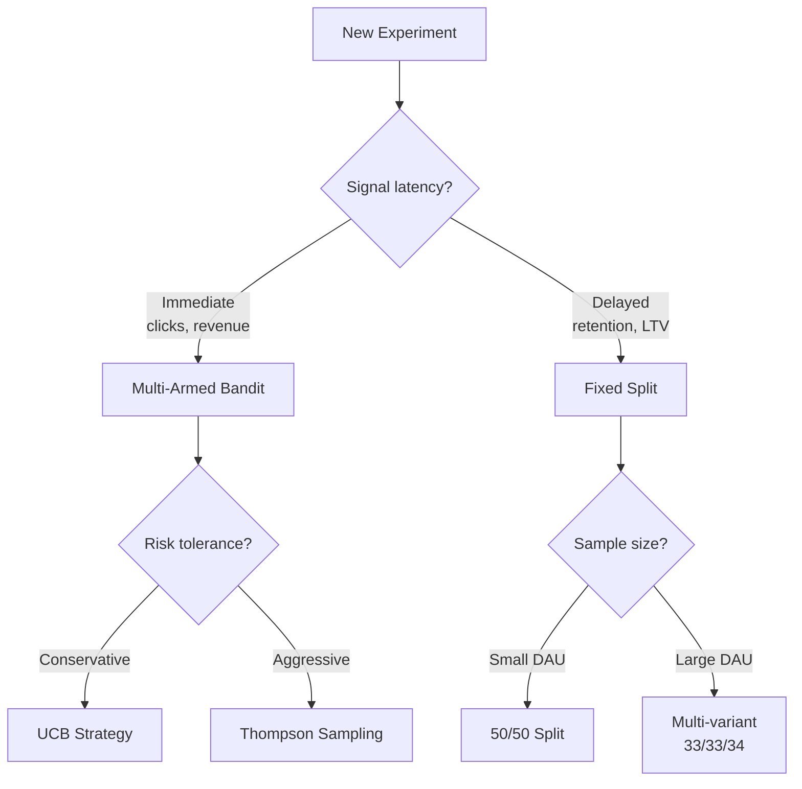
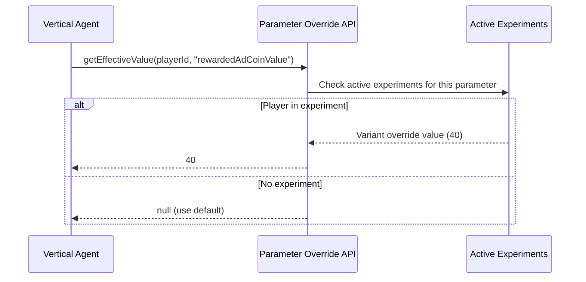

# AB Testing Vertical -- Interfaces

> **Owner:** AB Testing Agent
> **Version:** 1.0.0
> **Status:** Draft

---

## Overview

This document defines the API contracts for the AB Testing vertical. All cross-vertical communication uses the [GameEvent](../00_SharedInterfaces.md) pattern -- no direct method calls across boundaries.

---

## Experiment Definition API

Create, read, update, and lifecycle-manage experiments.

```typescript
interface ExperimentDefinitionAPI {
  /**
   * Create a new experiment from a hypothesis.
   * Validates: no parameter overlap with active experiments,
   * sample size is achievable, guardrails are defined.
   */
  createExperiment(request: CreateExperimentRequest): ExperimentId;

  /**
   * Retrieve an experiment by ID, including current status and metrics.
   */
  getExperiment(id: ExperimentId): Experiment;

  /**
   * List experiments filtered by status, vertical, or date range.
   */
  listExperiments(filter: ExperimentFilter): readonly Experiment[];

  /**
   * Transition an experiment through its lifecycle.
   * Valid transitions: Designed->Running, Running->Paused,
   * Paused->Running, Running->Concluded, Any->Cancelled.
   */
  transitionExperiment(id: ExperimentId, action: ExperimentAction): Experiment;
}

type ExperimentId = string;

interface CreateExperimentRequest {
  readonly hypothesis: HypothesisStatement;
  readonly targetVertical: VerticalId;
  readonly parameter: string;
  readonly metric: MetricId;
  readonly control: VariantConfig;
  readonly variants: readonly VariantConfig[];   // 1-3 treatment variants
  readonly allocationStrategy: AllocationStrategy;
  readonly guardrailMetrics: readonly GuardrailMetricConfig[];
  readonly maxDurationDays: number;              // 7-28
  readonly minimumDetectableEffect: number;      // e.g., 0.03 for 3%
  readonly segments?: readonly SegmentId[];      // Target segments (empty = all)
}

interface HypothesisStatement {
  readonly ifClause: string;       // "we change X from A to B"
  readonly thenClause: string;     // "metric Y improves by Z%"
  readonly becauseClause: string;  // "reasoning"
  readonly priorityScore: number;  // Weighted score (see Concepts_Hypothesis.md)
  readonly source: HypothesisSource;
}

type HypothesisSource =
  | 'analytics_anomaly'
  | 'prior_experiment'
  | 'domain_heuristic'
  | 'cross_game_learning'
  | 'agent_generated';

interface ExperimentFilter {
  readonly status?: ExperimentStatus;
  readonly targetVertical?: VerticalId;
  readonly createdAfter?: ISO8601;
  readonly createdBefore?: ISO8601;
  readonly parameter?: string;
}

type ExperimentAction =
  | { readonly type: 'start' }
  | { readonly type: 'pause'; readonly reason: string }
  | { readonly type: 'resume' }
  | { readonly type: 'conclude'; readonly winner: VariantId | 'control' | 'inconclusive' }
  | { readonly type: 'cancel'; readonly reason: string }
  | { readonly type: 'emergency_stop'; readonly guardrailBreached: MetricId };

type ExperimentStatus =
  | 'designed'
  | 'running'
  | 'paused'
  | 'concluded'
  | 'cancelled';
```

---

## Traffic Allocation API

Controls how players are assigned to experiment variants.

```typescript
interface TrafficAllocationAPI {
  /**
   * Get the variant assignment for a player in an experiment.
   * Assignment is sticky: same player always gets same variant.
   */
  getAssignment(
    experimentId: ExperimentId,
    playerId: string
  ): VariantAssignment;

  /**
   * Set the allocation strategy for an experiment.
   * Can switch from fixed to bandit mid-experiment.
   */
  setAllocationStrategy(
    experimentId: ExperimentId,
    strategy: AllocationStrategy
  ): void;

  /**
   * Get current traffic distribution across variants.
   */
  getAllocationState(experimentId: ExperimentId): AllocationState;

  /**
   * Update bandit allocation weights based on latest performance data.
   * Only valid for bandit-mode experiments.
   */
  updateBanditWeights(
    experimentId: ExperimentId,
    weights: readonly BanditWeight[]
  ): AllocationState;
}

type AllocationStrategy =
  | FixedSplitStrategy
  | ThompsonSamplingStrategy
  | UCBStrategy;

interface FixedSplitStrategy {
  readonly type: 'fixed_split';
  readonly weights: readonly number[];  // Must sum to 1.0
}

interface ThompsonSamplingStrategy {
  readonly type: 'thompson_sampling';
  readonly priorAlpha: number;          // Beta distribution alpha (default: 1)
  readonly priorBeta: number;           // Beta distribution beta (default: 1)
  readonly minExploration: number;      // Min traffic % per variant (e.g., 0.05)
  readonly updateIntervalMinutes: number;
}

interface UCBStrategy {
  readonly type: 'ucb';
  readonly explorationParam: number;    // Controls explore/exploit tradeoff
  readonly minExploration: number;
  readonly updateIntervalMinutes: number;
}

interface VariantAssignment {
  readonly experimentId: ExperimentId;
  readonly variantId: VariantId;
  readonly assignedAt: ISO8601;
  readonly isControl: boolean;
}

interface AllocationState {
  readonly experimentId: ExperimentId;
  readonly strategy: AllocationStrategy['type'];
  readonly currentWeights: readonly BanditWeight[];
  readonly totalAssigned: number;
  readonly perVariantCounts: Record<VariantId, number>;
}

interface BanditWeight {
  readonly variantId: VariantId;
  readonly weight: number;             // 0.0-1.0, all weights sum to 1.0
  readonly estimatedReward: number;    // Current reward estimate
  readonly confidence: number;         // Confidence interval width
}
```

### Allocation Strategy Selection



---

## Parameter Override API

Controls how experiments change live game parameters.

```typescript
interface ParameterOverrideAPI {
  /**
   * Get all active parameter overrides for a player.
   * Returns overrides from all experiments the player is enrolled in.
   * Verticals call this to get the effective parameter values.
   */
  getOverrides(playerId: string): readonly ParameterOverride[];

  /**
   * Get the effective value of a specific parameter for a player.
   * Returns the override value if the player is in an experiment,
   * otherwise returns null (caller uses default).
   */
  getEffectiveValue(
    playerId: string,
    parameter: string
  ): ParameterValue | null;

  /**
   * Register a parameter as testable. Each vertical calls this
   * during initialization to declare its tunable parameters.
   */
  registerParameter(definition: TestableParameter): void;

  /**
   * List all registered testable parameters, optionally filtered by vertical.
   */
  listParameters(vertical?: VerticalId): readonly TestableParameter[];
}

interface ParameterOverride {
  readonly experimentId: ExperimentId;
  readonly variantId: VariantId;
  readonly parameter: string;
  readonly value: ParameterValue;
  readonly vertical: VerticalId;
}

type ParameterValue = number | string | boolean | readonly number[];

interface TestableParameter {
  readonly vertical: VerticalId;
  readonly name: string;
  readonly type: 'float' | 'int' | 'string' | 'boolean' | 'float_array';
  readonly min?: number;
  readonly max?: number;
  readonly allowedValues?: readonly ParameterValue[];
  readonly defaultValue: ParameterValue;
  readonly description: string;
  readonly sensitivity: 'low' | 'medium' | 'high';  // High = needs smaller MDE
}

type VerticalId =
  | '01_UI'
  | '02_CoreMechanics'
  | '03_Monetization'
  | '04_Economy'
  | '05_Difficulty'
  | '06_LiveOps';
```

### Override Resolution Flow



---

## Results Analysis API

Statistical analysis of experiment outcomes.

```typescript
interface ResultsAnalysisAPI {
  /**
   * Get the current statistical summary for a running or concluded experiment.
   */
  getResults(experimentId: ExperimentId): ExperimentResult;

  /**
   * Run an interim analysis without concluding the experiment.
   * Uses sequential testing to control false positive rate.
   */
  runInterimAnalysis(experimentId: ExperimentId): InterimAnalysis;

  /**
   * Get the minimum sample size required for an experiment
   * given the desired MDE, significance, and power.
   */
  calculateSampleSize(request: SampleSizeRequest): SampleSizeResult;

  /**
   * Compare two specific variants with full statistical detail.
   */
  compareVariants(
    experimentId: ExperimentId,
    variantA: VariantId,
    variantB: VariantId,
    metric: MetricId
  ): VariantComparison;
}

interface SampleSizeRequest {
  readonly baselineRate: number;          // Current metric value
  readonly minimumDetectableEffect: number; // Relative improvement
  readonly significance: number;          // Default: 0.05
  readonly power: number;                 // Default: 0.80
  readonly variants: number;             // Number of variants (including control)
  readonly metric: MetricType;
}

type MetricType = 'binary' | 'continuous' | 'revenue';

interface SampleSizeResult {
  readonly perVariant: number;
  readonly total: number;
  readonly estimatedDays: number;         // Based on current DAU
  readonly assumptions: string;
}

interface InterimAnalysis {
  readonly experimentId: ExperimentId;
  readonly analyzedAt: ISO8601;
  readonly sampleSizes: Record<VariantId, number>;
  readonly primaryMetric: MetricAnalysis;
  readonly guardrailMetrics: readonly GuardrailAnalysis[];
  readonly recommendation: 'continue' | 'stop_winner' | 'stop_guardrail' | 'stop_futility';
  readonly alphaSpent: number;            // Cumulative alpha from sequential testing
}

interface VariantComparison {
  readonly metricId: MetricId;
  readonly variantA: { id: VariantId; mean: number; stdDev: number; n: number };
  readonly variantB: { id: VariantId; mean: number; stdDev: number; n: number };
  readonly absoluteDifference: number;
  readonly relativeDifference: number;
  readonly confidenceInterval: { lower: number; upper: number };
  readonly pValue: number;
  readonly isSignificant: boolean;
  readonly effectSize: number;            // Cohen's d
}
```

---

## Guardrail Monitoring API

Continuous monitoring to prevent experiments from harming the game.

```typescript
interface GuardrailMonitoringAPI {
  /**
   * Check all guardrail metrics for an experiment.
   * Returns violations if any metric exceeds its threshold.
   */
  checkGuardrails(experimentId: ExperimentId): GuardrailCheckResult;

  /**
   * Set guardrail configuration for an experiment.
   */
  setGuardrails(
    experimentId: ExperimentId,
    guardrails: readonly GuardrailMetricConfig[]
  ): void;

  /**
   * Get the default guardrail configuration applied to all experiments.
   */
  getDefaultGuardrails(): readonly GuardrailMetricConfig[];

  /**
   * Subscribe to guardrail violation events.
   */
  readonly events: {
    onGuardrailViolation: GameEvent<GuardrailViolationPayload>;
    onGuardrailWarning: GameEvent<GuardrailWarningPayload>;
  };
}

interface GuardrailMetricConfig {
  readonly metricId: MetricId;
  readonly maxDegradation: number;        // Max acceptable drop (absolute or relative)
  readonly degradationType: 'absolute' | 'relative';
  readonly warningThreshold: number;      // Trigger warning at this % of max
  readonly action: 'warn' | 'pause' | 'stop';
}

interface GuardrailCheckResult {
  readonly experimentId: ExperimentId;
  readonly checkedAt: ISO8601;
  readonly passed: boolean;
  readonly metrics: readonly GuardrailMetricResult[];
}

interface GuardrailMetricResult {
  readonly metricId: MetricId;
  readonly controlValue: number;
  readonly variantValues: Record<VariantId, number>;
  readonly worstDegradation: number;
  readonly status: 'ok' | 'warning' | 'violated';
}

interface GuardrailViolationPayload {
  readonly experimentId: ExperimentId;
  readonly metricId: MetricId;
  readonly variantId: VariantId;
  readonly degradation: number;
  readonly threshold: number;
  readonly actionTaken: 'paused' | 'stopped';
}

interface GuardrailWarningPayload {
  readonly experimentId: ExperimentId;
  readonly metricId: MetricId;
  readonly variantId: VariantId;
  readonly degradation: number;
  readonly warningThreshold: number;
}
```

---

## Hypothesis Queue Management

Manage the prioritized queue of hypotheses awaiting experimentation.

```typescript
interface HypothesisQueueAPI {
  /**
   * Add a new hypothesis to the queue.
   * Auto-scored by impact x confidence x ease / risk.
   */
  enqueue(hypothesis: HypothesisStatement): HypothesisId;

  /**
   * Get the next N highest-priority hypotheses.
   */
  peek(count: number): readonly QueuedHypothesis[];

  /**
   * Remove a hypothesis from the queue (e.g., already tested or invalidated).
   */
  dequeue(id: HypothesisId): void;

  /**
   * Re-score all hypotheses based on updated analytics data.
   */
  rescoreAll(): void;

  /**
   * Get queue depth and health metrics.
   */
  getQueueStats(): QueueStats;
}

type HypothesisId = string;

interface QueuedHypothesis {
  readonly id: HypothesisId;
  readonly hypothesis: HypothesisStatement;
  readonly priorityScore: number;
  readonly enqueuedAt: ISO8601;
  readonly estimatedSampleSize: number;
  readonly estimatedDurationDays: number;
  readonly relatedExperiments: readonly ExperimentId[];  // Prior experiments on same parameter
}

interface QueueStats {
  readonly depth: number;
  readonly avgPriorityScore: number;
  readonly oldestHypothesisAge: DurationSeconds;
  readonly hypothesesByVertical: Record<VerticalId, number>;
  readonly hypothesesBySource: Record<HypothesisSource, number>;
}
```

---

## Analytics Event Stream Integration

The AB Testing Agent emits and consumes events through the standard [Analytics Event Contract](../00_SharedInterfaces.md).

### Events Emitted

```typescript
// Emitted when a player is assigned to a variant
interface ExperimentAssignedEvent {
  readonly name: 'experiment_assigned';
  readonly properties: {
    readonly experiment_id: string;
    readonly variant_id: string;
    readonly is_control: boolean;
    readonly allocation_strategy: AllocationStrategy['type'];
  };
}

// Emitted when a player is first exposed to the variant treatment
interface ExperimentExposedEvent {
  readonly name: 'experiment_exposed';
  readonly properties: {
    readonly experiment_id: string;
    readonly variant_id: string;
    readonly parameter: string;
    readonly value: ParameterValue;
  };
}

// Emitted when an experiment concludes
interface ExperimentConcludedEvent {
  readonly name: 'experiment_concluded';
  readonly properties: {
    readonly experiment_id: string;
    readonly outcome: 'won' | 'lost' | 'inconclusive' | 'stopped';
    readonly winning_variant?: string;
    readonly effect_size?: number;
    readonly p_value?: number;
  };
}
```

### Events Consumed

| Event | Purpose |
|-------|---------|
| All `StandardEvents` | Measure experiment outcomes |
| `level_complete` | Difficulty and mechanics experiments |
| `currency_earn`, `currency_spend` | Economy experiments |
| `ad_watched`, `iap_completed` | Monetization experiments |
| `screen_view`, `button_tap` | UI experiments |
| `event_entered`, `event_completed` | LiveOps experiments |

---

## Related Documents

- [Spec](Spec.md) -- Vertical specification
- [Data Models](DataModels.md) -- Schema definitions
- [Agent Responsibilities](AgentResponsibilities.md) -- Decision authority
- [Feedback Loop](FeedbackLoop.md) -- The test-analyze-allocate-iterate cycle
- [Shared Interfaces](../00_SharedInterfaces.md) -- Cross-vertical contracts
- [Concepts: Hypothesis](../../SemanticDictionary/Concepts_Hypothesis.md) -- Hypothesis lifecycle
