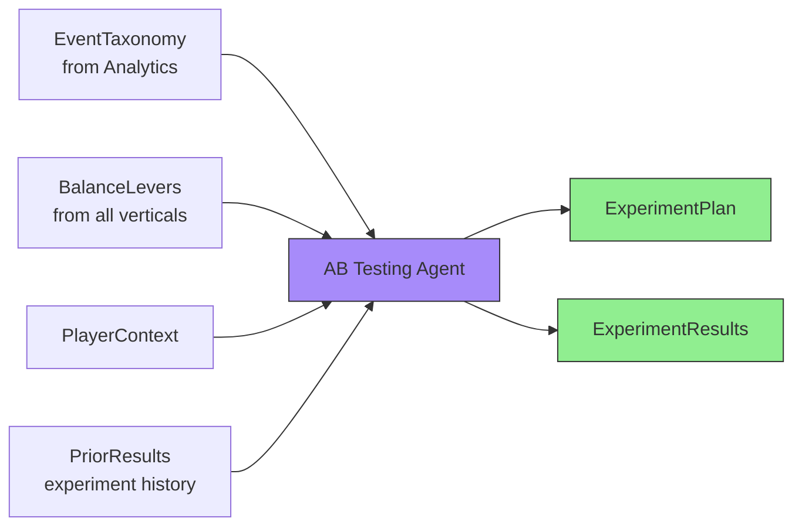
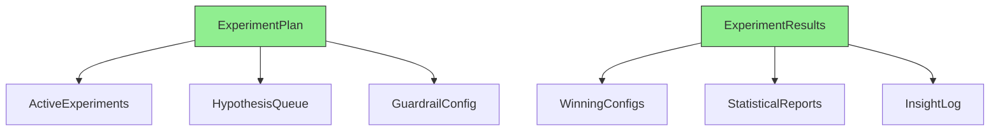
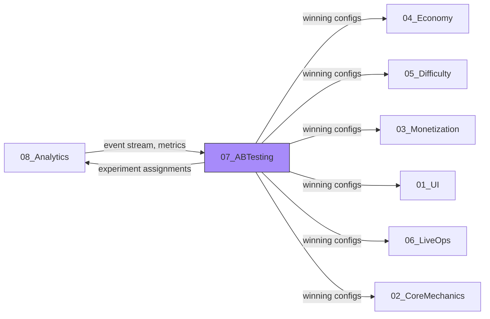
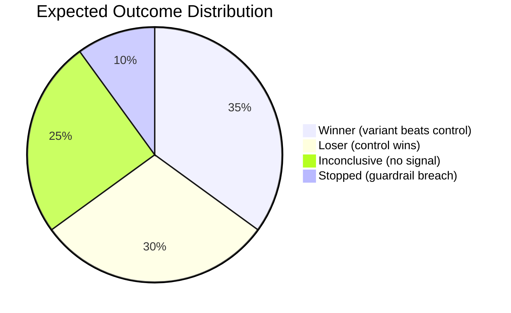
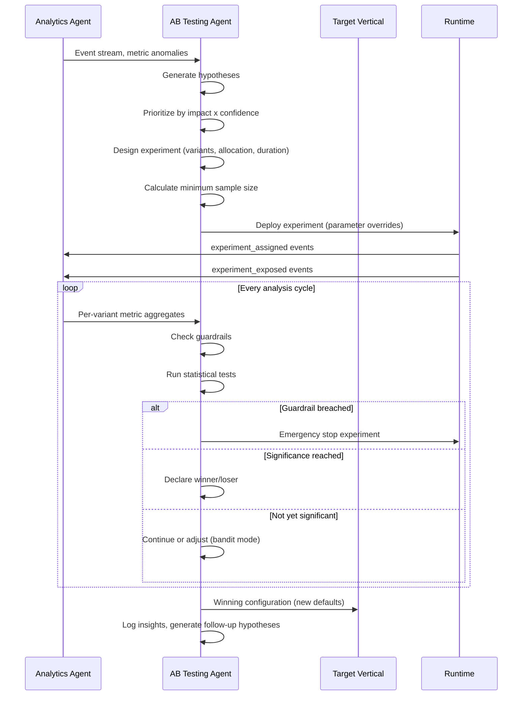
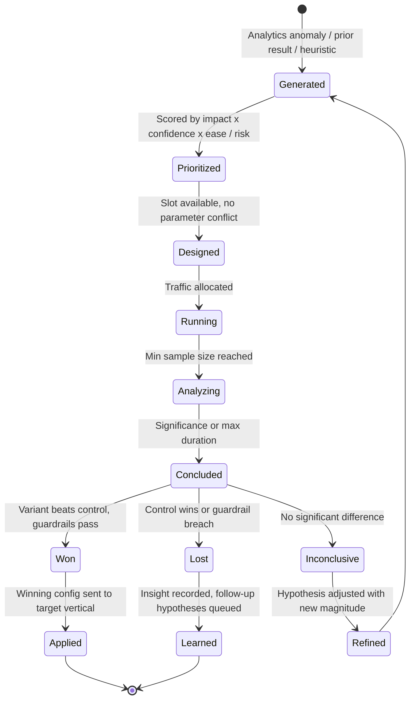
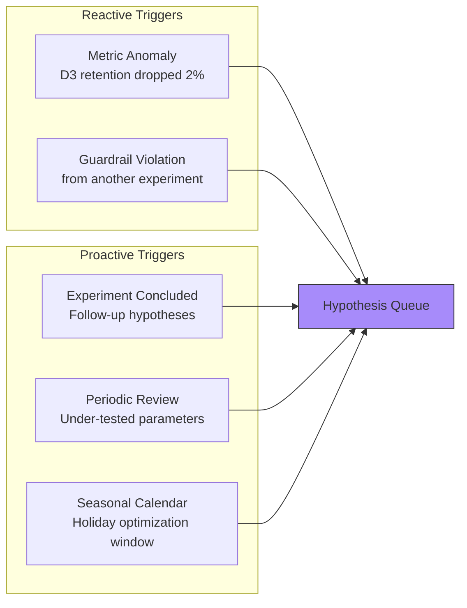
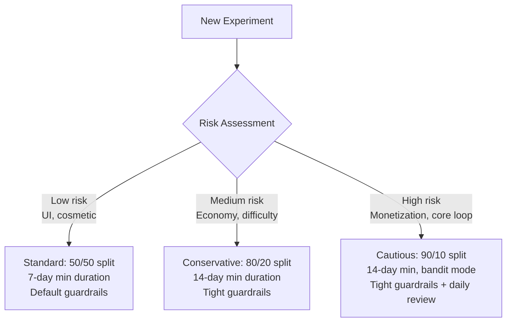

# AB Testing Vertical -- Specification

> **Owner:** AB Testing Agent
> **Version:** 1.0.0
> **Status:** Draft

---

## Purpose

Continuously optimize all game parameters through systematic experimentation. The AB Testing Agent generates hypotheses from analytics data, designs experiments, allocates traffic, performs statistical analysis, and feeds winning configurations back to every other vertical. Everything in the game is testable -- economy balancing, difficulty curves, ad placements, UI layouts, LiveOps cadence.

---

## Scope

| In Scope | Out of Scope |
|----------|-------------|
| Hypothesis generation from analytics data | Manual experiment definition by designers |
| Experiment design (variants, allocation, duration) | Feature flag infrastructure (runtime concern) |
| Traffic allocation (fixed split and multi-armed bandit) | Player identity / device fingerprinting |
| Statistical significance testing | Data warehouse implementation |
| Guardrail metric monitoring | Metric collection (owned by [Analytics](../08_Analytics/)) |
| Multi-armed bandit optimization | A/A test infrastructure validation |
| Winning configuration propagation | Parameter deployment to production (CI/CD concern) |
| Experiment velocity tracking | Long-term holdout group management |
| Diminishing returns detection | Cross-game experiment transfer |

---

## Inputs



### EventTaxonomy (from Analytics)

The full event stream and metric definitions used to measure experiment outcomes. See [SharedInterfaces.md](../00_SharedInterfaces.md) for the `AnalyticsEvent` and `StandardEvents` contracts.

| Field | Type | Description |
|-------|------|-------------|
| `events` | `StandardEvents` | All trackable events across verticals |
| `metrics` | `MetricDefinition[]` | Computed metrics (retention, ARPDAU, conversion) |
| `segments` | `SegmentDefinition[]` | Player segments for targeted experiments |
| `funnels` | `FunnelDefinition[]` | Conversion funnels to measure |

### BalanceLevers (from all verticals)

Every tunable parameter across the game, exposed by each vertical for experimentation.

| Source Vertical | Example Parameters |
|----------------|-------------------|
| [Economy](../04_Economy/) | `dailyLoginReward`, `sinkMultiplier`, `inflationRate` |
| [Difficulty](../05_Difficulty/) | `difficultySlope`, `failSafetyNet`, `bossHealthMultiplier` |
| [Monetization](../03_Monetization/) | `rewardedAdCoinValue`, `interstitialFrequency`, `starterBundlePrice` |
| [UI](../01_UI/) | `shopButtonPosition`, `currencyBarAnimation`, `tutorialLength` |
| [LiveOps](../06_LiveOps/) | `eventFrequencyDays`, `milestoneCount`, `eventRewardBudget` |
| [Core Mechanics](../02_CoreMechanics/) | `moveSpeed`, `spawnRate`, `comboMultiplier` |

### PlayerContext (from Shared Interfaces)

Real-time player data for segment-targeted experiments. See [SharedInterfaces.md](../00_SharedInterfaces.md) for the full `PlayerContext` schema.

### PriorResults (internal)

Historical experiment outcomes used to generate new hypotheses and avoid re-testing known results.

---

## Outputs

The AB Testing Agent produces two primary artifacts: `ExperimentPlan` (active experiments) and `ExperimentResults` (concluded experiments with winners). See [DataModels.md](DataModels.md) for the complete schemas.



### ExperimentPlan Components

| Component | Description | Consumed By |
|-----------|-------------|-------------|
| `activeExperiments` | Currently running experiments with traffic allocation | All verticals (parameter overrides) |
| `hypothesisQueue` | Prioritized list of hypotheses awaiting execution | Internal (scheduling) |
| `guardrailConfig` | Metrics that must not degrade during any experiment | Internal (monitoring) |

### ExperimentResults Components

| Component | Description | Consumed By |
|-----------|-------------|-------------|
| `winningConfigs` | Parameter values from winning variants | Target vertical (new defaults) |
| `statisticalReports` | Full statistical analysis per experiment | Analytics (dashboards) |
| `insightLog` | Learnings from lost and inconclusive experiments | Internal (hypothesis generation) |

---

## Dependencies



| Dependency | Direction | What Flows |
|------------|-----------|------------|
| Analytics | Bidirectional | Analytics provides event stream and metrics; AB Testing provides experiment assignments |
| Economy | Outbound | AB Testing sends winning economy parameters |
| Difficulty | Outbound | AB Testing sends winning difficulty parameters |
| Monetization | Outbound | AB Testing sends winning monetization parameters |
| UI | Outbound | AB Testing sends winning UI parameters |
| LiveOps | Outbound | AB Testing sends winning LiveOps parameters |
| Core Mechanics | Outbound | AB Testing sends winning mechanics parameters |

---

## Constraints

### Statistical Rigor (Hard Rules)

| Constraint | Value | Rationale |
|------------|-------|-----------|
| Significance threshold | p < 0.05 | Industry standard for declaring winners |
| Minimum detectable effect (MDE) | Varies by metric, typically 2-5% | Avoids underpowered tests |
| Minimum sample size per variant | Calculated per experiment | Ensures adequate statistical power (80%+) |
| Sticky assignment | Player sees same variant for entire experiment | Prevents contamination |
| No peeking penalty | Sequential testing with alpha spending | Prevents false positives from early stops |

### Guardrail Metrics

Every experiment must monitor guardrail metrics that must not degrade beyond acceptable thresholds:

| Guardrail | Max Degradation | Applies To |
|-----------|----------------|------------|
| D1 retention | -1% absolute | All experiments |
| D7 retention | -0.5% absolute | All experiments |
| ARPDAU | -5% relative | Non-monetization experiments |
| Crash rate | +0.1% absolute | All experiments |
| Session length | -10% relative | All experiments |
| Payer conversion | -2% relative | Non-monetization experiments |

### Operational

| Constraint | Limit | Rationale |
|------------|-------|-----------|
| Max concurrent experiments | 5 | Prevents interaction effects |
| Max traffic in experiments | 30% of DAU | Protects baseline experience |
| Min experiment duration | 7 days | Captures weekly cycle effects |
| Max experiment duration | 28 days | Prevents indefinite resource lock |
| Experiment overlap check | Mandatory | No two experiments can modify the same parameter |

---

## Success Criteria

| Metric | Target | Measurement |
|--------|--------|-------------|
| Experiment velocity | > 3 experiments/week concluded | Concluded experiments / calendar weeks |
| Win rate | 30-40% of experiments | Winners / total concluded |
| Guardrail violations | 0 | Experiments stopped due to guardrail breach |
| Statistical power | > 80% per experiment | Pre-experiment power calculation |
| Time-to-conclusion | < 14 days median | Days from launch to statistical significance |
| Improvement magnitude | Measurable lift in target metric | Per-experiment effect size |
| Hypothesis queue depth | > 10 hypotheses at all times | Queued hypotheses count |
| Bandit convergence time | < 7 days for monetization tests | Days to 95% traffic on best variant |

### Experiment Outcome Distribution



---

## Agent Workflow



---

## Hypothesis Lifecycle

The AB Testing Agent follows the hypothesis lifecycle defined in [Concepts_Hypothesis.md](../../SemanticDictionary/Concepts_Hypothesis.md):



Each concluded experiment feeds back into hypothesis generation, creating a continuous optimization loop. See [FeedbackLoop.md](FeedbackLoop.md) for the complete cycle.

---

## Hypothesis Sources

The AB Testing Agent generates hypotheses from five data channels. Each source has different confidence and typical impact profiles:

| Source | Confidence | Typical Impact | Volume |
|--------|-----------|---------------|--------|
| Analytics anomalies | High (data-backed) | Medium-High | Reactive (event-driven) |
| Prior experiment results | High (empirical) | Medium | Continuous (after each experiment) |
| Domain heuristics | Medium (theory-based) | Variable | Batch (periodic review) |
| Cross-game learnings | Medium (transferable) | Medium-High | Periodic (new game data) |
| Seasonal patterns | Low-Medium (contextual) | Low-Medium | Seasonal (calendar-driven) |

### Hypothesis Generation Triggers



---

## Experiment Types

Different game areas call for different experimentation approaches:

### By Vertical

| Vertical | Typical Experiments | Metric Latency | Preferred Strategy |
|----------|-------------------|----------------|-------------------|
| [Economy](../04_Economy/) | Reward values, sink rates, inflation | Days (retention) | Fixed split |
| [Difficulty](../05_Difficulty/) | Curve shape, fail safety nets, boss tuning | Days (retention, completion) | Fixed split |
| [Monetization](../03_Monetization/) | Ad rewards, price points, offer timing | Hours (conversion, revenue) | Thompson Sampling |
| [UI](../01_UI/) | Button placement, flow changes, animations | Hours (click rates) | UCB |
| [LiveOps](../06_LiveOps/) | Event frequency, milestone count, rewards | Days (engagement) | Fixed split |
| [Core Mechanics](../02_CoreMechanics/) | Speed, spawn rates, combo multipliers | Days (session length) | Fixed split |

### By Risk Level



---

## Concurrency Management

Running multiple experiments simultaneously requires careful management to avoid interaction effects.

### Experiment Slot Allocation

| Priority | Slot Budget | Example |
|----------|------------|---------|
| Critical (revenue/retention) | 2 slots reserved | Monetization price test, retention experiment |
| Standard (optimization) | 2 slots | UI improvements, difficulty tuning |
| Exploratory (low confidence) | 1 slot | Novel hypotheses, cross-game ports |

### Interaction Detection

Before launching any experiment, the agent validates:

1. **Parameter exclusivity:** No two running experiments modify the same parameter
2. **Metric independence:** Primary metrics of running experiments don't share confounders
3. **Segment separation:** Targeted experiments don't overlap on player segments
4. **Traffic budget:** Total traffic in experiments stays under 30% of DAU

```typescript
interface InteractionCheck {
  readonly canLaunch: boolean;
  readonly conflicts: readonly {
    readonly existingExperimentId: ExperimentId;
    readonly conflictType: 'parameter_overlap' | 'metric_confound' | 'segment_overlap' | 'traffic_exceeded';
    readonly description: string;
  }[];
}
```

---

## Related Documents

- [Interfaces](Interfaces.md) -- API contracts
- [Data Models](DataModels.md) -- Schema definitions
- [Agent Responsibilities](AgentResponsibilities.md) -- Decision authority
- [Feedback Loop](FeedbackLoop.md) -- The test-analyze-allocate-iterate cycle
- [Shared Interfaces](../00_SharedInterfaces.md) -- `AnalyticsEvent`, `PlayerContext` contracts
- [Concepts: Hypothesis](../../SemanticDictionary/Concepts_Hypothesis.md) -- Hypothesis lifecycle
- [Glossary](../../SemanticDictionary/Glossary.md) -- Term definitions
- [Metrics Dictionary](../../SemanticDictionary/MetricsDictionary.md) -- KPI formulas
