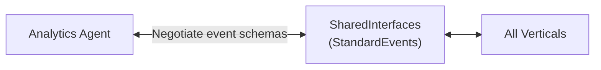
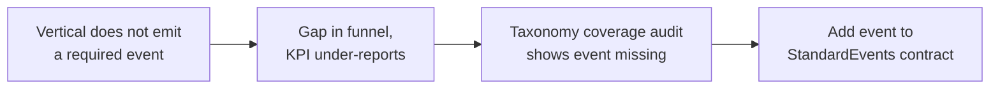
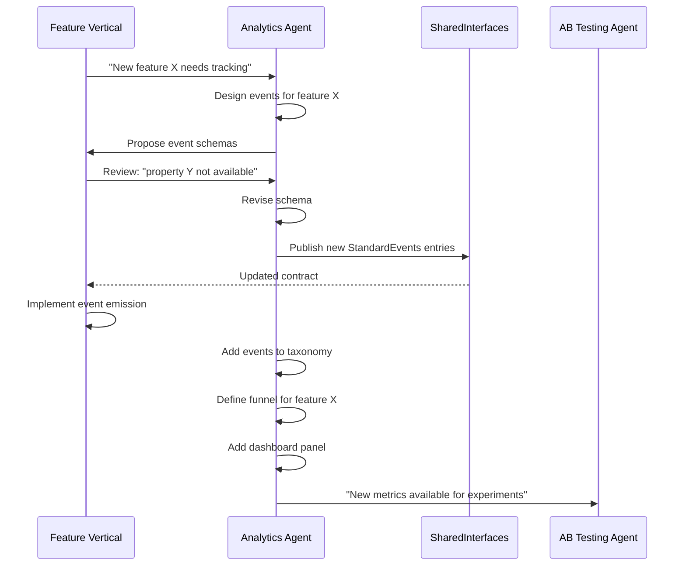

# Analytics Agent Responsibilities

Defines what the Analytics Agent decides autonomously, what it coordinates with other agents, the quality criteria for its outputs, and its known failure modes.

> **Spec:** [Spec.md](./Spec.md)
> **Interfaces:** [Interfaces.md](./Interfaces.md)
> **Data Models:** [DataModels.md](./DataModels.md)
> **Dashboards:** [KPIDashboards.md](./KPIDashboards.md)

---

## Responsibility Matrix

```mermaid
graph TB
    subgraph Autonomous["Autonomous Decisions"]
        TAX["Event Taxonomy Design"]
        FUN["Funnel Selection & Definition"]
        DASH["Dashboard Layout & Panels"]
        ALERT["Alert Thresholds & Rules"]
        BATCH["Batching Strategy"]
        QUEUE["Offline Queue Policy"]
        PRIV["Privacy Scrubbing Rules"]
        SAMP["Event Sampling Rates"]
    end

    subgraph Coordinated["Coordinated Decisions"]
        EVT["Event Names & Payloads<br/>(with all verticals)"]
        SEG["Segment Definitions<br/>(with Economy)"]
        KPI["KPI Target Values<br/>(with AB Testing)"]
        EXP["Experiment Metrics<br/>(with AB Testing)"]
        LIVE["Event Tracking Hooks<br/>(with LiveOps)"]
    end

    subgraph ReadOnly["Read-Only Inputs"]
        SE["StandardEvents<br/>(SharedInterfaces)"]
        MD["MetricsDictionary"]
        PC["PlayerContext"]
    end

    SE --> TAX
    MD --> DASH
    MD --> ALERT
    PC --> SEG
```



---

## Autonomous Decisions

The Analytics Agent makes these decisions without requiring approval from other agents. It owns the output and is accountable for quality.

### 1. Event Taxonomy Design

| Aspect | Detail |
|--------|--------|
| **What** | The full catalog of trackable events beyond `StandardEvents` |
| **Why** | Analytics needs session lifecycle, funnel, engagement, and system events that no other vertical owns |
| **Constraint** | Must include all `StandardEvents` from [SharedInterfaces](../00_SharedInterfaces.md) as-is; cannot rename or restructure them |
| **Output** | `EventTaxonomy` schema in [DataModels.md](./DataModels.md) |

**Decision criteria:**
- Every player action that could influence a KPI must map to at least one event
- Events must be atomic (one action = one event, not compound)
- Property schemas must be strict enough to validate but flexible enough for future extensions
- Sampling rates must balance data completeness with battery/network cost

### 2. Funnel Selection and Definition

| Aspect | Detail |
|--------|--------|
| **What** | Which player journeys to track as funnels, step sequences, expected conversion rates |
| **Why** | Funnels are the primary diagnostic tool for identifying where players get stuck or churn |
| **Constraint** | Steps must reference events in the taxonomy; cross-session funnels need clear identity stitching |
| **Output** | `FunnelDefinition` instances in [DataModels.md](./DataModels.md) |

**Decision criteria:**
- Every critical player journey must have a funnel (onboarding, first purchase, ad engagement, event participation, retention)
- Expected conversion rates must be based on industry benchmarks from [MetricsDictionary](../../SemanticDictionary/MetricsDictionary.md)
- Funnels must have alert thresholds so regressions are caught automatically

### 3. Dashboard Layout and Panels

| Aspect | Detail |
|--------|--------|
| **What** | Which dashboards exist, what panels each contains, chart types, metric bindings |
| **Why** | Dashboards are the primary consumption surface for all computed analytics |
| **Constraint** | Must cover Executive, Engagement, Monetization, and LiveOps perspectives |
| **Output** | `DashboardConfig` instances in [KPIDashboards.md](./KPIDashboards.md) |

**Decision criteria:**
- Executive dashboard must answer "is the game healthy?" in under 10 seconds
- Detail dashboards must enable drill-down from any Executive panel
- Every panel must reference a metric from [MetricsDictionary](../../SemanticDictionary/MetricsDictionary.md)
- Refresh cadence must match the metric's natural frequency (DAU = daily, revenue = hourly)

### 4. Alert Thresholds and Rules

| Aspect | Detail |
|--------|--------|
| **What** | Which metrics get alerts, threshold values, anomaly detection parameters, notification routing |
| **Why** | Alerts catch KPI regressions before they compound into multi-day losses |
| **Constraint** | Must not produce more than 2-3 actionable alerts per day under normal conditions |
| **Output** | `AlertConfig` instances in [DataModels.md](./DataModels.md) |

**Decision criteria:**
- Critical alerts: DAU drop, D1 retention drop, crash rate spike
- Warning alerts: ARPDAU drop, funnel conversion drops, session length anomalies
- Info alerts: event participation dips, ad fill rate dips
- Signal-to-noise: every alert that fires must be actionable; noisy alerts are worse than no alerts

### 5. Batching and Offline Queue Strategy

| Aspect | Detail |
|--------|--------|
| **What** | Batch interval, max batch size, queue limits, retry policy |
| **Why** | Batching is the balance between data freshness and mobile resource consumption |
| **Constraint** | 60s interval, < 10 KB gzipped, max 1000 events in offline queue |
| **Output** | Batch assembler and offline queue configuration in [Spec.md](./Spec.md) |

### 6. Privacy Scrubbing Rules

| Aspect | Detail |
|--------|--------|
| **What** | Which fields are scrubbed, how player IDs are hashed, consent gating logic |
| **Why** | GDPR/CCPA compliance is non-negotiable; a single PII leak can be catastrophic |
| **Constraint** | No PII in any event payload, ever |
| **Output** | Privacy compliance rules in [Spec.md](./Spec.md) |

### 7. Event Sampling Rates

| Aspect | Detail |
|--------|--------|
| **What** | Per-event sampling rates (what fraction of occurrences are actually tracked) |
| **Why** | High-frequency events (button_tap, screen_view) can overwhelm batch budgets |
| **Constraint** | Critical events (iap_completed, level_complete) must always be 1.0 (100%) |
| **Output** | `sampleRate` field in each `EventDefinition` |

---

## Coordinated Decisions

These decisions require agreement between the Analytics Agent and one or more other agents. No single agent can unilaterally change these.

### Event Names and Payloads (with All Verticals)



| Aspect | Detail |
|--------|--------|
| **What** | The `StandardEvents` contract: event names, property schemas, required fields |
| **Coordination partner** | All verticals (01-07, 09) |
| **Process** | Analytics proposes event schemas -> verticals review for feasibility -> consensus -> publish to [SharedInterfaces](../00_SharedInterfaces.md) |
| **Conflict resolution** | Analytics has final say on naming conventions and schema structure; verticals have final say on what data is available from their systems |

### Segment Definitions (with Economy Agent)

| Aspect | Detail |
|--------|--------|
| **What** | Player segment boundaries (when does a 'minnow' become a 'dolphin'?) |
| **Coordination partner** | Economy Agent (04) |
| **Process** | Economy defines spending thresholds -> Analytics validates that segment distribution enables meaningful cohort analysis -> iterate |
| **Constraint** | Segments must produce cohorts large enough for statistical significance in AB tests |

### KPI Target Values (with AB Testing)

| Aspect | Detail |
|--------|--------|
| **What** | Target values for KPIs used as experiment success criteria |
| **Coordination partner** | AB Testing Agent (07) |
| **Process** | Analytics provides historical baselines -> AB Testing defines minimum detectable effects -> targets set collaboratively |
| **Constraint** | Targets must align with [MetricsDictionary](../../SemanticDictionary/MetricsDictionary.md) benchmarks |

### Experiment Metric Feeds (with AB Testing)

| Aspect | Detail |
|--------|--------|
| **What** | Which computed metrics are sent to AB Testing, at what latency, with what granularity |
| **Coordination partner** | AB Testing Agent (07) |
| **Process** | AB Testing specifies required metrics per experiment -> Analytics configures aggregation pipelines -> data flows within 5 minutes of batch ingestion |

### Event Tracking Hooks (with LiveOps)

| Aspect | Detail |
|--------|--------|
| **What** | How LiveOps events (seasonal, challenge, limited_offer) are tracked and attributed |
| **Coordination partner** | LiveOps Agent (06) |
| **Process** | LiveOps defines event types and milestones -> Analytics maps them to funnel steps and dashboard panels |

---

## Quality Criteria

### Event Coverage

| Criterion | Target | Measurement |
|-----------|--------|-------------|
| StandardEvents coverage | 100% | Every event in `StandardEvents` has a matching taxonomy entry |
| Player action coverage | > 95% | Audit: map every screen interaction to an event |
| Property completeness | 100% required fields | No event sent with missing required properties |
| Taxonomy consistency | Zero name collisions | Automated check on taxonomy registration |

### Dashboard Actionability

| Criterion | Target | Measurement |
|-----------|--------|-------------|
| Time to insight | < 10 seconds | User can answer "is the game healthy?" from Executive dashboard |
| Drill-down completeness | Every Executive panel links to a detail panel | Navigation test |
| Metric accuracy | Within 1% of raw data | Compare dashboard values to direct SQL queries |
| Refresh reliability | > 99.9% uptime | Dashboard availability monitoring |
| Filter coverage | Date, segment, platform on every dashboard | Schema validation |

### Alert Signal-to-Noise

| Criterion | Target | Measurement |
|-----------|--------|-------------|
| Actionable alert rate | > 80% | Alerts that led to investigation / Alerts fired |
| False positive rate | < 10% | Alerts that resolved without action / Alerts fired |
| Mean time to fire | < 5 minutes after condition met | Alert latency test |
| Alert coverage | All critical KPIs monitored | Audit against MetricsDictionary critical metrics |
| Notification delivery | > 99% | Channel delivery confirmation |

### Data Quality

| Criterion | Target | Measurement |
|-----------|--------|-------------|
| Event delivery rate | > 99.5% (online) | Events sent / events emitted |
| Offline queue recovery | > 99% | Events drained / events queued |
| Batch integrity | Zero corrupted batches | Server-side validation |
| Timestamp accuracy | Within 1 second of actual | Clock synchronization check |
| PII compliance | Zero PII fields in any batch | Automated PII scanner |

---

## Failure Modes

### 1. Missing Events



| Aspect | Detail |
|--------|--------|
| **Cause** | A vertical forgets to emit an event, or a new feature ships without analytics instrumentation |
| **Symptom** | Funnel shows 0% conversion at a step; KPI aggregation under-reports |
| **Detection** | Automated coverage audit compares taxonomy to actual event volume; zero-volume events flagged |
| **Prevention** | Every vertical's spec must reference which `StandardEvents` it emits; CI check validates |
| **Recovery** | Add missing event emission; backfill from server logs if possible |

### 2. Noisy Alerts

| Aspect | Detail |
|--------|--------|
| **Cause** | Alert thresholds too sensitive, anomaly baselines too short, or natural variance not accounted for |
| **Symptom** | More than 5 alerts per day; team starts ignoring notifications |
| **Detection** | Alert signal-to-noise ratio drops below 80% actionable |
| **Prevention** | Require 24h+ evaluation windows for daily metrics; 48h+ for weekly metrics; tune anomaly baselines to 30+ days |
| **Recovery** | Increase evaluation windows; raise deviation thresholds; mute known-noisy alerts and reclassify severity |

### 3. Stale Dashboards

| Aspect | Detail |
|--------|--------|
| **Cause** | Aggregation pipeline fails, refresh job crashes, or server-side ingestion lag |
| **Symptom** | Dashboard shows data from hours/days ago; "last updated" timestamp is stale |
| **Detection** | Dashboard freshness monitor: alert if any panel's data is older than 2x its refresh cadence |
| **Prevention** | Redundant aggregation pipelines; retry logic on refresh jobs; health check on ingestion endpoint |
| **Recovery** | Restart failed pipeline; re-process events from store; manual refresh |

### 4. Batch Delivery Failure

| Aspect | Detail |
|--------|--------|
| **Cause** | Network timeout, server 5xx, or batch exceeds size limit |
| **Symptom** | Events accumulate in offline queue; dashboards show data gap |
| **Detection** | `pendingEventCount()` exceeds threshold; `onEventDropped` fires with `queue_overflow` |
| **Prevention** | Exponential backoff retry; batch splitting when size exceeded; offline queue with 1000-event cap |
| **Recovery** | Queue drains automatically on reconnect; split oversized batches; oldest events dropped FIFO if queue overflows |

### 5. Schema Drift

| Aspect | Detail |
|--------|--------|
| **Cause** | A vertical changes event properties without updating the taxonomy |
| **Symptom** | Events fail validation and are dropped; funnel steps stop matching |
| **Detection** | `onEventDropped` fires with `schema_mismatch`; event drop rate spikes |
| **Prevention** | Taxonomy versioning; verticals must update SharedInterfaces before changing payloads |
| **Recovery** | Update taxonomy to match new schema; re-validate recent events; publish updated taxonomy version |

### 6. Privacy Leak

| Aspect | Detail |
|--------|--------|
| **Cause** | A vertical includes PII (email, raw device ID, IP) in event properties |
| **Symptom** | PII scanner flags events in server-side ingestion |
| **Detection** | Automated PII regex scanner on every batch at ingestion; pattern matching for emails, IPs, device IDs |
| **Prevention** | Client-side PII scrubber removes known patterns before batch assembly; taxonomy marks `piiRisk: 'high'` events for extra scrubbing |
| **Recovery** | Purge affected events from store; notify compliance team; patch the emitting vertical |

---

## Decision Authority Summary

| Decision | Analytics Agent | Other Agent | SharedInterfaces |
|----------|:--------------:|:-----------:|:----------------:|
| Event taxonomy (Analytics-owned events) | OWNS | -- | -- |
| StandardEvents schema | PROPOSES | REVIEWS | PUBLISHES |
| Funnel definitions | OWNS | -- | -- |
| Dashboard layout | OWNS | -- | -- |
| Alert thresholds | OWNS | -- | -- |
| Segment boundaries | REVIEWS | Economy OWNS | -- |
| KPI targets for experiments | CO-OWNS | AB Testing CO-OWNS | -- |
| Experiment metric feeds | IMPLEMENTS | AB Testing SPECIFIES | -- |
| LiveOps event tracking | IMPLEMENTS | LiveOps SPECIFIES | -- |
| Batching strategy | OWNS | -- | -- |
| Privacy rules | OWNS | -- | -- |
| Sampling rates | OWNS | -- | -- |

---

## Agent Interaction Flows

### New Feature Instrumentation Flow



### KPI Regression Response Flow

```mermaid
sequenceDiagram
    participant AL as Alert Evaluator
    participant AN as Analytics Agent
    participant DASH as Dashboard
    participant V as Responsible Vertical

    AL->>AN: KPI regression detected
    AN->>AN: Identify affected metric and segment
    AN->>DASH: Highlight regression panel
    AN->>AN: Check funnels for drop-off point
    AN->>V: "Funnel step X dropped Y%; investigate"
    V->>V: Diagnose root cause
    V->>AN: "Fixed; deploy in next build"
    AN->>AL: Monitor for recovery
    AL->>AN: Metric recovered
    AN->>AN: Close alert
```

---

## Related Documents

- [Spec](./Spec.md) -- Full vertical specification
- [Interfaces](./Interfaces.md) -- API surface
- [DataModels](./DataModels.md) -- Schema definitions
- [KPIDashboards](./KPIDashboards.md) -- Standard dashboard configurations
- [SharedInterfaces](../00_SharedInterfaces.md) -- Cross-vertical contracts
- [MetricsDictionary](../../SemanticDictionary/MetricsDictionary.md) -- KPI definitions
