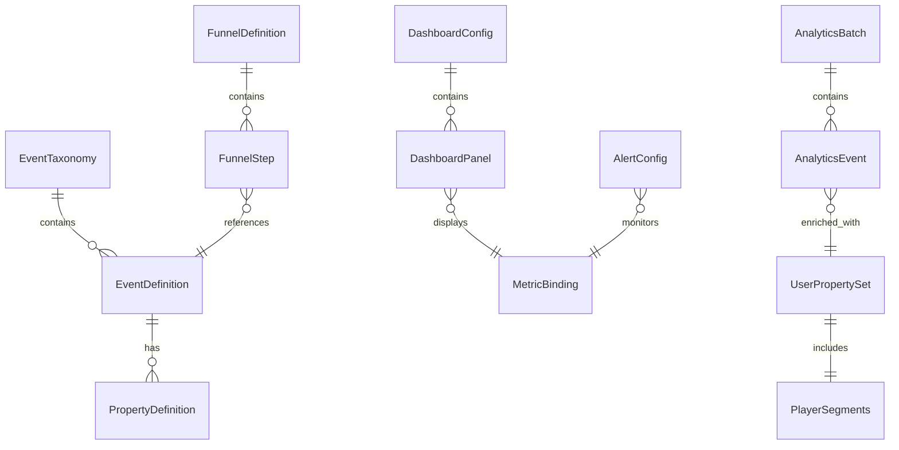
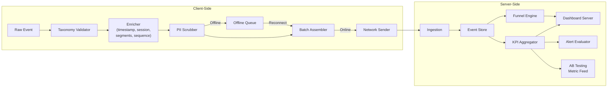

# Analytics Data Models

Complete schema definitions for every data structure in the Analytics vertical. These schemas are the single source of truth for event taxonomy catalogs, funnel definitions, dashboard configurations, alert rules, batched event payloads, and user property attachments.

> **Interfaces that use these models:** [Interfaces.md](./Interfaces.md)
> **KPI definitions referenced here:** [MetricsDictionary](../../SemanticDictionary/MetricsDictionary.md)
> **Shared types:** [SharedInterfaces](../00_SharedInterfaces.md) for `AnalyticsEvent`, `PlayerContext`, `ISO8601`, `DurationSeconds`

---

## Schema Relationship Diagram



---

## EventTaxonomy

The full catalog of trackable events. This is the authoritative registry -- events not in this catalog are rejected by the collector.

```typescript
interface EventTaxonomy {
  /** Unique ID for this taxonomy version. Semver format. */
  readonly version: string;                          // e.g., "1.4.0"

  /** When this taxonomy version was published. */
  readonly publishedAt: ISO8601;

  /** All registered event definitions, keyed by event name. */
  readonly events: Readonly<Record<string, EventDefinition>>;

  /** Categories for grouping events in the taxonomy browser. */
  readonly categories: ReadonlyArray<EventCategoryInfo>;
}

interface EventCategoryInfo {
  readonly id: EventCategory;
  readonly label: string;                            // Human-readable: "Player Progression"
  readonly description: string;
  readonly eventCount: number;                       // Number of events in this category
}

type EventCategory =
  | 'engagement'
  | 'progression'
  | 'economy'
  | 'monetization'
  | 'liveops'
  | 'experiment'
  | 'system';

interface EventDefinition {
  /** Snake_case event name. Must be unique across the taxonomy. */
  readonly name: string;                             // "level_complete"

  /** Category for grouping and filtering. */
  readonly category: EventCategory;

  /** Which vertical owns this event. */
  readonly vertical: string;                         // "mechanics", "monetization", etc.

  /** Human-readable description of when/why this event fires. */
  readonly description: string;

  /** Schema of properties attached to this event. */
  readonly properties: ReadonlyArray<PropertyDefinition>;

  /** Which properties are required (subset of properties[].name). */
  readonly required: ReadonlyArray<string>;

  /** Sampling rate. 1.0 = every occurrence, 0.1 = 10% sample. */
  readonly sampleRate: number;

  /** PII risk level. 'high' triggers extra scrubbing before send. */
  readonly piiRisk: 'none' | 'low' | 'high';

  /** Whether this event is part of StandardEvents (true) or Analytics-owned (false). */
  readonly isStandard: boolean;

  /** Example payload for documentation and testing. */
  readonly example: Readonly<Record<string, string | number | boolean>>;
}

interface PropertyDefinition {
  /** Property name. Lowercase snake_case. */
  readonly name: string;                             // "level_id"

  /** Data type. */
  readonly type: 'string' | 'number' | 'boolean';

  /** Human-readable description. */
  readonly description: string;

  /** For string properties: constrained set of allowed values. */
  readonly enumValues?: ReadonlyArray<string>;

  /** For number properties: minimum allowed value (inclusive). */
  readonly min?: number;

  /** For number properties: maximum allowed value (inclusive). */
  readonly max?: number;

  /** Default value if not provided. Null = no default (must be provided or event is invalid). */
  readonly defaultValue?: string | number | boolean;
}
```

### Example: Taxonomy Entry for `level_complete`

```typescript
const levelCompleteDefinition: EventDefinition = {
  name: 'level_complete',
  category: 'progression',
  vertical: 'mechanics',
  description: 'Fired when a player successfully completes a level.',
  properties: [
    { name: 'level_id', type: 'string', description: 'Unique level identifier' },
    { name: 'score', type: 'number', description: 'Final score', min: 0 },
    { name: 'stars', type: 'number', description: 'Stars earned (0-3)', min: 0, max: 3 },
    { name: 'time_seconds', type: 'number', description: 'Completion time in seconds', min: 0 },
    { name: 'difficulty', type: 'number', description: 'DifficultyScore (1-10)', min: 1, max: 10 },
    { name: 'reward_tier', type: 'string', description: 'Reward tier', enumValues: ['easy', 'medium', 'hard', 'very_hard', 'extreme'] }
  ],
  required: ['level_id', 'score', 'stars', 'time_seconds', 'difficulty', 'reward_tier'],
  sampleRate: 1.0,
  piiRisk: 'none',
  isStandard: true,
  example: {
    level_id: 'world1_level5',
    score: 4200,
    stars: 3,
    time_seconds: 45,
    difficulty: 4,
    reward_tier: 'medium'
  }
};
```

---

## FunnelDefinition

A conversion funnel is an ordered sequence of events representing a player journey. The Analytics Agent tracks how many users complete each step and where they drop off.

```typescript
interface FunnelDefinition {
  /** Unique funnel ID. Lowercase kebab-case. */
  readonly id: string;                               // "onboarding-flow"

  /** Human-readable funnel name. */
  readonly name: string;                             // "Onboarding Flow"

  /** Funnel category for grouping. */
  readonly category: 'onboarding' | 'monetization' | 'engagement' | 'retention' | 'liveops';

  /** Description of what this funnel measures. */
  readonly description: string;

  /** Ordered steps. A user must complete step N before step N+1 counts. */
  readonly steps: ReadonlyArray<FunnelStep>;

  /** Maximum time (seconds) allowed between first and last step. */
  readonly maxDurationSeconds: number;

  /** Expected end-to-end conversion rate. Used for alerting. */
  readonly expectedConversion: number;               // 0.0-1.0

  /** Alert if actual conversion drops below this fraction of expected. */
  readonly alertThreshold: number;                   // 0.0-1.0; e.g., 0.8 = alert at 80% of expected

  /** Whether this funnel is cross-session (true) or single-session (false). */
  readonly crossSession: boolean;
}

interface FunnelStep {
  /** Zero-based step index. */
  readonly index: number;

  /** Human-readable step name. */
  readonly name: string;                             // "Complete Tutorial Level"

  /** Event name that signals this step is complete. */
  readonly eventName: string;                        // "level_complete"

  /** Optional: filter on event properties to narrow the match. */
  readonly propertyFilters?: ReadonlyArray<PropertyFilter>;

  /** Expected conversion rate from the previous step to this step. */
  readonly expectedStepConversion: number;           // 0.0-1.0
}

interface PropertyFilter {
  readonly property: string;                         // "level_id"
  readonly operator: 'eq' | 'neq' | 'gt' | 'lt' | 'gte' | 'lte' | 'in';
  readonly value: string | number | boolean | ReadonlyArray<string | number>;
}
```

### Standard Funnels

| Funnel ID | Steps | Max Duration | Cross-Session | Expected Conversion |
|-----------|-------|-------------|---------------|---------------------|
| `onboarding-flow` | install -> session_start -> level_start(L1) -> level_complete(L1) -> level_start(L2) | 1800s (30 min) | No | 0.60 |
| `first-purchase` | session_start -> screen_view(shop) -> iap_initiated -> iap_completed | 86400s (24h) | Yes | 0.04 |
| `ad-engagement` | level_complete -> ad_requested(rewarded) -> ad_watched(completed=true) | 120s (2 min) | No | 0.50 |
| `event-participation` | event_entered -> event_milestone(first) -> event_milestone(final) -> event_completed | 604800s (7d) | Yes | 0.40 |
| `retention-loop` | session_end(D0) -> session_start(D1) -> session_start(D7) | 604800s (7d) | Yes | 0.15 |

---

## DashboardConfig

Configuration for a dashboard, its panels, metric bindings, and filters. See [KPIDashboards.md](./KPIDashboards.md) for the four standard dashboard instances.

```typescript
interface DashboardConfig {
  /** Unique dashboard ID. */
  readonly id: string;                               // "executive"

  /** Display name. */
  readonly name: string;                             // "Executive Dashboard"

  /** Description shown in dashboard header. */
  readonly description: string;

  /** Dashboard hierarchy level. Lower = higher in drill-down tree. */
  readonly hierarchyLevel: number;                   // 0 = top-level, 1 = detail

  /** Parent dashboard for drill-down navigation. Null for top-level. */
  readonly parentDashboardId: string | null;

  /** Ordered list of panels in this dashboard. */
  readonly panels: ReadonlyArray<DashboardPanel>;

  /** Filters available on this dashboard. */
  readonly filters: ReadonlyArray<DashboardFilter>;

  /** Default time range when dashboard opens. */
  readonly defaultTimeRange: 'today' | 'last_7_days' | 'last_30_days' | 'last_90_days';

  /** Auto-refresh interval in seconds. 0 = manual refresh only. */
  readonly refreshIntervalSeconds: number;
}

interface DashboardPanel {
  /** Unique panel ID within the dashboard. */
  readonly id: string;                               // "dau_trend"

  /** Display title. */
  readonly title: string;                            // "Daily Active Users"

  /** Panel visualization type. */
  readonly chartType: ChartType;

  /** Metric binding -- which KPI this panel displays. */
  readonly metric: MetricBinding;

  /** Panel size in the grid layout. */
  readonly size: PanelSize;

  /** Refresh cadence for this specific panel. */
  readonly refreshCadence: 'real_time' | 'hourly' | 'daily';

  /** Optional: threshold lines or bands to overlay on the chart. */
  readonly thresholds?: ReadonlyArray<ThresholdLine>;

  /** Optional: drill-down target when clicking this panel. */
  readonly drillDown?: DrillDownTarget;
}

type ChartType =
  | 'single_value'       // Big number with trend arrow
  | 'line_chart'         // Time series
  | 'bar_chart'          // Categorical comparison
  | 'stacked_bar'        // Segmented breakdown
  | 'funnel_chart'       // Funnel visualization
  | 'heatmap'            // Time-of-day / day-of-week
  | 'table'              // Tabular data
  | 'pie_chart';         // Proportional breakdown

interface MetricBinding {
  /** KPI name from MetricsDictionary. */
  readonly metricName: string;                       // "DAU"

  /** Aggregation to apply. */
  readonly aggregation: 'sum' | 'avg' | 'median' | 'min' | 'max' | 'count' | 'p95' | 'p99';

  /** Granularity for time series. Ignored for single_value. */
  readonly granularity?: 'hourly' | 'daily' | 'weekly';

  /** Optional segment breakdown. */
  readonly groupBy?: ReadonlyArray<string>;           // ["spending", "platform"]

  /** Display unit. */
  readonly unit: string;                             // "users", "USD", "%", "seconds"
}

type PanelSize = 'small' | 'medium' | 'large' | 'full_width';

interface ThresholdLine {
  readonly label: string;                            // "Target"
  readonly value: number;
  readonly color: string;                            // Hex color
  readonly style: 'solid' | 'dashed';
}

interface DrillDownTarget {
  readonly dashboardId: string;
  readonly panelId?: string;                         // Scroll to specific panel
  readonly filterOverrides?: Readonly<Record<string, string>>;
}

interface DashboardFilter {
  /** Filter ID. */
  readonly id: string;                               // "date_range"

  /** Display label. */
  readonly label: string;                            // "Date Range"

  /** Filter type. */
  readonly type: 'date_range' | 'select' | 'multi_select' | 'search';

  /** Possible values for select filters. */
  readonly options?: ReadonlyArray<{ value: string; label: string }>;

  /** Default selected value. */
  readonly defaultValue: string;
}
```

---

## AlertConfig

Alert configurations for monitoring KPI health. Two types: threshold-based (static) and anomaly-based (dynamic baseline).

```typescript
interface AlertConfig {
  /** Unique alert configuration ID. */
  readonly id: string;

  /** Alert type discriminator. */
  readonly type: 'threshold' | 'anomaly';

  /** Which metric to monitor. Must match a MetricsDictionary entry. */
  readonly metricName: string;

  /** Severity determines notification urgency and routing. */
  readonly severity: AlertSeverity;

  /** How long the condition must persist before firing (seconds). */
  readonly evaluationWindow: DurationSeconds;

  /** Minimum time between re-fires (seconds). */
  readonly cooldownSeconds: DurationSeconds;

  /** Where to send notifications. */
  readonly notificationChannels: ReadonlyArray<NotificationChannel>;

  /** Human-readable description of what this alert monitors. */
  readonly description: string;

  /** Whether this alert is currently active (not muted). */
  readonly enabled: boolean;
}

interface ThresholdAlertConfig extends AlertConfig {
  readonly type: 'threshold';
  readonly condition: 'above' | 'below';
  readonly threshold: number;
}

interface AnomalyAlertConfig extends AlertConfig {
  readonly type: 'anomaly';
  readonly baselineDays: number;                     // Days of history for baseline
  readonly deviationThreshold: number;               // Std deviations from baseline
}

type AlertSeverity = 'critical' | 'warning' | 'info';

interface NotificationChannel {
  readonly type: 'slack' | 'email' | 'pagerduty' | 'webhook';
  readonly target: string;
}
```

### Standard Alert Configurations

| Alert ID | Type | Metric | Condition | Severity | Evaluation Window |
|----------|------|--------|-----------|----------|-------------------|
| `dau-drop` | anomaly | DAU | 2 std devs below baseline | critical | 24h |
| `d1-retention-low` | threshold | D1 Retention | below 35% | critical | 48h |
| `arpdau-drop` | anomaly | ARPDAU | 2 std devs below baseline | warning | 24h |
| `crash-rate-spike` | threshold | client_error rate | above 2% of sessions | critical | 1h |
| `funnel-onboarding-drop` | threshold | Onboarding funnel conversion | below 48% | warning | 24h |
| `ad-fill-rate-low` | threshold | Ad Fill Rate | below 90% | warning | 6h |
| `event-participation-low` | threshold | Event Participation Rate | below 30% | info | 48h |
| `session-length-anomaly` | anomaly | Session Length (median) | 2 std devs from baseline | warning | 24h |

---

## AnalyticsBatch

The batched payload sent over the network. Events are collected client-side, enriched, and assembled into batches at 60-second intervals.

```typescript
interface AnalyticsBatch {
  /** Unique batch ID (UUID v4). */
  readonly batchId: string;

  /** When this batch was assembled. */
  readonly assembledAt: ISO8601;

  /** App version that produced this batch. */
  readonly appVersion: string;

  /** SDK version for the analytics client. */
  readonly sdkVersion: string;

  /** Platform identifier. */
  readonly platform: 'ios' | 'android' | 'web';

  /** Number of events in this batch. */
  readonly eventCount: number;

  /** Events in this batch, ordered by timestamp. */
  readonly events: ReadonlyArray<EnrichedAnalyticsEvent>;

  /** User properties snapshot at batch assembly time. */
  readonly userProperties: UserPropertySet;

  /** Whether this batch contains events from the offline queue. */
  readonly containsOfflineEvents: boolean;

  /** Estimated compressed size in bytes (gzip). */
  readonly estimatedSizeBytes: number;
}

interface EnrichedAnalyticsEvent {
  /** Event name from taxonomy. */
  readonly name: string;

  /** UTC timestamp of when the event occurred. */
  readonly timestamp: ISO8601;

  /** Hashed player ID (never raw device ID or PII). */
  readonly playerId: string;

  /** Session ID (generated on session_start, persists until session_end). */
  readonly sessionId: string;

  /** Sequence number within the session. Monotonically increasing. */
  readonly sequenceNumber: number;

  /** Event properties as defined in the taxonomy. */
  readonly properties: Readonly<Record<string, string | number | boolean>>;

  /** Player segments at the time of the event. */
  readonly segments: PlayerContext['segments'];

  /** Whether this event was queued offline and sent later. */
  readonly wasOffline: boolean;
}
```

### Batch Size Budget

| Component | Typical Size | Notes |
|-----------|-------------|-------|
| Batch header (IDs, version, platform) | ~200 bytes | Fixed overhead per batch |
| User properties snapshot | ~300 bytes | Segments + custom props |
| Per-event overhead (name, timestamp, IDs) | ~150 bytes | Fixed per event |
| Per-event properties | ~100-300 bytes | Varies by event type |
| **Typical batch (50 events, uncompressed)** | **~15 KB** | |
| **Typical batch (50 events, gzipped)** | **~4-5 KB** | Well within 10 KB limit |
| **Max batch (100 events, gzipped)** | **~8-9 KB** | Hard cap at 10 KB |

---

## UserPropertySet

Properties attached to every event for segmentation and cohort analysis.

```typescript
interface UserPropertySet {
  /** Player spending segment. Updated by Economy Agent. */
  readonly segments: PlayerSegments;

  /** Device platform. Set once on SDK init. */
  readonly platform: 'ios' | 'android' | 'web';

  /** App version string. Set once on SDK init. */
  readonly appVersion: string;

  /** Analytics SDK version. Set once on SDK init. */
  readonly sdkVersion: string;

  /** Device locale (ISO 639-1). */
  readonly locale: string;                           // "en", "ja", "de"

  /** Country code (ISO 3166-1 alpha-2). Derived from IP server-side, NOT sent from client. */
  readonly country?: string;                         // "US", "JP" -- server-enriched only

  /** Days since install. Computed client-side from install date. */
  readonly daysSinceInstall: number;

  /** Total session count for this player. */
  readonly sessionCount: number;

  /** Custom properties set by any vertical (max 20). */
  readonly custom: Readonly<Record<string, string | number | boolean>>;
}

interface PlayerSegments {
  /** Spending tier. Matches PlayerContext.segments.spending. */
  readonly spending: 'whale' | 'dolphin' | 'minnow' | 'free';

  /** Lifecycle stage. Matches PlayerContext.segments.lifecycle. */
  readonly lifecycle: 'new' | 'activated' | 'engaged' | 'loyal' | 'at_risk' | 'churned';

  /** Engagement pattern. Matches PlayerContext.segments.engagement. */
  readonly engagement: 'hardcore' | 'regular' | 'casual' | 'weekend_warrior';
}
```

### Reserved Custom Property Keys

These keys are set automatically and cannot be overwritten by `setUserProperty`:

| Key | Source | Description |
|-----|--------|-------------|
| `install_source` | Attribution SDK | Campaign or organic source |
| `ab_experiments` | AB Testing Agent | Comma-separated list of active experiment:variant pairs |
| `last_level_completed` | Mechanics events | Most recent level_complete level_id |
| `total_iap_spend_cents` | Monetization events | Cumulative IAP spend |
| `current_basic_balance` | Economy events | Current basic currency balance |

---

## Validation Rules Summary

All schemas enforce these cross-cutting validation rules:

| Rule | Applies To | Enforcement |
|------|-----------|-------------|
| Event names are snake_case, 3-50 chars | `EventDefinition.name` | Regex: `^[a-z][a-z0-9_]{2,49}$` |
| Property names are snake_case, 1-30 chars | `PropertyDefinition.name` | Regex: `^[a-z][a-z0-9_]{0,29}$` |
| Timestamps are ISO 8601 UTC | All `ISO8601` fields | Regex + timezone = Z |
| Batch size <= 10 KB gzipped | `AnalyticsBatch` | Checked before send; split if exceeded |
| Max 100 events per batch | `AnalyticsBatch.events` | Hard cap in batch assembler |
| Max 20 custom user properties | `UserPropertySet.custom` | Oldest dropped if exceeded |
| Sample rates between 0.0 and 1.0 | `EventDefinition.sampleRate` | Clamped on registration |
| Funnel steps reference registered events | `FunnelStep.eventName` | Validated on funnel registration |
| Alert metrics reference MetricsDictionary | `AlertConfig.metricName` | Validated on alert registration |

---

## Data Flow Diagram



---

## Related Documents

- [SharedInterfaces](../00_SharedInterfaces.md) -- `AnalyticsEvent`, `StandardEvents`, `PlayerContext`
- [MetricsDictionary](../../SemanticDictionary/MetricsDictionary.md) -- KPI definitions referenced by `MetricBinding`
- [Interfaces](./Interfaces.md) -- APIs that consume these schemas
- [Spec](./Spec.md) -- Vertical specification
- [KPIDashboards](./KPIDashboards.md) -- Standard dashboard instances built on `DashboardConfig`
- [AgentResponsibilities](./AgentResponsibilities.md) -- Who owns which schema decisions
