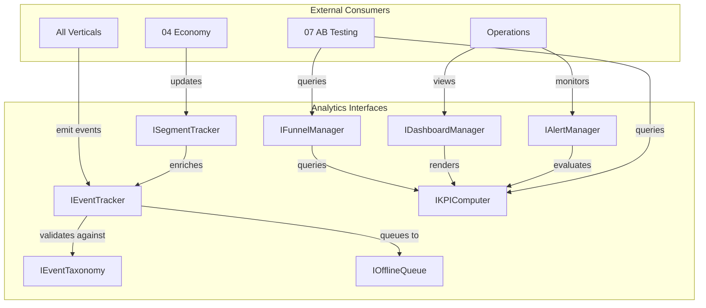

# Analytics Interfaces

API surface for the Analytics vertical. All verticals call these APIs to emit events. The Analytics Agent consumes these APIs to define what is trackable, how funnels work, and what dashboards show.

> **Depends on:** [SharedInterfaces](../00_SharedInterfaces.md) for `AnalyticsEvent`, `StandardEvents`, `PlayerContext`.
> **Data schemas:** [DataModels](./DataModels.md) for full type definitions.

---

## Event Tracking API

The primary interface every vertical uses to emit analytics events.

```typescript
interface IEventTracker {
  /**
   * Emit a single event. The event is validated against the taxonomy,
   * enriched with session/player context, and added to the current batch.
   * Events not in the taxonomy are silently dropped and logged as warnings.
   */
  emit<K extends keyof FullEventTaxonomy>(
    name: K,
    properties: FullEventTaxonomy[K]
  ): void;

  /**
   * Emit multiple events at once. Useful for replaying offline-queued
   * events or bulk-emitting from a mechanic's end-of-level summary.
   */
  emitBatch(events: ReadonlyArray<{ name: string; properties: Record<string, string | number | boolean> }>): void;

  /**
   * Force-flush the current batch immediately, bypassing the 60-second
   * interval. Use sparingly -- only on session_end or app backgrounding.
   */
  flush(): Promise<FlushResult>;

  /**
   * Check whether the tracker has pending events in the offline queue.
   */
  hasPendingEvents(): boolean;

  /**
   * Get the count of events in the offline queue awaiting send.
   */
  pendingEventCount(): number;

  /**
   * Register a callback invoked when a batch is successfully sent.
   * Useful for AB Testing to know when fresh data is available.
   */
  onBatchSent(callback: (batch: AnalyticsBatch) => void): Unsubscribe;

  /**
   * Register a callback invoked when an event is dropped (invalid name,
   * schema mismatch, or queue overflow).
   */
  onEventDropped(callback: (event: DroppedEvent) => void): Unsubscribe;
}

interface FlushResult {
  readonly success: boolean;
  readonly eventsSent: number;
  readonly eventsQueued: number;  // Remaining in offline queue
  readonly error?: string;
}

interface DroppedEvent {
  readonly name: string;
  readonly reason: 'invalid_name' | 'schema_mismatch' | 'queue_overflow' | 'consent_denied';
  readonly timestamp: ISO8601;
}
```

### Usage Examples

```typescript
// Basic event emission (most common)
tracker.emit('level_complete', {
  levelId: 'world1_level5',
  score: 4200,
  stars: 3,
  timeSeconds: 45,
  difficulty: 4,
  rewardTier: 'medium'
});

// Force flush on app background
window.addEventListener('visibilitychange', () => {
  if (document.hidden) {
    tracker.flush();
  }
});

// Listen for batch sends (AB Testing integration)
tracker.onBatchSent((batch) => {
  abTestingAgent.onNewAnalyticsData(batch.eventCount);
});
```

---

## Event Taxonomy API

Defines and queries the catalog of all trackable events.

```typescript
interface IEventTaxonomy {
  /**
   * Register a new event type in the taxonomy. Typically called during
   * initialization by the Analytics Agent. Other agents should NOT call this.
   */
  registerEvent(definition: EventDefinition): void;

  /**
   * Check whether an event name exists in the taxonomy.
   */
  isRegistered(eventName: string): boolean;

  /**
   * Get the full definition for a registered event.
   */
  getDefinition(eventName: string): EventDefinition | undefined;

  /**
   * Get all registered event definitions, optionally filtered by category.
   */
  listEvents(filter?: { category?: EventCategory; vertical?: string }): ReadonlyArray<EventDefinition>;

  /**
   * Validate an event payload against its registered schema.
   * Returns a list of validation errors (empty if valid).
   */
  validate(eventName: string, properties: Record<string, unknown>): ReadonlyArray<ValidationError>;
}

interface EventDefinition {
  readonly name: string;                         // Snake_case: "level_complete"
  readonly category: EventCategory;
  readonly vertical: string;                     // Owning vertical: "mechanics", "monetization", etc.
  readonly description: string;                  // Human-readable purpose
  readonly properties: ReadonlyArray<PropertyDefinition>;
  readonly required: ReadonlyArray<string>;      // Required property names
  readonly sampleRate: number;                   // 0.0-1.0; 1.0 = track every occurrence
  readonly piiRisk: 'none' | 'low' | 'high';    // Flags events needing extra scrubbing
}

type EventCategory =
  | 'engagement'      // screen_view, button_tap, session_start
  | 'progression'     // level_start, level_complete, level_fail
  | 'economy'         // currency_earn, currency_spend
  | 'monetization'    // ad_watched, iap_completed
  | 'liveops'         // event_entered, event_milestone
  | 'experiment'      // experiment_assigned, experiment_exposed
  | 'system';         // client_error, performance_sample

interface PropertyDefinition {
  readonly name: string;
  readonly type: 'string' | 'number' | 'boolean';
  readonly description: string;
  readonly enumValues?: ReadonlyArray<string>;    // Constrained string values
  readonly min?: number;                          // For numeric properties
  readonly max?: number;
}

interface ValidationError {
  readonly property: string;
  readonly message: string;
  readonly severity: 'error' | 'warning';
}
```

---

## Funnel Definition API

Create and manage conversion funnels.

```typescript
interface IFunnelManager {
  /**
   * Register a new funnel definition. Funnel steps reference event names
   * from the taxonomy.
   */
  defineFunnel(funnel: FunnelDefinition): void;

  /**
   * Get a funnel definition by ID.
   */
  getFunnel(funnelId: string): FunnelDefinition | undefined;

  /**
   * List all registered funnels, optionally filtered by category.
   */
  listFunnels(filter?: { category?: string }): ReadonlyArray<FunnelDefinition>;

  /**
   * Query funnel conversion data for a given time range and optional segment.
   * Returns step-by-step conversion rates.
   */
  queryConversion(
    funnelId: string,
    timeRange: TimeRange,
    segment?: SegmentFilter
  ): Promise<FunnelConversionResult>;

  /**
   * Identify the biggest drop-off step in a funnel for a given period.
   */
  findBottleneck(
    funnelId: string,
    timeRange: TimeRange
  ): Promise<FunnelBottleneck>;
}

interface TimeRange {
  readonly start: ISO8601;
  readonly end: ISO8601;
}

interface SegmentFilter {
  readonly spending?: PlayerContext['segments']['spending'];
  readonly lifecycle?: PlayerContext['segments']['lifecycle'];
  readonly engagement?: PlayerContext['segments']['engagement'];
  readonly platform?: 'ios' | 'android';
  readonly version?: string;
}

interface FunnelConversionResult {
  readonly funnelId: string;
  readonly timeRange: TimeRange;
  readonly segment: SegmentFilter | null;
  readonly steps: ReadonlyArray<FunnelStepResult>;
  readonly overallConversion: number;           // 0.0-1.0
}

interface FunnelStepResult {
  readonly stepIndex: number;
  readonly stepName: string;
  readonly eventName: string;
  readonly usersEntered: number;
  readonly usersCompleted: number;
  readonly conversionRate: number;              // 0.0-1.0
  readonly medianTimeSeconds: number;           // Time to complete this step
}

interface FunnelBottleneck {
  readonly funnelId: string;
  readonly stepIndex: number;
  readonly stepName: string;
  readonly dropOffRate: number;                 // Fraction lost at this step
  readonly suggestion: string;                  // AI-generated improvement hint
}
```

---

## KPI Computation API

Hooks for computing and querying KPIs defined in [MetricsDictionary](../../SemanticDictionary/MetricsDictionary.md).

```typescript
interface IKPIComputer {
  /**
   * Get the current value of a KPI for a given time range.
   * KPI names match MetricsDictionary entries (e.g., "DAU", "ARPDAU", "D1_Retention").
   */
  getMetric(
    metricName: string,
    timeRange: TimeRange,
    segment?: SegmentFilter
  ): Promise<MetricResult>;

  /**
   * Get a time series of a KPI over a date range.
   * Granularity: 'hourly', 'daily', 'weekly'.
   */
  getTimeSeries(
    metricName: string,
    timeRange: TimeRange,
    granularity: 'hourly' | 'daily' | 'weekly',
    segment?: SegmentFilter
  ): Promise<TimeSeriesResult>;

  /**
   * Compare a KPI across two segments or two time ranges.
   */
  compare(
    metricName: string,
    baseline: { timeRange: TimeRange; segment?: SegmentFilter },
    comparison: { timeRange: TimeRange; segment?: SegmentFilter }
  ): Promise<ComparisonResult>;

  /**
   * List all computable KPI names.
   */
  listMetrics(): ReadonlyArray<MetricDefinitionRef>;
}

interface MetricResult {
  readonly metricName: string;
  readonly value: number;
  readonly unit: string;                        // "users", "USD", "percent", "seconds"
  readonly timeRange: TimeRange;
  readonly segment: SegmentFilter | null;
  readonly confidence: 'exact' | 'estimated';   // Estimated if data is still aggregating
}

interface TimeSeriesResult {
  readonly metricName: string;
  readonly granularity: 'hourly' | 'daily' | 'weekly';
  readonly points: ReadonlyArray<{ timestamp: ISO8601; value: number }>;
}

interface ComparisonResult {
  readonly metricName: string;
  readonly baselineValue: number;
  readonly comparisonValue: number;
  readonly delta: number;                       // Absolute difference
  readonly deltaPercent: number;                // Percentage change
  readonly isSignificant: boolean;              // Statistical significance at p < 0.05
}

interface MetricDefinitionRef {
  readonly name: string;
  readonly category: string;                    // "engagement", "retention", "monetization", etc.
  readonly unit: string;
  readonly refreshCadence: 'real_time' | 'hourly' | 'daily';
}
```

---

## Dashboard Configuration API

Define and manage dashboard layouts. See [KPIDashboards.md](./KPIDashboards.md) for the four standard dashboards.

```typescript
interface IDashboardManager {
  /**
   * Register a dashboard configuration.
   */
  registerDashboard(config: DashboardConfig): void;

  /**
   * Get a dashboard configuration by ID.
   */
  getDashboard(dashboardId: string): DashboardConfig | undefined;

  /**
   * List all registered dashboards.
   */
  listDashboards(): ReadonlyArray<DashboardConfig>;

  /**
   * Refresh a specific dashboard panel's data.
   */
  refreshPanel(dashboardId: string, panelId: string): Promise<PanelData>;

  /**
   * Refresh all panels in a dashboard.
   */
  refreshDashboard(dashboardId: string): Promise<ReadonlyArray<PanelData>>;
}

interface PanelData {
  readonly panelId: string;
  readonly metricName: string;
  readonly value: number;
  readonly trend: 'up' | 'down' | 'flat';
  readonly trendPercent: number;
  readonly lastUpdated: ISO8601;
  readonly timeSeries?: ReadonlyArray<{ timestamp: ISO8601; value: number }>;
}
```

---

## Alert Definition API

Configure alerts that fire when KPIs cross thresholds or exhibit anomalous behavior.

```typescript
interface IAlertManager {
  /**
   * Register a threshold-based alert. Fires when a metric crosses
   * above or below a fixed value.
   */
  defineThresholdAlert(config: ThresholdAlertConfig): void;

  /**
   * Register an anomaly-based alert. Fires when a metric deviates
   * from its historical baseline by more than N standard deviations.
   */
  defineAnomalyAlert(config: AnomalyAlertConfig): void;

  /**
   * Get all active alerts (currently firing).
   */
  getActiveAlerts(): ReadonlyArray<ActiveAlert>;

  /**
   * Get alert history for a time range.
   */
  getAlertHistory(timeRange: TimeRange): Promise<ReadonlyArray<AlertHistoryEntry>>;

  /**
   * Acknowledge an active alert (prevents re-notification for cooldown period).
   */
  acknowledge(alertId: string): void;

  /**
   * Mute an alert definition for a duration (e.g., during known maintenance).
   */
  mute(alertConfigId: string, duration: DurationSeconds): void;

  /**
   * List all alert configurations.
   */
  listAlertConfigs(): ReadonlyArray<ThresholdAlertConfig | AnomalyAlertConfig>;
}

interface ThresholdAlertConfig {
  readonly id: string;
  readonly type: 'threshold';
  readonly metricName: string;
  readonly condition: 'above' | 'below';
  readonly threshold: number;
  readonly severity: AlertSeverity;
  readonly evaluationWindow: DurationSeconds;   // How long the condition must persist
  readonly cooldownSeconds: DurationSeconds;     // Min time between re-fires
  readonly notificationChannels: ReadonlyArray<NotificationChannel>;
}

interface AnomalyAlertConfig {
  readonly id: string;
  readonly type: 'anomaly';
  readonly metricName: string;
  readonly baselineDays: number;                // Days of history to compute baseline
  readonly deviationThreshold: number;          // Number of standard deviations
  readonly severity: AlertSeverity;
  readonly evaluationWindow: DurationSeconds;
  readonly cooldownSeconds: DurationSeconds;
  readonly notificationChannels: ReadonlyArray<NotificationChannel>;
}

type AlertSeverity = 'critical' | 'warning' | 'info';

interface NotificationChannel {
  readonly type: 'slack' | 'email' | 'pagerduty' | 'webhook';
  readonly target: string;                      // Channel ID, email address, or URL
}

interface ActiveAlert {
  readonly alertId: string;
  readonly configId: string;
  readonly metricName: string;
  readonly currentValue: number;
  readonly threshold: number;
  readonly severity: AlertSeverity;
  readonly firedAt: ISO8601;
  readonly acknowledged: boolean;
}

interface AlertHistoryEntry {
  readonly alertId: string;
  readonly configId: string;
  readonly metricName: string;
  readonly firedAt: ISO8601;
  readonly resolvedAt: ISO8601 | null;
  readonly durationSeconds: number;
  readonly peakValue: number;
}
```

---

## Offline Queue Management

Manage the local event queue for offline scenarios.

```typescript
interface IOfflineQueue {
  /**
   * Get the current state of the offline queue.
   */
  getStatus(): OfflineQueueStatus;

  /**
   * Force-drain the queue, attempting to send all queued events.
   * Returns the number of events successfully sent.
   */
  drain(): Promise<number>;

  /**
   * Clear the queue, discarding all pending events.
   * Use only in testing or on user data-deletion request.
   */
  clear(): void;

  /**
   * Set the maximum queue size. Events beyond this limit are dropped FIFO.
   */
  setMaxSize(maxEvents: number): void;

  /**
   * Register a callback invoked when the queue transitions
   * between empty and non-empty states.
   */
  onStatusChange(callback: (status: OfflineQueueStatus) => void): Unsubscribe;
}

interface OfflineQueueStatus {
  readonly eventCount: number;
  readonly oldestEventTimestamp: ISO8601 | null;
  readonly estimatedSizeBytes: number;
  readonly isOnline: boolean;
}
```

---

## Segment Tracking Integration

Attach player segments to every event for cohort analysis.

```typescript
interface ISegmentTracker {
  /**
   * Update the current player's segment assignments.
   * Called by the Economy Agent when segments change (e.g., player
   * transitions from 'minnow' to 'dolphin').
   */
  updateSegments(segments: PlayerContext['segments']): void;

  /**
   * Get the current segment assignments.
   */
  getCurrentSegments(): PlayerContext['segments'];

  /**
   * Set a custom user property that is attached to every subsequent event.
   * Max 20 custom properties. Property names must be lowercase snake_case.
   */
  setUserProperty(key: string, value: string | number | boolean): void;

  /**
   * Remove a custom user property.
   */
  removeUserProperty(key: string): void;

  /**
   * Get all current user properties (segments + custom).
   */
  getUserProperties(): UserPropertySet;
}

interface UserPropertySet {
  readonly segments: PlayerContext['segments'];
  readonly platform: 'ios' | 'android' | 'web';
  readonly appVersion: string;
  readonly sdkVersion: string;
  readonly custom: Readonly<Record<string, string | number | boolean>>;
}
```

---

## Interface Dependency Map



---

## Related Documents

- [SharedInterfaces](../00_SharedInterfaces.md) -- `AnalyticsEvent`, `StandardEvents`, `PlayerContext`, `GameEvent`
- [Spec](./Spec.md) -- Analytics vertical specification
- [DataModels](./DataModels.md) -- Full schema definitions for all types
- [KPIDashboards](./KPIDashboards.md) -- Standard dashboard configurations
- [MetricsDictionary](../../SemanticDictionary/MetricsDictionary.md) -- KPI definitions and formulas
