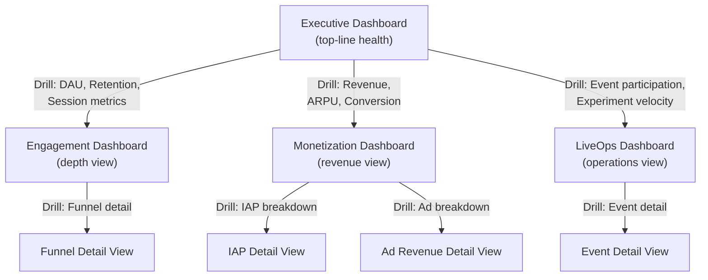
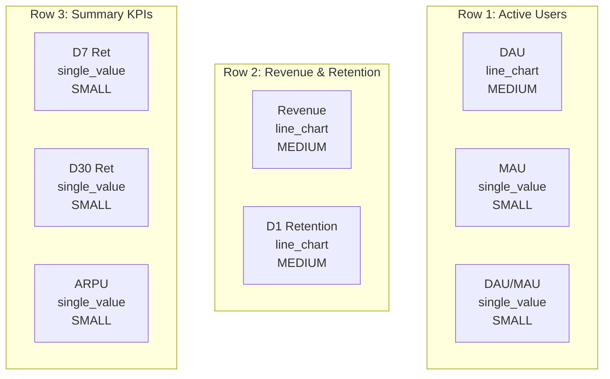

# KPI Dashboards

Four standard dashboards that make the game's health visible at a glance. Each dashboard is a configured instance of `DashboardConfig` from [DataModels.md](./DataModels.md), with panels bound to KPIs from [MetricsDictionary](../../SemanticDictionary/MetricsDictionary.md).

> **Data model:** [DataModels.md](./DataModels.md) for `DashboardConfig`, `DashboardPanel`, `MetricBinding`
> **Metrics:** [MetricsDictionary](../../SemanticDictionary/MetricsDictionary.md) for all KPI definitions and formulas
> **Alerts:** [DataModels.md](./DataModels.md) for `AlertConfig` schema

---

## Dashboard Hierarchy



The Executive Dashboard is the entry point. Every panel links to a detail panel on one of the three lower dashboards. Operators start at the top and drill down only when a metric demands investigation.

---

## Refresh Cadence Strategy

| Cadence | When Used | Examples |
|---------|-----------|---------|
| **Real-time** (< 5 min lag) | Metrics that change intra-day and need immediate visibility | Active users (current), crash rate, ad fill rate |
| **Hourly** | Revenue and engagement metrics that accumulate during the day | ARPDAU, session count, IAP revenue |
| **Daily** | Retention and cohort metrics that are only meaningful at day boundaries | D1/D7/D30 retention, MAU, LTV |

---

## 1. Executive Dashboard

**Purpose:** Answer "is the game healthy?" in under 10 seconds. The C-suite view.

**Default time range:** Last 30 days
**Auto-refresh:** Every 300 seconds (5 minutes)
**Hierarchy level:** 0 (top-level)

### Panels

| Panel ID | Title | Chart Type | Metric (from MetricsDictionary) | Aggregation | Refresh | Size | Drill-Down |
|----------|-------|------------|--------------------------------|-------------|---------|------|------------|
| `exec_dau` | Daily Active Users | line_chart | DAU | count | daily | medium | Engagement: `eng_dau_segments` |
| `exec_mau` | Monthly Active Users | single_value | MAU | count | daily | small | Engagement: `eng_stickiness` |
| `exec_stickiness` | DAU/MAU Ratio | single_value | DAU/MAU Ratio | avg | daily | small | Engagement: `eng_stickiness` |
| `exec_revenue` | Total Revenue | line_chart | ARPU (daily total) | sum | hourly | medium | Monetization: `mon_revenue_breakdown` |
| `exec_d1` | D1 Retention | line_chart | D1 Retention | avg | daily | medium | Engagement: `eng_retention_curve` |
| `exec_d7` | D7 Retention | single_value | D7 Retention | avg | daily | small | Engagement: `eng_retention_curve` |
| `exec_d30` | D30 Retention | single_value | D30 Retention | avg | daily | small | Engagement: `eng_retention_curve` |
| `exec_arpu` | ARPU | single_value | ARPU | avg | daily | small | Monetization: `mon_arpdau_trend` |

### Filters

| Filter ID | Label | Type | Options | Default |
|-----------|-------|------|---------|---------|
| `date_range` | Date Range | date_range | -- | last_30_days |
| `platform` | Platform | select | All, iOS, Android | All |
| `segment_spending` | Spending Tier | select | All, Whale, Dolphin, Minnow, Free | All |

### Alert Thresholds on Executive Panels

| Panel | Alert | Condition | Severity |
|-------|-------|-----------|----------|
| `exec_dau` | DAU anomaly | 2 std devs below 30-day baseline | critical |
| `exec_d1` | D1 retention drop | Below 35% for 48h | critical |
| `exec_revenue` | Revenue anomaly | 2 std devs below 14-day baseline | warning |
| `exec_arpu` | ARPU drop | Below $0.04 for 24h | warning |

### Executive Panel Layout



---

## 2. Engagement Dashboard

**Purpose:** Understand how deeply players engage -- session patterns, progression, and funnel health. The "depth view."

**Default time range:** Last 7 days
**Auto-refresh:** Every 600 seconds (10 minutes)
**Hierarchy level:** 1 (detail)
**Parent:** Executive Dashboard

### Panels

| Panel ID | Title | Chart Type | Metric | Aggregation | Refresh | Size | Drill-Down |
|----------|-------|------------|--------|-------------|---------|------|------------|
| `eng_dau_segments` | DAU by Segment | stacked_bar | DAU | count | daily | large | -- |
| `eng_session_length` | Median Session Length | line_chart | Session Length | median | hourly | medium | -- |
| `eng_sessions_day` | Sessions Per Day | line_chart | Sessions Per Day | avg | daily | medium | -- |
| `eng_playtime` | Playtime Per Day | line_chart | Playtime Per Day | median | daily | medium | -- |
| `eng_stickiness` | Stickiness (DAU/MAU) | line_chart | DAU/MAU Ratio | avg | daily | medium | -- |
| `eng_retention_curve` | Retention Curve | line_chart | D-N Retention | avg | daily | large | -- |
| `eng_level_completion` | Level Completion Rate | bar_chart | Level Completion Rate | avg | daily | large | -- |
| `eng_frustration` | Frustration Index | line_chart | Frustration Index | avg | daily | medium | -- |
| `eng_onboarding_funnel` | Onboarding Funnel | funnel_chart | Onboarding funnel | count | daily | large | -- |
| `eng_session_heatmap` | Session Heatmap | heatmap | Sessions Per Day | count | daily | large | -- |

### Filters

| Filter ID | Label | Type | Options | Default |
|-----------|-------|------|---------|---------|
| `date_range` | Date Range | date_range | -- | last_7_days |
| `platform` | Platform | select | All, iOS, Android | All |
| `segment_lifecycle` | Lifecycle Stage | select | All, New, Activated, Engaged, Loyal, At Risk, Churned | All |
| `segment_engagement` | Engagement Type | select | All, Hardcore, Regular, Casual, Weekend Warrior | All |

### Alert Thresholds on Engagement Panels

| Panel | Alert | Condition | Severity |
|-------|-------|-----------|----------|
| `eng_session_length` | Session length anomaly | 2 std devs from 30-day baseline | warning |
| `eng_frustration` | Frustration spike | Above 25% for 24h | warning |
| `eng_onboarding_funnel` | Onboarding conversion drop | Below 48% end-to-end for 24h | warning |
| `eng_level_completion` | Completion rate drop | Any level below 50% for 48h | info |

### Key Metrics Reference

All metrics reference [MetricsDictionary](../../SemanticDictionary/MetricsDictionary.md):

| Metric | Formula (summary) | Target |
|--------|-------------------|--------|
| Session Length | Median time from app open to app close | 5-15 min casual |
| Sessions Per Day | Mean sessions per active user per day | 3-6 casual |
| DAU/MAU Ratio | DAU / MAU | > 0.20 casual |
| Level Completion Rate | Completions / Attempts per level | 70-85% casual |
| Frustration Index | Sessions ending on failure / Total sessions | < 20% |

---

## 3. Monetization Dashboard

**Purpose:** Track all revenue streams -- IAP, ads, and their unit economics. The "revenue view."

**Default time range:** Last 7 days
**Auto-refresh:** Every 600 seconds (10 minutes)
**Hierarchy level:** 1 (detail)
**Parent:** Executive Dashboard

### Panels

| Panel ID | Title | Chart Type | Metric | Aggregation | Refresh | Size | Drill-Down |
|----------|-------|------------|--------|-------------|---------|------|------------|
| `mon_arpdau_trend` | ARPDAU Trend | line_chart | ARPDAU | avg | hourly | large | -- |
| `mon_revenue_breakdown` | Revenue Breakdown | stacked_bar | ARPU (IAP + Ad split) | sum | hourly | large | -- |
| `mon_conversion` | Payer Conversion Rate | line_chart | Conversion Rate | avg | daily | medium | -- |
| `mon_arppu` | ARPPU | single_value | ARPPU | avg | daily | small | -- |
| `mon_iap_products` | Top IAP Products | table | IAP Revenue Per Session | sum | daily | large | -- |
| `mon_first_purchase` | Time to First Purchase | line_chart | Time-to-First-Purchase | median | daily | medium | -- |
| `mon_ecpm` | eCPM by Format | bar_chart | eCPM | avg | hourly | medium | -- |
| `mon_ad_revenue` | Ad Revenue by Format | stacked_bar | Ad Revenue Per DAU | sum | hourly | large | -- |
| `mon_ad_optin` | Rewarded Ad Opt-In Rate | line_chart | Rewarded Ad Opt-In Rate | avg | hourly | medium | -- |
| `mon_ad_fill` | Ad Fill Rate | single_value | Ad Fill Rate | avg | hourly | small | -- |
| `mon_ltv_curve` | LTV Curve (cohort) | line_chart | LTV | sum | daily | large | -- |
| `mon_purchase_funnel` | First Purchase Funnel | funnel_chart | First Purchase funnel | count | daily | large | -- |

### Filters

| Filter ID | Label | Type | Options | Default |
|-----------|-------|------|---------|---------|
| `date_range` | Date Range | date_range | -- | last_7_days |
| `platform` | Platform | select | All, iOS, Android | All |
| `segment_spending` | Spending Tier | select | All, Whale, Dolphin, Minnow, Free | All |
| `ad_format` | Ad Format | select | All, Banner, Interstitial, Rewarded | All |

### Alert Thresholds on Monetization Panels

| Panel | Alert | Condition | Severity |
|-------|-------|-----------|----------|
| `mon_arpdau_trend` | ARPDAU drop | 2 std devs below 14-day baseline | warning |
| `mon_conversion` | Conversion anomaly | Below 1.5% for 7 days | warning |
| `mon_ad_fill` | Ad fill rate low | Below 90% for 6h | warning |
| `mon_ecpm` | eCPM crash | Below 50% of 7-day average | critical |

### Key Metrics Reference

| Metric | Formula (summary) | Target |
|--------|-------------------|--------|
| ARPDAU | Total revenue / DAU | $0.05-0.15 casual |
| Conversion Rate | Payers / Total users (D30 cohort) | 2-5% |
| ARPPU | IAP revenue / Paying users | Varies |
| eCPM | (Ad revenue / Impressions) * 1000 | Banner $1-3, Interstitial $5-15, Rewarded $10-30 |
| Rewarded Ad Opt-In | Watchers / Offered | > 50% |
| Ad Fill Rate | Impressions / Requests | > 95% |

---

## 4. LiveOps Dashboard

**Purpose:** Monitor live events, content freshness, and experiment velocity. The "operations view."

**Default time range:** Last 7 days
**Auto-refresh:** Every 300 seconds (5 minutes)
**Hierarchy level:** 1 (detail)
**Parent:** Executive Dashboard

### Panels

| Panel ID | Title | Chart Type | Metric | Aggregation | Refresh | Size | Drill-Down |
|----------|-------|------------|--------|-------------|---------|------|------------|
| `live_participation` | Event Participation Rate | line_chart | Event Participation Rate | avg | hourly | large | -- |
| `live_revenue_uplift` | Event Revenue Uplift | bar_chart | Event Revenue Uplift | avg | daily | medium | -- |
| `live_retention_impact` | Event Retention Impact | bar_chart | Event Retention Impact | avg | daily | medium | -- |
| `live_freshness` | Content Freshness Score | single_value | Content Freshness Score | min | daily | small | -- |
| `live_experiment_velocity` | Experiment Velocity | line_chart | Experiment Velocity | count | weekly | medium | -- |
| `live_experiment_wins` | Experiment Win Rate | single_value | Win Rate | avg | weekly | small | -- |
| `live_active_events` | Active Events | table | Event Participation Rate | count | real_time | large | -- |
| `live_active_experiments` | Active Experiments | table | Experiment Velocity | count | real_time | large | -- |
| `live_event_funnel` | Event Participation Funnel | funnel_chart | Event Participation funnel | count | daily | large | -- |
| `live_calendar` | Event Calendar | table | Content Freshness Score | count | daily | full_width | -- |

### Filters

| Filter ID | Label | Type | Options | Default |
|-----------|-------|------|---------|---------|
| `date_range` | Date Range | date_range | -- | last_7_days |
| `event_type` | Event Type | multi_select | Seasonal, Challenge, Limited Offer, Mini Game, Daily Challenge | All |
| `platform` | Platform | select | All, iOS, Android | All |

### Alert Thresholds on LiveOps Panels

| Panel | Alert | Condition | Severity |
|-------|-------|-----------|----------|
| `live_participation` | Low event participation | Below 30% for 48h | info |
| `live_freshness` | Stale content | Freshness score > 10 days | warning |
| `live_revenue_uplift` | No revenue uplift | Uplift below 1.0x for active event | info |
| `live_experiment_velocity` | Low experiment throughput | < 1 experiment concluded this week | warning |

### Key Metrics Reference

| Metric | Formula (summary) | Target |
|--------|-------------------|--------|
| Event Participation | Users in event / DAU during event | > 40% major events |
| Event Revenue Uplift | ARPDAU during event / ARPDAU baseline | > 1.2x |
| Content Freshness | Days since last new content | < 7 days |
| Experiment Velocity | Experiments concluded per week | > 3/week |
| Win Rate | Variants that beat control / Total experiments | 30-40% |

---

## Cross-Dashboard Metric Coverage

This table shows which [MetricsDictionary](../../SemanticDictionary/MetricsDictionary.md) metrics appear on which dashboards:

| Metric | Executive | Engagement | Monetization | LiveOps |
|--------|:---------:|:----------:|:------------:|:-------:|
| DAU | X | X | | |
| MAU | X | | | |
| DAU/MAU Ratio | X | X | | |
| Session Length | | X | | |
| Sessions Per Day | | X | | |
| D1 Retention | X | X | | |
| D7 Retention | X | X | | |
| D30 Retention | X | X | | |
| Level Completion Rate | | X | | |
| Frustration Index | | X | | |
| ARPU | X | | X | |
| ARPDAU | | | X | |
| ARPPU | | | X | |
| Conversion Rate | | | X | |
| LTV | | | X | |
| eCPM | | | X | |
| Ad Revenue Per DAU | | | X | |
| Ad Fill Rate | | | X | |
| Rewarded Ad Opt-In | | | X | |
| Event Participation | | | | X |
| Event Revenue Uplift | | | | X |
| Content Freshness | | | | X |
| Experiment Velocity | | | | X |
| Win Rate | | | | X |

---

## Dashboard Configuration Examples

### Executive Dashboard Config (TypeScript pseudocode)

```typescript
const executiveDashboard: DashboardConfig = {
  id: 'executive',
  name: 'Executive Dashboard',
  description: 'Top-line game health: users, revenue, retention.',
  hierarchyLevel: 0,
  parentDashboardId: null,
  panels: [
    {
      id: 'exec_dau',
      title: 'Daily Active Users',
      chartType: 'line_chart',
      metric: {
        metricName: 'DAU',
        aggregation: 'count',
        granularity: 'daily',
        unit: 'users'
      },
      size: 'medium',
      refreshCadence: 'daily',
      thresholds: [
        { label: 'Target', value: 10000, color: '#22C55E', style: 'dashed' }
      ],
      drillDown: {
        dashboardId: 'engagement',
        panelId: 'eng_dau_segments'
      }
    },
    {
      id: 'exec_d1',
      title: 'D1 Retention',
      chartType: 'line_chart',
      metric: {
        metricName: 'D1_Retention',
        aggregation: 'avg',
        granularity: 'daily',
        unit: '%'
      },
      size: 'medium',
      refreshCadence: 'daily',
      thresholds: [
        { label: 'Target (40%)', value: 40, color: '#22C55E', style: 'dashed' },
        { label: 'Alert (35%)', value: 35, color: '#EF4444', style: 'solid' }
      ],
      drillDown: {
        dashboardId: 'engagement',
        panelId: 'eng_retention_curve'
      }
    }
    // ... remaining panels follow same pattern
  ],
  filters: [
    {
      id: 'date_range',
      label: 'Date Range',
      type: 'date_range',
      defaultValue: 'last_30_days'
    },
    {
      id: 'platform',
      label: 'Platform',
      type: 'select',
      options: [
        { value: 'all', label: 'All Platforms' },
        { value: 'ios', label: 'iOS' },
        { value: 'android', label: 'Android' }
      ],
      defaultValue: 'all'
    },
    {
      id: 'segment_spending',
      label: 'Spending Tier',
      type: 'select',
      options: [
        { value: 'all', label: 'All' },
        { value: 'whale', label: 'Whale' },
        { value: 'dolphin', label: 'Dolphin' },
        { value: 'minnow', label: 'Minnow' },
        { value: 'free', label: 'Free' }
      ],
      defaultValue: 'all'
    }
  ],
  defaultTimeRange: 'last_30_days',
  refreshIntervalSeconds: 300
};
```

---

## Alert Summary Across All Dashboards

| Alert ID | Dashboard | Metric | Type | Condition | Severity | Eval Window |
|----------|-----------|--------|------|-----------|----------|-------------|
| `dau-drop` | Executive | DAU | anomaly | 2 std devs below baseline | critical | 24h |
| `d1-retention-low` | Executive | D1 Retention | threshold | below 35% | critical | 48h |
| `revenue-anomaly` | Executive | Revenue | anomaly | 2 std devs below baseline | warning | 24h |
| `arpu-drop` | Executive | ARPU | threshold | below $0.04 | warning | 24h |
| `session-length-anomaly` | Engagement | Session Length | anomaly | 2 std devs from baseline | warning | 24h |
| `frustration-spike` | Engagement | Frustration Index | threshold | above 25% | warning | 24h |
| `onboarding-drop` | Engagement | Onboarding funnel | threshold | below 48% | warning | 24h |
| `arpdau-drop` | Monetization | ARPDAU | anomaly | 2 std devs below baseline | warning | 24h |
| `conversion-anomaly` | Monetization | Conversion Rate | threshold | below 1.5% | warning | 7d |
| `ad-fill-low` | Monetization | Ad Fill Rate | threshold | below 90% | warning | 6h |
| `ecpm-crash` | Monetization | eCPM | threshold | below 50% of average | critical | 6h |
| `participation-low` | LiveOps | Event Participation | threshold | below 30% | info | 48h |
| `content-stale` | LiveOps | Content Freshness | threshold | above 10 days | warning | 24h |
| `experiment-slow` | LiveOps | Experiment Velocity | threshold | < 1/week | warning | 7d |

---

## Implementation Notes

1. **Dashboard rendering is server-side.** The client requests panel data via the `IDashboardManager` API ([Interfaces.md](./Interfaces.md)); the server computes and returns `PanelData`.
2. **Drill-down preserves filters.** When navigating from Executive to Engagement, any active filters (date range, segment, platform) carry over.
3. **Real-time panels use WebSocket.** Panels with `refreshCadence: 'real_time'` subscribe to a server push channel rather than polling.
4. **Dashboard configs are versioned.** Changes to panel layout or metric bindings produce a new config version, enabling rollback.
5. **Custom dashboards are possible** but out of scope for the initial release. The four standard dashboards cover the MVP.

---

## Related Documents

- [Spec](./Spec.md) -- Analytics vertical specification
- [Interfaces](./Interfaces.md) -- `IDashboardManager`, `IKPIComputer`, `IAlertManager` APIs
- [DataModels](./DataModels.md) -- `DashboardConfig`, `DashboardPanel`, `AlertConfig` schemas
- [AgentResponsibilities](./AgentResponsibilities.md) -- Dashboard layout is an autonomous decision
- [MetricsDictionary](../../SemanticDictionary/MetricsDictionary.md) -- KPI definitions and formulas
- [SharedInterfaces](../00_SharedInterfaces.md) -- `AnalyticsEvent`, `StandardEvents`
