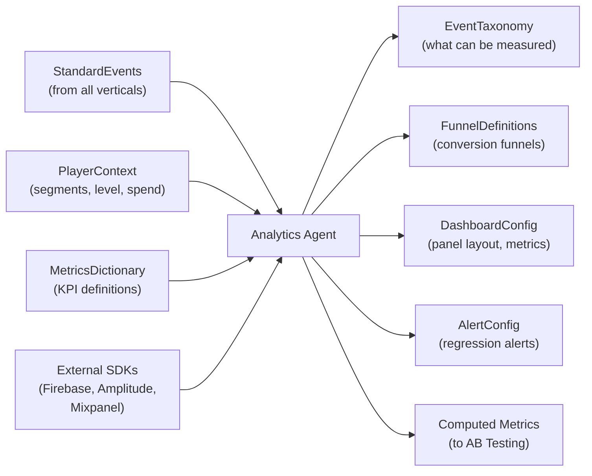
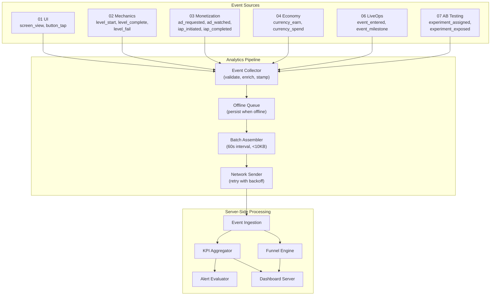
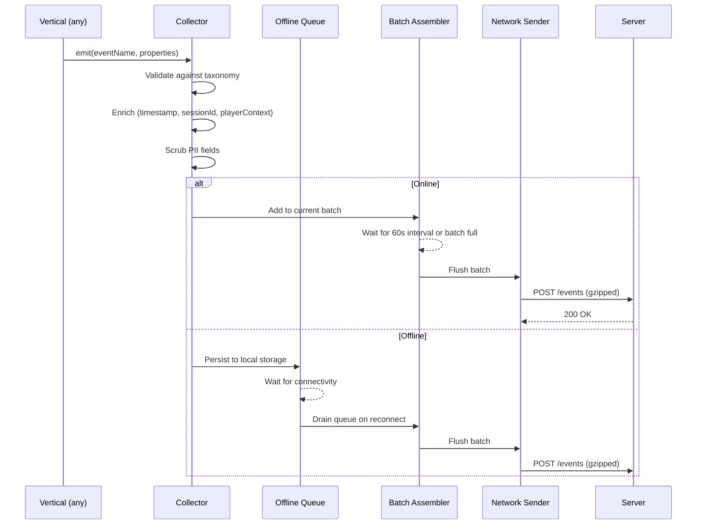
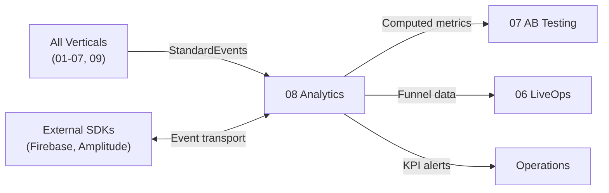

# Analytics Vertical Specification

The Analytics vertical owns **telemetry, event tracking, KPI computation, funnel analysis, and dashboards**. It instruments the entire game, captures every meaningful player action, and feeds computed metrics to the AB Testing vertical and all optimization loops across the engine.

---

## Purpose

Instrument every surface of the game so that every decision -- from difficulty tuning to monetization placement -- is data-informed. The Analytics Agent designs the event taxonomy, defines funnels, computes KPIs, configures dashboards, and sets up alerting so that regressions are caught before they compound.

Without Analytics, the other eight verticals operate blind. With it, every vertical has a feedback loop: emit events, observe metrics, adjust.

---

## Scope

### In Scope

| Area | Description |
|------|-------------|
| **Event Taxonomy** | Full catalog of trackable events, extending `StandardEvents` from [SharedInterfaces](../00_SharedInterfaces.md) |
| **Event Tracking API** | Emit, batch, flush, and offline-queue lifecycle for `AnalyticsEvent` payloads |
| **Funnel Definitions** | Step sequences with expected conversion rates for key player journeys |
| **KPI Computation** | Server-side and client-side metric aggregation per [MetricsDictionary](../../SemanticDictionary/MetricsDictionary.md) |
| **Dashboards** | Four standard dashboards: Executive, Engagement, Monetization, LiveOps (see [KPIDashboards](./KPIDashboards.md)) |
| **Alerting** | Threshold-based and anomaly-based alerts on KPI regressions |
| **Segment Tracking** | Attaching `PlayerContext.segments` to every event for cohort breakdowns |
| **Privacy Compliance** | GDPR/CCPA data minimization, consent gating, PII scrubbing before send |

### Out of Scope

| Area | Owner |
|------|-------|
| Experiment assignment and statistical analysis | AB Testing Agent (07) |
| Economy balance metrics computation | Economy Agent (04) -- emits events, Analytics aggregates |
| Ad mediation reporting | Monetization Agent (03) -- raw ad data, Analytics normalizes |
| Asset performance tracking | Asset Agent (09) |
| User acquisition attribution | External attribution SDK (Adjust, AppsFlyer) |

---

## Inputs and Outputs



### Inputs

| Input | Source | Description |
|-------|--------|-------------|
| `StandardEvents` | All verticals via [SharedInterfaces](../00_SharedInterfaces.md) | The canonical set of events every vertical must emit |
| `PlayerContext` | Runtime player state | Segment tags, level, days since install, spend tier |
| `MetricsDictionary` | [MetricsDictionary](../../SemanticDictionary/MetricsDictionary.md) | Formal definitions and formulas for every KPI |
| External SDK configs | Firebase / Amplitude / Mixpanel | Endpoint URLs, API keys, SDK initialization params |

### Outputs

| Output | Consumer | Description |
|--------|----------|-------------|
| `EventTaxonomy` | All verticals, AB Testing (07) | Complete catalog of trackable events with schemas |
| `FunnelDefinitions` | AB Testing (07), LiveOps (06) | Step sequences and expected conversion rates |
| `DashboardConfig` | Operations, all agents | Panel definitions, metric bindings, filter options |
| `AlertConfig` | Operations | Threshold and anomaly alert rules |
| Computed metrics | AB Testing (07) | Aggregated KPI values per experiment variant |

---

## Architecture



---

## Event Lifecycle

Every event follows this path from emission to dashboard:



---

## Event Taxonomy Design

The taxonomy extends `StandardEvents` from [SharedInterfaces](../00_SharedInterfaces.md) with Analytics-specific events:

```typescript
// Analytics-owned events (beyond StandardEvents)
type AnalyticsOwnedEvents = {
  // Session lifecycle
  session_start: { is_first_session: boolean; referrer?: string };
  session_end: { duration_seconds: number; screens_viewed: number };

  // Funnel progression
  funnel_step: { funnel_id: string; step_index: number; step_name: string };
  funnel_complete: { funnel_id: string; total_steps: number; duration_seconds: number };
  funnel_abandon: { funnel_id: string; last_step_index: number; step_name: string };

  // Engagement signals
  feature_discovered: { feature_id: string; discovery_method: 'organic' | 'ftue' | 'prompt' };
  content_consumed: { content_type: string; content_id: string; duration_seconds: number };

  // Error tracking
  client_error: { error_type: string; message: string; stack_hash: string };
  performance_sample: { screen_name: string; fps: number; memory_mb: number };
};

// Full taxonomy = StandardEvents + AnalyticsOwnedEvents
type FullEventTaxonomy = StandardEvents & AnalyticsOwnedEvents;
```

See [Interfaces.md](./Interfaces.md) for the event tracking API and [DataModels.md](./DataModels.md) for the `EventTaxonomy` schema.

---

## Funnel Definitions

The Analytics Agent defines these standard funnels:

| Funnel | Steps | Target Conversion |
|--------|-------|-------------------|
| **Onboarding** | install -> session_start -> level_start(L1) -> level_complete(L1) -> level_start(L2) | 60% end-to-end |
| **First Purchase** | session_start -> shop_view -> product_view -> iap_initiated -> iap_completed | 3-5% end-to-end |
| **Ad Engagement** | level_complete -> ad_offered -> ad_watched -> reward_claimed | 50% offer-to-watch |
| **Event Participation** | event_entered -> event_milestone(1st) -> event_milestone(final) -> event_completed | 40% entry-to-complete |
| **Retention Loop** | session_end(D0) -> session_start(D1) -> session_start(D7) | Matches D1/D7 retention targets |

See [KPIDashboards.md](./KPIDashboards.md) for how funnels appear in dashboards.

---

## Batching and Network

| Parameter | Value | Rationale |
|-----------|-------|-----------|
| Batch interval | 60 seconds | Balance between latency and battery |
| Max batch size | 10 KB (gzipped) | Fits in a single mobile packet |
| Max events per batch | 100 | Hard cap to prevent memory spikes |
| Offline queue max | 1000 events | ~10 KB uncompressed; older events dropped FIFO |
| Retry strategy | Exponential backoff: 1s, 2s, 4s, 8s, max 60s | Standard mobile retry pattern |
| Compression | gzip | Reduces payload ~70% |
| Transport | HTTPS POST | Required for privacy compliance |

---

## Privacy Compliance

| Rule | Implementation |
|------|----------------|
| Consent gating | No events emitted until player accepts analytics consent |
| PII scrubbing | `playerId` is a hashed device ID; no email, name, or IP in events |
| Data minimization | Only properties defined in taxonomy are sent; no free-form fields |
| GDPR right to delete | Server-side deletion endpoint keyed on hashed `playerId` |
| CCPA opt-out | Consent flag disables all non-essential events; only crash reporting remains |
| Data retention | Raw events: 90 days. Aggregated metrics: 2 years. |

---

## Constraints

1. **Batched sends only.** Events are never sent individually. The 60-second batch interval is the minimum granularity.
2. **< 10 KB per batch.** Gzipped. If a batch exceeds this, it is split before send.
3. **Offline queuing.** Up to 1000 events queued locally. On reconnect, queued events drain before new events.
4. **Privacy first.** No event is emitted before consent. No PII in any event payload.
5. **Taxonomy is the contract.** Events not in the taxonomy are rejected by the collector. This prevents unstructured data drift.
6. **No client-side KPI computation.** All aggregation happens server-side. The client only emits raw events.
7. **External SDK abstraction.** The Analytics API wraps Firebase/Amplitude/Mixpanel behind a unified interface. Switching providers requires zero changes to event-emitting code.

---

## Success Criteria

| Criterion | Measurement |
|-----------|-------------|
| Event taxonomy covers 100% of `StandardEvents` | Schema validation against [SharedInterfaces](../00_SharedInterfaces.md) |
| Every player action maps to at least one event | Coverage audit against screen inventory and mechanic actions |
| All 4 dashboards are configured and rendering | Dashboard smoke test |
| Alerts fire within 5 minutes of KPI regression | Alert latency test with synthetic data |
| Offline queue drains correctly on reconnect | Integration test: queue 50 events offline, reconnect, verify server receipt |
| Batch size never exceeds 10 KB | Batch assembler unit test with max-size payloads |
| Privacy: no PII in any event payload | Automated PII scanner on event output |
| Funnels match expected conversion rates within 10% | Funnel validation against historical benchmarks |
| AB Testing receives computed metrics within 5 minutes of batch ingestion | End-to-end latency test |

---

## Dependencies



| Dependency | Direction | What Flows |
|-----------|-----------|------------|
| All Verticals (01-07, 09) | Upstream to Analytics | `StandardEvents` per [SharedInterfaces](../00_SharedInterfaces.md) |
| AB Testing (07) | Analytics to downstream | Computed metrics per experiment variant |
| LiveOps (06) | Analytics to downstream | Funnel conversion data for event optimization |
| Economy (04) | Analytics to downstream | Currency flow metrics for balance tuning |
| External SDKs | Bidirectional | Event transport (out), attribution data (in) |

---

## Related Documents

- [SharedInterfaces](../00_SharedInterfaces.md) -- `AnalyticsEvent`, `StandardEvents`, `PlayerContext`
- [MetricsDictionary](../../SemanticDictionary/MetricsDictionary.md) -- KPI definitions and formulas
- [Interfaces](./Interfaces.md) -- Analytics API surface
- [DataModels](./DataModels.md) -- Event taxonomy, funnel, dashboard, alert schemas
- [AgentResponsibilities](./AgentResponsibilities.md) -- What the Analytics Agent decides vs coordinates
- [KPIDashboards](./KPIDashboards.md) -- Dashboard specifications and panel definitions
- [Glossary](../../SemanticDictionary/Glossary.md) -- Term definitions
