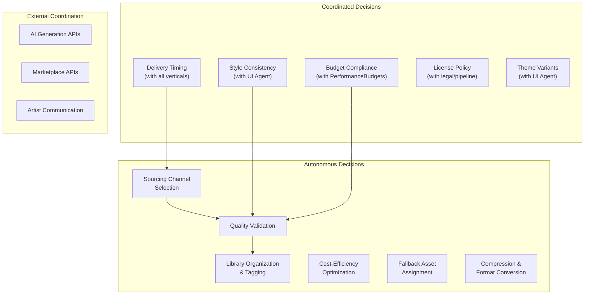
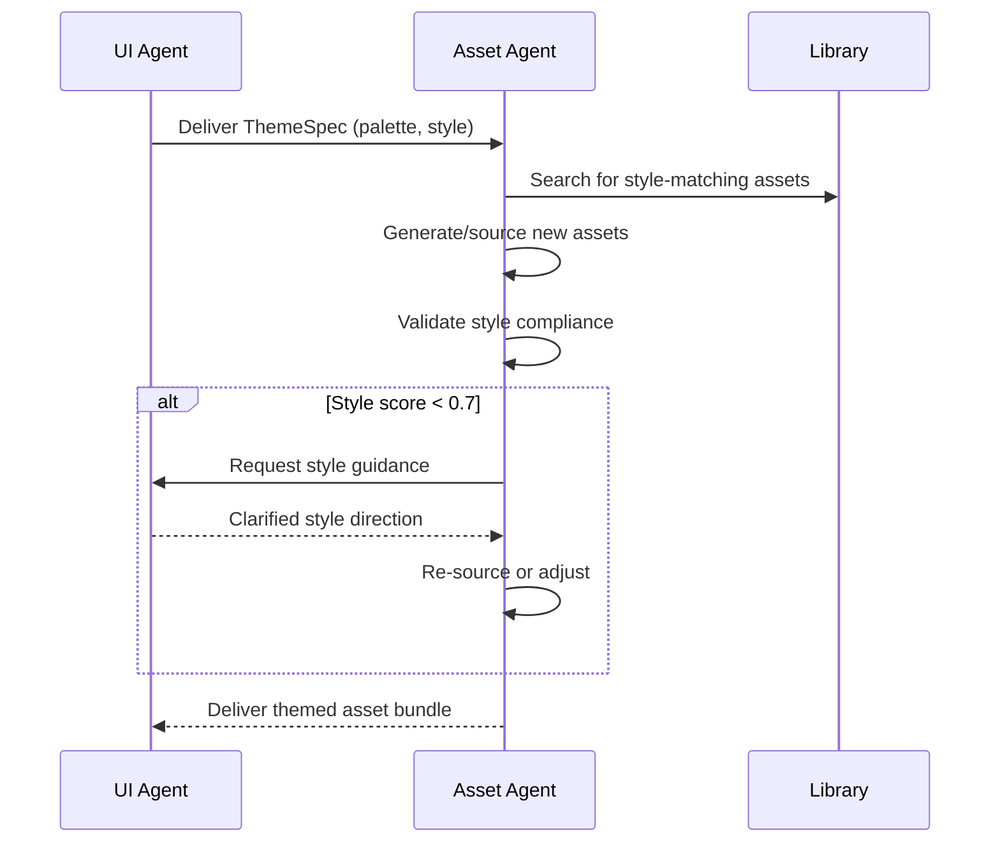
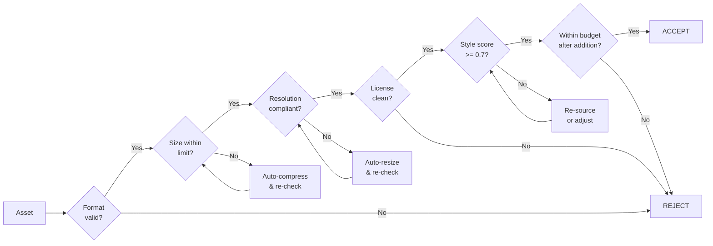

# Assets Vertical -- Agent Responsibilities

Defines what the Asset Agent decides autonomously, what it coordinates with other agents, its quality criteria, and its failure modes. This document draws the boundary between independent action and required collaboration.

---

## Responsibility Overview

---

## Autonomous Responsibilities

These decisions are made by the Asset Agent without consulting other agents. The agent has full authority and is accountable for outcomes.

### 1. Sourcing Channel Selection

The Asset Agent decides which of the three sourcing channels (AI-generated, purchased, commissioned) to use for each request, based on the decision matrix in [SourcingStrategy.md](./SourcingStrategy.md).

| Decision Factor | Agent Authority |
|----------------|-----------------|
| Channel assignment per request | Full -- agent selects channel |
| Switching channels on failure | Full -- agent retries alternate channels |
| Cost/speed tradeoff | Full within per-game budget |
| Vendor selection (which AI provider, which marketplace) | Full |

**Guardrails:**
- Must search the library before sourcing new assets (reuse-first policy).
- Must respect the cost budget allocated per game by the pipeline orchestrator.
- Commission decisions exceeding $500 require pipeline orchestrator approval.

### 2. Quality Validation

The Asset Agent autonomously validates every asset against technical rules before it enters the manifest or library.

| Validation Area | Agent Authority |
|----------------|-----------------|
| Format compliance | Full -- reject non-compliant formats |
| Size limit enforcement | Full -- reject or auto-compress oversized assets |
| Resolution checks | Full -- reject or auto-resize |
| Checksum computation | Full |
| Auto-compression decisions | Full -- choose optimal format and quality |

**Guardrails:**
- Validation rules are defined by [PerformanceBudgets](../../Architecture/PerformanceBudgets.md) and are not negotiable.
- Auto-compression must not reduce perceptual quality below a minimum threshold (SSIM >= 0.92).

### 3. Library Organization and Tagging

The Asset Agent manages the shared collateral library: adding entries, assigning tags, managing categories, and controlling storage tiers.

| Decision Area | Agent Authority |
|--------------|-----------------|
| Tag assignment | Full |
| Category placement | Full |
| Storage tier assignment (hot/warm/cold) | Full, based on usage metrics |
| Duplicate detection and deduplication | Full |
| Deprecation of unused assets | Full, after 180-day inactivity |

### 4. Cost-Efficiency Optimization

The Asset Agent optimizes sourcing cost across channels.

| Decision Area | Agent Authority |
|--------------|-----------------|
| Batch AI generation requests to reduce API calls | Full |
| Bundle marketplace purchases for volume discounts | Full |
| Substitute higher-cost assets with equivalent lower-cost ones | Full, if quality is equivalent |
| Track and report cost per asset | Full |

### 5. Fallback Asset Assignment

The Asset Agent assigns a fallback asset to every `AssetRef` in the manifest.

| Decision Area | Agent Authority |
|--------------|-----------------|
| Selecting appropriate fallback assets | Full |
| Creating generic fallback assets for missing categories | Full |
| Fallback chain depth (primary -> fallback -> default) | Full, max depth = 2 |

### 6. Compression and Format Conversion

The Asset Agent decides when and how to compress or convert assets.

| Decision Area | Agent Authority |
|--------------|-----------------|
| PNG to WebP conversion | Full, when size savings > 20% |
| Audio compression level | Full, within quality threshold |
| Minimum-tier variant generation | Full, half-resolution for all textures |
| Texture atlas packing | Full |

---

## Coordinated Responsibilities

These decisions require input from or alignment with other agents. The Asset Agent cannot act unilaterally.

### 1. Style Consistency (with UI Agent)

The UI Agent owns the `ThemeSpec`. The Asset Agent must ensure all visual assets conform to the theme's palette, typography, and aesthetic direction.

| Coordination Point | Protocol |
|-------------------|----------|
| Style compliance threshold | Score >= 0.7 (set by UI Agent) |
| Palette deviation tolerance | Delta-E < 10 for primary colors |
| Style dispute resolution | UI Agent has final authority on visual style |

### 2. Budget Compliance (with PerformanceBudgets)

Asset budgets are defined externally. The Asset Agent enforces them but cannot change them.

| Budget | Limit | Authority to Change |
|--------|-------|-------------------|
| Texture memory | 150 MB | Architecture team only |
| Audio memory | 50 MB | Architecture team only |
| Mesh/animation memory | 50 MB | Architecture team only |
| Initial download | 100 MB | Architecture team only |

**Coordination protocol:** If the Asset Agent projects that a game will exceed a budget, it must:
1. Report the projected overage to the pipeline orchestrator.
2. Recommend specific assets to compress, remove, or replace.
3. Wait for orchestrator decision before exceeding any hard limit.

### 3. Delivery Timing (with All Verticals)

Other verticals depend on assets to proceed with their work. The Asset Agent coordinates delivery order based on priority and dependency chains.

| Consuming Agent | Delivery Dependency | Timing Requirement |
|----------------|--------------------|--------------------|
| UI Agent (01) | Theme assets (icons, backgrounds, fonts) | Before UI generation begins |
| Core Mechanics (02) | Gameplay sprites, meshes, animations | Before level assembly |
| Monetization (03) | Shop icons, offer banners | Before shop catalog finalization |
| Economy (04) | Currency icons, reward art | Before economy configuration |
| Difficulty (05) | Level environment assets | Before difficulty curve validation |
| LiveOps (06) | Event-themed bundles | Before event configuration |

**Coordination protocol:** The Asset Agent publishes an estimated delivery timeline at pipeline start. If delivery will be late, it notifies the affected vertical immediately with a revised ETA and available fallback options.

### 4. License Policy (with Pipeline Orchestrator)

License compliance is a shared responsibility between the Asset Agent (which tracks licenses) and the pipeline orchestrator (which enforces legal policy).

| Decision Area | Asset Agent Role | Pipeline Orchestrator Role |
|--------------|-----------------|--------------------------|
| License type tracking | Records and monitors | Sets acceptable license types |
| Expiration monitoring | Alerts on upcoming expirations | Decides renewal vs replacement |
| New license type approval | Recommends | Approves |

### 5. Theme Variant Generation (with UI Agent)

Creating themed variants requires the UI Agent's `ThemeSpec` and approval of the visual results.

| Step | Owner |
|------|-------|
| Define theme requirements | UI Agent |
| Select base assets for theming | Asset Agent |
| Choose theming method (remap, transfer, regenerate) | Asset Agent |
| Execute theming | Asset Agent |
| Review and approve results | UI Agent (for hero assets), Asset Agent (for standard assets) |

---

## Quality Criteria

Every asset entering the manifest must meet all of the following criteria:

### Quality Scorecard

| Criterion | Weight | Measurement | Minimum |
|-----------|--------|-------------|---------|
| Format compliance | 15% | Binary: accepted format or not | Pass |
| Size compliance | 20% | File size vs type-specific limit | Pass |
| Resolution compliance | 15% | Dimensions vs max for type and tier | Pass |
| License validity | 20% | Commercial license on file | Pass |
| Style consistency | 15% | Style compliance score vs ThemeSpec | >= 0.7 |
| Budget headroom | 15% | Budget category not exceeded | Pass |
| **Overall** | 100% | All criteria met | All pass |

---

## Failure Modes

### 1. Budget Overrun

**Trigger:** Cumulative asset sizes exceed a memory budget category.

| Aspect | Detail |
|--------|--------|
| **Detection** | Quality validator projects budget exceedance |
| **Impact** | Game may crash on low-memory devices; store rejection risk |
| **Mitigation** | Auto-compress top N largest assets; suggest removal of least-critical assets |
| **Escalation** | Report to pipeline orchestrator with compression recommendations |
| **Recovery** | Rebuild manifest with compressed/removed assets |

### 2. Style Mismatch

**Trigger:** Sourced assets do not match the game's `ThemeSpec`.

| Aspect | Detail |
|--------|--------|
| **Detection** | Style compliance score < 0.7 |
| **Impact** | Visually inconsistent game; poor player experience |
| **Mitigation** | Apply color remap; re-generate with adjusted prompts; escalate to UI Agent |
| **Escalation** | Request UI Agent style clarification if repeated failures |
| **Recovery** | Re-source asset through appropriate channel with corrected style guidance |

### 3. License Violation

**Trigger:** Asset used without valid commercial license, or license has expired.

| Aspect | Detail |
|--------|--------|
| **Detection** | License audit finds missing, expired, or non-commercial license |
| **Impact** | Legal liability; potential store takedown |
| **Mitigation** | Immediately remove asset from manifest; substitute with licensed alternative |
| **Escalation** | Alert pipeline orchestrator and legal review |
| **Recovery** | Replace asset; update library entry status to `archived` |
| **Prevention** | License check is mandatory gate before manifest entry |

### 4. Delivery Delay

**Trigger:** Asset delivery misses estimated timeline, blocking downstream verticals.

| Aspect | Detail |
|--------|--------|
| **Detection** | Delivery timestamp exceeds estimated delivery + 25% buffer |
| **Impact** | Downstream verticals blocked; pipeline delay |
| **Mitigation** | Use fallback assets; switch to faster sourcing channel; parallelize requests |
| **Escalation** | Notify affected verticals with revised ETA and fallback plan |
| **Recovery** | Deliver final assets as hot-patch; replace fallbacks in manifest |

### 5. AI Generation Failure

**Trigger:** AI generation API returns unusable results (artifacts, wrong style, inappropriate content).

| Aspect | Detail |
|--------|--------|
| **Detection** | Quality validation rejects AI output; content safety check flags |
| **Impact** | Delayed delivery for the specific asset |
| **Mitigation** | Retry with refined prompt (max 3 attempts); switch to alternate AI provider; fall back to marketplace |
| **Escalation** | If all AI attempts fail, escalate to purchased or commissioned channel |
| **Recovery** | Source from alternate channel and update delivery estimate |

### 6. Marketplace Availability

**Trigger:** Target asset pack no longer available on marketplace, or price has changed significantly.

| Aspect | Detail |
|--------|--------|
| **Detection** | Purchase API returns 404 or price exceeds budget by > 50% |
| **Impact** | Cannot acquire planned assets |
| **Mitigation** | Search for equivalent packs; check library for substitutes; generate via AI |
| **Escalation** | Report to pipeline orchestrator if no suitable alternative found |
| **Recovery** | Source alternative or adjust game design to available assets |

---

## Decision Authority Summary

| Decision | Asset Agent | UI Agent | Pipeline Orchestrator |
|----------|-----------|----------|----------------------|
| Sourcing channel selection | **Decides** | -- | -- |
| Quality validation rules | **Enforces** | -- | Defines (via budgets) |
| Tag and category assignment | **Decides** | -- | -- |
| Style compliance threshold | Enforces | **Defines** | -- |
| Budget limits | Enforces | -- | **Defines** |
| License approval | Recommends | -- | **Approves** |
| High-cost commissions (>$500) | Recommends | -- | **Approves** |
| Delivery priority order | **Decides** | Advises | Advises |
| Fallback asset selection | **Decides** | -- | -- |
| Compression strategy | **Decides** | -- | -- |
| Library deprecation | **Decides** | -- | -- |

---

## Related Documents

- [Spec](./Spec.md) -- Vertical scope, constraints, and success criteria
- [Interfaces](./Interfaces.md) -- API contracts the agent implements
- [DataModels](./DataModels.md) -- Schemas the agent produces and consumes
- [SourcingStrategy](./SourcingStrategy.md) -- Detailed channel selection logic
- [AssetLibrary](./AssetLibrary.md) -- Library management the agent owns
- [SharedInterfaces](../00_SharedInterfaces.md) -- Cross-vertical contracts
- [PerformanceBudgets](../../Architecture/PerformanceBudgets.md) -- Budget constraints the agent enforces
