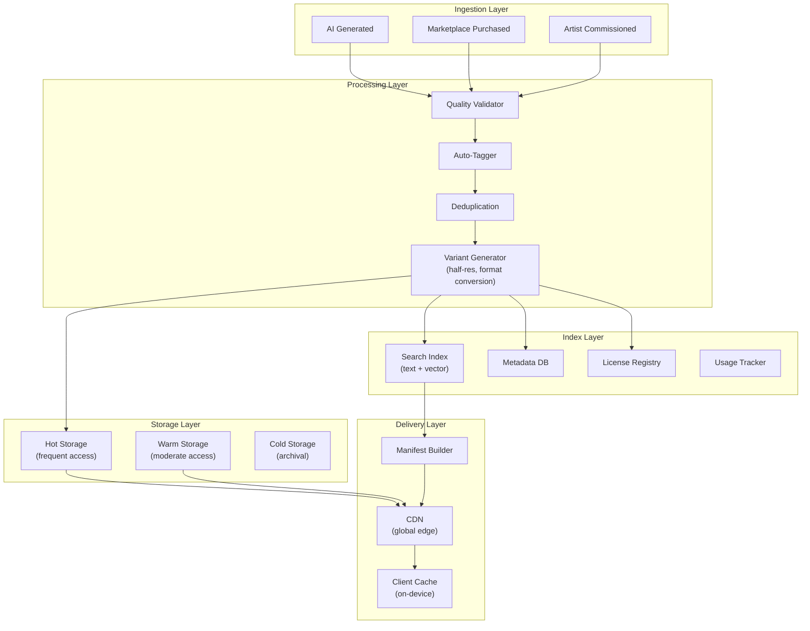
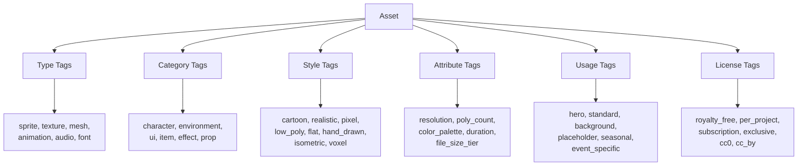
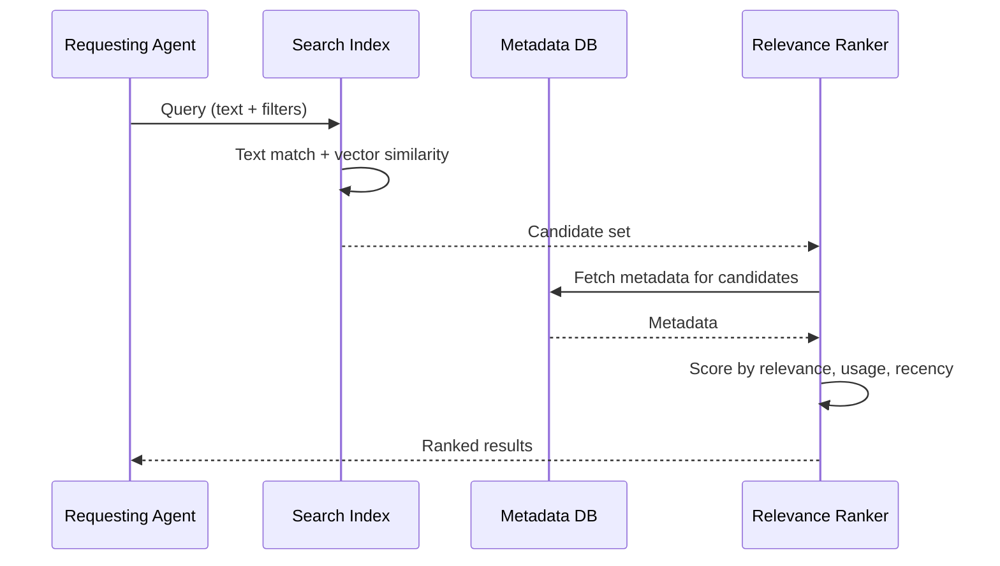
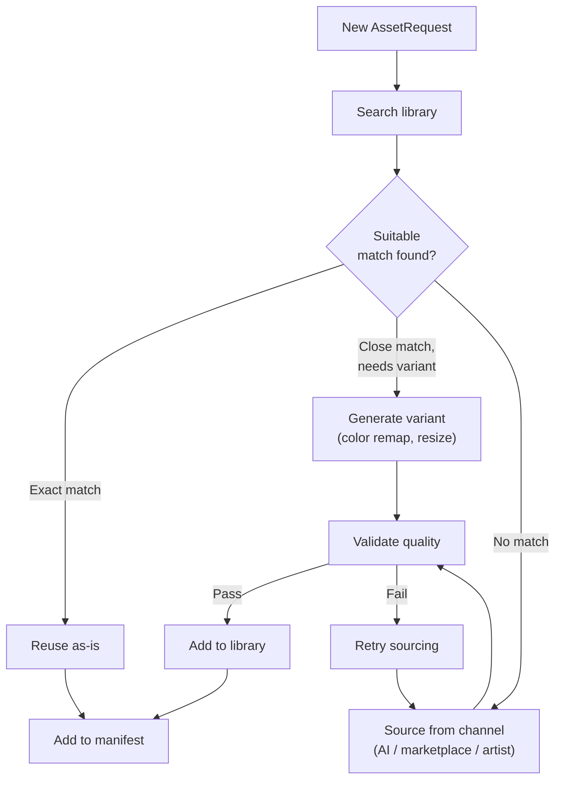
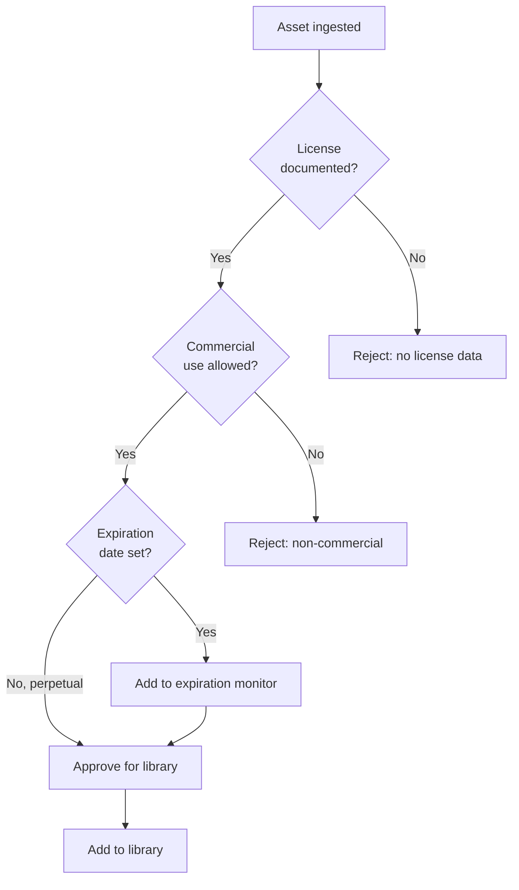
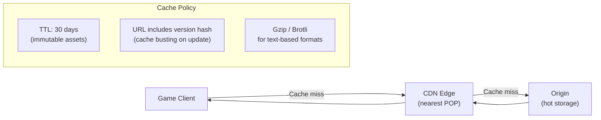
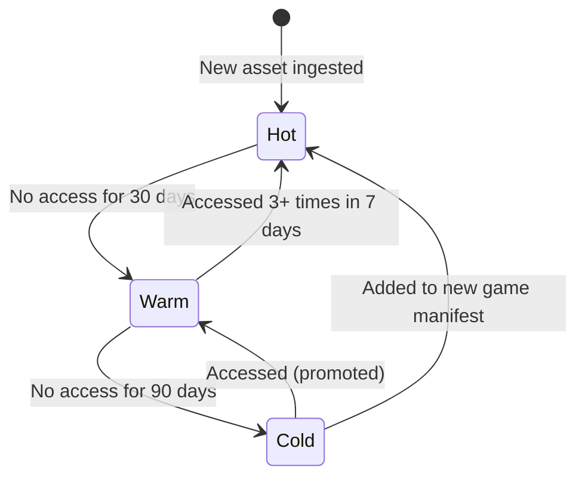

# Assets Vertical -- Asset Library

The shared collateral library is the central repository for all assets used across games produced by the AI Game Engine. It stores, tags, indexes, and serves assets to maximize reuse and minimize redundant sourcing.

---

## Library Architecture



---

## Library Structure and Organization

### Directory Hierarchy

Assets are organized by type, then by category, then by style. The physical storage structure mirrors the logical taxonomy.

```
library/
  sprites/
    characters/
      cartoon/
      realistic/
      pixel/
    items/
    ui_elements/
    particles/
  textures/
    backgrounds/
    tilemaps/
    atlases/
    patterns/
  meshes/
    characters/
    props/
    environments/
  animations/
    character_anims/
    ui_anims/
    particle_anims/
  audio/
    music/
    sfx/
    ambient/
    ui_sounds/
  fonts/
    heading/
    body/
    display/
```

### Naming Convention

All assets follow a consistent naming scheme:

```
{type}_{category}_{description}_{style}_{variant}.{format}

Examples:
  sprite_character_knight_cartoon_idle.png
  texture_background_forest_realistic_day.webp
  audio_sfx_coin_pickup_cheerful_v2.ogg
  mesh_prop_treasure_chest_lowpoly_lod1.glb
  font_heading_adventure_display.ttf
```

---

## Tagging System

Every asset is tagged along multiple dimensions to enable fast, flexible search. Tags are assigned automatically during ingestion and can be refined manually.

### Tag Dimensions



### Category Tags (Hierarchical)

| Top Level | Second Level | Third Level (examples) |
|-----------|-------------|----------------------|
| `character` | `player`, `npc`, `enemy`, `boss` | `warrior`, `mage`, `animal`, `robot` |
| `environment` | `background`, `tile`, `prop`, `skybox` | `forest`, `desert`, `city`, `dungeon` |
| `ui` | `icon`, `button`, `panel`, `bar`, `modal` | `currency`, `health`, `navigation`, `reward` |
| `audio` | `music`, `sfx`, `ambient`, `voice` | `action`, `calm`, `ui_click`, `explosion` |
| `item` | `weapon`, `armor`, `consumable`, `cosmetic` | `sword`, `shield`, `potion`, `hat` |
| `effect` | `particle`, `trail`, `explosion`, `glow` | `fire`, `ice`, `sparkle`, `smoke` |

### Style Tags

| Tag | Description | Example |
|-----|-------------|---------|
| `cartoon` | Bold outlines, exaggerated proportions, bright colors | Most casual games |
| `realistic` | Photorealistic textures, natural proportions | Simulation games |
| `pixel` | Pixel-art style, limited palette, retro feel | Retro-inspired games |
| `low_poly` | Simplified geometry, flat or gradient shading | Minimalist 3D games |
| `flat` | Solid colors, no gradients or shadows, vector-like | Modern UI, hyper-casual |
| `hand_drawn` | Sketch-like, organic lines, watercolor or ink | Narrative games |
| `isometric` | 2.5D perspective, consistent angle | Strategy, simulation |
| `voxel` | 3D pixel blocks | Crafting, sandbox games |

### Attribute Tags

| Attribute | Values | Applied To |
|-----------|--------|-----------|
| `resolution_tier` | `low` (<=512), `medium` (<=1024), `high` (<=2048) | Images, textures |
| `poly_tier` | `low` (<1K), `medium` (<5K), `high` (<10K) | Meshes |
| `duration_tier` | `short` (<5s), `medium` (<30s), `long` (>30s) | Audio, animation |
| `color_dominant` | Extracted hex codes | All visual assets |
| `size_tier` | `tiny` (<50KB), `small` (<200KB), `medium` (<1MB), `large` (>1MB) | All assets |
| `seasonal` | `spring`, `summer`, `autumn`, `winter`, `holiday` | Seasonal content |
| `mood` | `cheerful`, `dark`, `serene`, `energetic`, `mysterious` | All assets |

---

## Search and Discovery

### Search Pipeline



### Search Capabilities

| Capability | Method | Example |
|-----------|--------|---------|
| **Text search** | Full-text index on name, description, tags | `"forest background sunset"` |
| **Semantic search** | Vector embedding similarity | `"peaceful nature scene"` matches `"serene forest clearing"` |
| **Tag filtering** | Exact match on structured tags | `type:texture AND style:cartoon` |
| **Color search** | Delta-E distance from target palette | Find assets matching `#4A90D9` within Delta-E 15 |
| **Similar asset** | Vector similarity from reference asset | "Find assets like this one" |
| **Constraint filtering** | Range queries on technical attributes | `fileSizeKB < 200 AND width <= 1024` |
| **License filtering** | Exact match on license type | `licenseType:royalty_free` |

### Search Relevance Scoring

Results are ranked by a composite score:

| Factor | Weight | Description |
|--------|--------|-------------|
| Text/semantic relevance | 40% | How well the asset matches the query |
| Usage count | 20% | More-used assets rank higher (proven quality) |
| Recency | 10% | Recently added assets get a small boost |
| Quality score | 15% | Higher quality score ranks higher |
| Style match | 15% | Closer match to current game's ThemeSpec |

---

## Reuse Workflow

The library-first reuse pattern is mandatory for all asset requests. See [AgentResponsibilities.md](./AgentResponsibilities.md) for enforcement rules.



### Reuse Decision Criteria

| Scenario | Decision | Rationale |
|----------|----------|-----------|
| Exact asset exists, correct style and size | Reuse directly | Zero additional cost |
| Asset exists but wrong color palette | Generate color-remapped variant | Minutes, near-zero cost |
| Asset exists but wrong resolution | Generate resized variant | Seconds, zero cost |
| Similar asset exists, 80%+ match | Evaluate: reuse with minor adjustments or source new | Balance uniqueness vs cost |
| No similar asset exists | Source new through appropriate channel | Add to library for future reuse |

### Reuse Rate Tracking

The target reuse rate is **> 60%** across all games. This is measured as:

```
reuse_rate = library_hits / total_asset_requests
```

| Reuse Rate | Status | Action |
|-----------|--------|--------|
| > 75% | Excellent | Library is mature and well-tagged |
| 60-75% | Good | On target; continue growing library |
| 40-60% | Below target | Review tagging quality; audit missed matches |
| < 40% | Poor | Library gap analysis; bulk acquisition needed |

---

## Version Management

Assets may be updated over time. The library supports versioning to maintain backward compatibility.

### Version Policy

```typescript
interface AssetVersion {
  assetId: string;                    // Stable across versions
  version: number;                    // Monotonically increasing
  previousVersionId?: string;         // Link to prior version
  changeDescription: string;          // What changed
  backwardCompatible: boolean;        // Can replace prior version safely
  createdAt: ISO8601;
}
```

| Operation | Version Impact | Backward Compatible |
|-----------|---------------|-------------------|
| Color correction | New version | Yes |
| Resolution upgrade | New version + variant | Yes |
| Format conversion | New variant (not version) | Yes |
| Art style change | New version | No -- existing games keep prior |
| Bug fix (artifact removal) | New version | Yes |
| Complete replacement | New asset ID | No -- explicit migration required |

### Backward Compatibility Rules

1. **Existing manifests are never broken.** If a game references asset `v2`, that version remains available indefinitely.
2. **New games get latest version.** Library search returns the latest version by default.
3. **Non-compatible changes create new assets.** If an update is not backward-compatible, it gets a new `assetId` rather than a new version of the existing one.
4. **Deprecation period.** Old versions are marked `deprecated` but remain available for 1 year before archival.

---

## License Tracking

Every asset in the library has an associated `LicenseInfo` record. See [DataModels.md](./DataModels.md) for the full schema.

### License Compliance Workflow



### Expiration Monitoring

| Alert Threshold | Action |
|----------------|--------|
| 90 days before expiration | Info alert to pipeline orchestrator |
| 30 days before expiration | Warning: plan renewal or replacement |
| 7 days before expiration | Critical: renew now or mark for replacement |
| Expired | Asset status = `expired`; excluded from search results; existing manifests retain access |

### License Audit Schedule

| Frequency | Scope | Action |
|-----------|-------|--------|
| Daily | Expiring licenses (next 30 days) | Automated alerts |
| Weekly | All subscription-based licenses | Verify subscriptions active |
| Monthly | Random 10% sample of library | Full license validation |
| Quarterly | Entire library | Comprehensive audit report |

---

## Storage and CDN

### Storage Architecture

| Layer | Technology | Purpose | Latency |
|-------|-----------|---------|---------|
| **Client cache** | On-device storage | Previously downloaded assets | 0ms (local) |
| **CDN edge** | CloudFront / Fastly | Global distribution | 10-50ms |
| **Hot storage** | S3 Standard / GCS Standard | Frequently accessed originals | 50-100ms |
| **Warm storage** | S3 Infrequent Access | Moderately accessed assets | 100-200ms |
| **Cold storage** | S3 Glacier Instant | Archived, rarely accessed | 200ms - 2s |

### CDN Configuration



| Config | Value | Rationale |
|--------|-------|-----------|
| CDN TTL | 30 days | Assets are immutable; version changes = new URL |
| Cache key | `{assetId}-{version}-{variant}` | Unique per version and variant |
| Compression | Brotli for glTF, Gzip for JSON metadata | Reduce transfer size |
| Edge locations | Global (major regions) | < 50ms to 95% of players |
| Origin shield | Enabled | Reduce origin load |
| HTTPS only | Yes | Secure delivery |

### Storage Tier Migration

Assets automatically migrate between tiers based on access patterns:



### Cost Optimization

| Strategy | Savings | Implementation |
|----------|---------|---------------|
| Tier migration | 40-60% on cold assets | Automated lifecycle policy |
| Deduplication | 10-20% storage | Content-hash based dedup at ingest |
| Format optimization | 20-40% per asset | WebP for images, OGG for audio |
| CDN caching | 60-80% bandwidth | Long TTL + immutable URL pattern |
| Variant-on-demand | 30% storage | Generate reduced variants at request time, cache result |

---

## Metrics and Reporting

### Key Metrics

| Metric | Definition | Target | Frequency |
|--------|-----------|--------|-----------|
| **Reuse rate** | Library hits / total requests | > 60% | Per game |
| **Library size** | Total unique assets | Growing | Weekly |
| **Cost per asset** | Total sourcing cost / assets delivered | Decreasing trend | Monthly |
| **Average delivery time** | Request to manifest entry | < 30 min (AI), < 4 hr (purchased) | Per request |
| **Quality pass rate** | Assets passing validation on first attempt | > 80% | Weekly |
| **Budget utilization** | Used bytes / budget bytes per category | < 90% | Per game |
| **License compliance** | Assets with valid licenses / total assets | 100% | Daily |
| **Storage cost** | Monthly storage + CDN cost | Optimized | Monthly |

### Usage Analytics

| Report | Contents | Audience |
|--------|----------|----------|
| **Most used assets** | Top 50 assets by usage count across games | Asset Agent (optimize caching) |
| **Least used assets** | Bottom 50 assets with > 90 day inactivity | Asset Agent (archive candidates) |
| **Reuse by type** | Reuse rate broken down by asset type | Pipeline orchestrator |
| **Cost by channel** | Sourcing cost per channel over time | Pipeline orchestrator |
| **Style coverage** | Tag distribution across styles | Asset Agent (gap analysis) |
| **Library growth** | New assets per week/month, by channel | Pipeline orchestrator |

### Dashboard Queries

```typescript
// Example metric queries
interface AssetLibraryMetrics {
  getReuseRate(gameId: string): Promise<number>;
  getLibrarySize(filters?: { type?: string; style?: string }): Promise<number>;
  getCostPerAsset(period: { from: ISO8601; to: ISO8601 }): Promise<number>;
  getMostUsedAssets(limit: number): Promise<AssetLibraryEntry[]>;
  getLeastUsedAssets(inactiveDays: number, limit: number): Promise<AssetLibraryEntry[]>;
  getStorageCost(period: { from: ISO8601; to: ISO8601 }): Promise<{
    hot: number;
    warm: number;
    cold: number;
    cdn: number;
    total: number;
  }>;
  getLicenseExpirations(withinDays: number): Promise<{
    assetId: string;
    expiresAt: ISO8601;
    licenseType: string;
  }[]>;
}
```

---

## Library Bootstrap

For a new AI Game Engine deployment, the library should be bootstrapped with a starter set to ensure minimum reuse rates from game one.

### Starter Pack Contents

| Category | Count | Source | Estimated Cost |
|----------|-------|--------|---------------|
| UI icon set (standard actions) | 100 | Purchased (Kenney, free) | $0 |
| UI button/panel kit | 50 | Purchased | $15 - $30 |
| Character sprites (cartoon, 5 archetypes) | 25 | Purchased | $20 - $40 |
| Environment tiles (4 biomes) | 80 | Purchased | $30 - $60 |
| SFX library (actions, UI, environment) | 200 | Purchased | $20 - $40 |
| Music tracks (5 moods, 3 each) | 15 | Purchased (subscription) | $15 - $25/mo |
| Fonts (4 families: heading, body, display, mono) | 4 | Google Fonts (free) | $0 |
| Fallback/placeholder assets (all types) | 20 | AI Generated | $1 - $5 |
| **Total starter pack** | **~494** | **Mixed** | **$100 - $200** |

This starter pack provides immediate library coverage, ensuring the first game built on the engine achieves at least a 30-40% reuse rate before any game-specific assets are added.

---

## Related Documents

- [Spec](./Spec.md) -- Vertical scope and success criteria (reuse rate target)
- [Interfaces](./Interfaces.md) -- Library search API definition
- [DataModels](./DataModels.md) -- AssetLibraryEntry, LicenseInfo schemas
- [AgentResponsibilities](./AgentResponsibilities.md) -- Library management authority
- [SourcingStrategy](./SourcingStrategy.md) -- How new assets enter the library
- [SharedInterfaces](../00_SharedInterfaces.md) -- AssetRef contract
- [PerformanceBudgets](../../Architecture/PerformanceBudgets.md) -- Size constraints for stored assets
