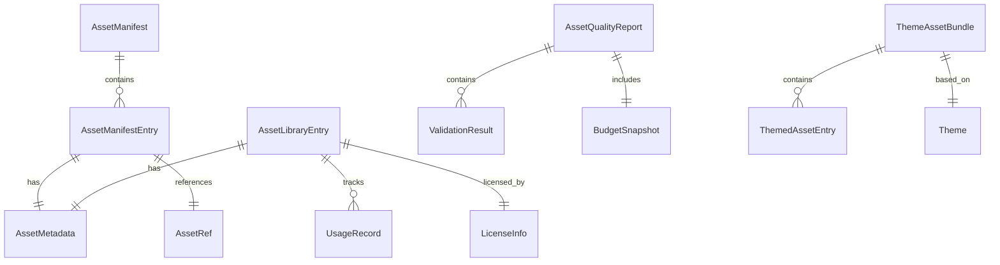

# Assets Vertical -- Data Models

Canonical schema definitions for all data structures produced and consumed by the Asset Agent. These models define the shape of asset manifests, metadata, library entries, quality reports, and themed bundles.

> All models reference core types from [SharedInterfaces](../00_SharedInterfaces.md) (`AssetRef`, `AssetRequest`, `Theme`, `ISO8601`).

---

## Model Relationship Diagram



---

## 1. AssetManifest

The primary output artifact of the Asset Agent. One manifest per game, containing every asset delivered for that game build.

```typescript
interface AssetManifest {
  // Identity
  manifestId: string;                           // Unique manifest identifier
  gameId: string;                               // Game this manifest belongs to
  version: number;                              // Incremented on each rebuild
  createdAt: ISO8601;
  updatedAt: ISO8601;

  // Summary
  summary: ManifestSummary;

  // Entries
  entries: AssetManifestEntry[];

  // Budget compliance
  budgetReport: ManifestBudgetReport;

  // Build info
  buildTarget: 'android' | 'ios' | 'web';
  deviceTier: 'minimum' | 'target' | 'high_end';
}

interface ManifestSummary {
  totalAssets: number;
  totalSizeBytes: number;
  byType: Record<AssetRef['type'], TypeSummary>;
  byChannel: Record<SourcingChannel, number>;   // Count per sourcing channel
  reuseRate: number;                            // 0.0 - 1.0
  newAssetsCreated: number;
  libraryAssetsReused: number;
}

interface TypeSummary {
  count: number;
  totalSizeBytes: number;
  budgetBytes: number;
  percentUsed: number;
}

type SourcingChannel = 'library_reuse' | 'ai_generated' | 'purchased' | 'commissioned';

interface AssetManifestEntry {
  asset: AssetRef;                              // Reference with path and fallback
  metadata: AssetMetadata;                      // Full metadata
  sourcingChannel: SourcingChannel;
  requestId?: string;                           // Original AssetRequest ID, if any
  deliveredAt: ISO8601;
  downloadUrl: string;                          // CDN URL for runtime download
  bundled: boolean;                             // true = included in initial download
  checksum: string;                             // SHA-256 of asset binary
}

interface ManifestBudgetReport {
  withinBudget: boolean;
  textureBudget: BudgetLine;
  audioBudget: BudgetLine;
  meshBudget: BudgetLine;
  initialDownloadBudget: BudgetLine;
  totalInstalledBudget: BudgetLine;
  violations: BudgetViolation[];
}

interface BudgetLine {
  category: string;
  usedBytes: number;
  limitBytes: number;
  percentUsed: number;
  withinBudget: boolean;
}

interface BudgetViolation {
  category: string;
  overageBytes: number;
  offendingAssets: string[];                    // Asset IDs exceeding budget
  recommendation: string;
}
```

### Manifest Size Targets

| Category | Budget Limit | Source |
|----------|-------------|--------|
| Textures | 150 MB (157,286,400 bytes) | [PerformanceBudgets](../../Architecture/PerformanceBudgets.md) |
| Audio | 50 MB (52,428,800 bytes) | [PerformanceBudgets](../../Architecture/PerformanceBudgets.md) |
| Mesh/Animation | 50 MB (52,428,800 bytes) | [PerformanceBudgets](../../Architecture/PerformanceBudgets.md) |
| Initial download | 100 MB (104,857,600 bytes) | [PerformanceBudgets](../../Architecture/PerformanceBudgets.md) |
| Total installed | 500 MB (524,288,000 bytes) | [PerformanceBudgets](../../Architecture/PerformanceBudgets.md) |

---

## 2. AssetMetadata

Descriptive metadata attached to every asset. Stored in the library and included in manifests.

```typescript
interface AssetMetadata {
  // Identity
  assetId: string;
  name: string;                                 // Human-readable name
  description: string;                          // What this asset is/depicts

  // Classification
  type: AssetRef['type'];                       // sprite, texture, mesh, animation, audio, font
  subType: string;                              // Finer classification (see table below)
  tags: string[];                               // Searchable tags
  categories: string[];                         // Hierarchical categories

  // Technical properties
  format: string;                               // File format: 'png', 'webp', 'ogg', 'gltf', etc.
  fileSizeBytes: number;
  checksum: string;                             // SHA-256

  // Type-specific properties (only relevant fields populated)
  dimensions?: {
    width: number;
    height: number;
  };
  polygonCount?: number;                        // For meshes
  duration?: number;                            // Seconds, for audio and animation
  sampleRate?: number;                          // Hz, for audio
  channels?: number;                            // 1 = mono, 2 = stereo
  frameCount?: number;                          // For animations
  fps?: number;                                 // For animations
  colorDepth?: number;                          // Bits per pixel for images

  // Style properties
  style: AssetStyle;

  // Provenance
  sourcingChannel: SourcingChannel;
  sourceDetails: SourceDetails;
  license: LicenseInfo;

  // Timestamps
  createdAt: ISO8601;
  updatedAt: ISO8601;
}

interface AssetStyle {
  aesthetic: string;                            // 'cartoon', 'realistic', 'pixel', 'low_poly', 'flat'
  colorPalette: string[];                       // Dominant hex colors extracted from asset
  mood?: string;                                // 'cheerful', 'dark', 'serene', 'energetic'
  era?: string;                                 // 'modern', 'fantasy', 'sci_fi', 'medieval'
}

interface SourceDetails {
  channel: SourcingChannel;

  // AI generation details
  aiProvider?: string;                          // 'dall_e_3', 'stable_diffusion_xl', 'midjourney'
  aiPrompt?: string;                            // Generation prompt used
  aiModel?: string;                             // Model version
  aiSeed?: number;                              // For reproducibility

  // Purchase details
  marketplace?: string;                         // 'unity_asset_store', 'itch_io', 'synty'
  purchaseId?: string;                          // Order/receipt ID
  packName?: string;                            // Asset pack name
  purchaseDate?: ISO8601;
  purchasePriceCents?: number;                  // In USD cents

  // Commission details
  artistName?: string;
  artistContact?: string;
  commissionBrief?: string;
  contractId?: string;
  commissionPriceCents?: number;
  commissionedDate?: ISO8601;
  deliveredDate?: ISO8601;
  revisionCount?: number;
}
```

### SubType Reference

| Type | SubTypes |
|------|----------|
| `sprite` | `icon`, `character`, `item`, `ui_element`, `particle`, `background_element` |
| `texture` | `background`, `tilemap`, `atlas`, `pattern`, `skybox` |
| `mesh` | `character`, `prop`, `environment`, `vehicle`, `weapon` |
| `animation` | `character_anim`, `ui_anim`, `particle_anim`, `spine_skeleton` |
| `audio` | `sfx`, `music`, `ambient`, `ui_sound`, `voice` |
| `font` | `heading`, `body`, `display`, `monospace` |

---

## 3. AssetLibraryEntry

Extends metadata with storage location and usage tracking. One entry per unique asset in the shared library.

```typescript
interface AssetLibraryEntry {
  // Core metadata
  metadata: AssetMetadata;

  // Storage
  storage: AssetStorageInfo;

  // Usage tracking
  usage: AssetUsageInfo;

  // Variants
  variants: AssetVariant[];

  // Library management
  status: 'active' | 'deprecated' | 'archived' | 'pending_review';
  addedBy: string;                              // Agent or process that added this
  reviewedBy?: string;                          // Human reviewer, if manually reviewed
  qualityScore: number;                         // 0-100, composite quality metric
}

interface AssetStorageInfo {
  primaryUrl: string;                           // Cloud storage URL
  cdnUrl: string;                               // CDN-accelerated URL
  thumbnailUrl: string;                         // Low-res preview
  storageRegion: string;                        // e.g., 'us-east-1'
  storageTier: 'hot' | 'warm' | 'cold';        // Based on usage frequency
  uploadedAt: ISO8601;
  lastAccessedAt: ISO8601;
}

interface AssetUsageInfo {
  totalUses: number;                            // Times used across all games
  uniqueGames: number;                          // Distinct games using this asset
  usageHistory: UsageRecord[];
  firstUsed: ISO8601;
  lastUsed: ISO8601;
  popularityRank?: number;                      // Rank within its type category
}

interface UsageRecord {
  gameId: string;
  gameName: string;
  usedAt: ISO8601;
  context: string;                              // e.g., 'main_menu_background', 'player_character'
}

interface AssetVariant {
  variantId: string;
  variantType: 'resolution' | 'format' | 'theme' | 'platform';
  description: string;                          // e.g., 'half-res for minimum tier'
  metadata: Partial<AssetMetadata>;             // Override fields
  storageUrl: string;
}
```

### Storage Tier Policy

| Tier | Criteria | Access Latency | Cost |
|------|----------|----------------|------|
| **Hot** | Used in last 30 days or usage > 10 | < 50ms | Highest |
| **Warm** | Used in last 90 days or usage > 3 | < 200ms | Medium |
| **Cold** | Not used in 90+ days and usage <= 3 | < 2s | Lowest |

---

## 4. AssetQualityReport

Result of running an asset through the quality validation pipeline. Generated for every asset before it enters the manifest or library.

```typescript
interface AssetQualityReport {
  // Identity
  reportId: string;
  assetId: string;
  generatedAt: ISO8601;

  // Overall result
  passed: boolean;
  overallScore: number;                         // 0-100

  // Validation results by category
  results: ValidationResult[];

  // Budget impact
  budgetSnapshot: BudgetSnapshot;

  // Style compliance
  styleCompliance: StyleComplianceResult;

  // Recommendations
  recommendations: QualityRecommendation[];
}

interface ValidationResult {
  ruleId: string;
  category: 'format' | 'size' | 'resolution' | 'performance' | 'license' | 'style';
  severity: 'error' | 'warning' | 'info';
  passed: boolean;
  message: string;
  actualValue?: string | number;
  expectedValue?: string | number;
  threshold?: string | number;
}

interface BudgetSnapshot {
  category: string;                             // 'texture', 'audio', 'mesh'
  currentUsageBytes: number;
  assetSizeBytes: number;
  projectedUsageBytes: number;
  budgetLimitBytes: number;
  withinBudget: boolean;
  percentAfterAddition: number;
}

interface StyleComplianceResult {
  themeId: string;
  paletteMatch: number;                         // 0.0 - 1.0
  aestheticMatch: number;                       // 0.0 - 1.0
  overallStyleScore: number;                    // 0.0 - 1.0
  deviations: StyleDeviation[];
}

interface StyleDeviation {
  aspect: string;                               // 'color', 'linework', 'shading', 'proportion'
  description: string;
  severity: 'minor' | 'moderate' | 'major';
}

interface QualityRecommendation {
  type: 'compress' | 'resize' | 'reformat' | 'regenerate' | 'replace';
  description: string;
  estimatedImprovement: string;                 // e.g., 'Save 120 KB (40% reduction)'
  autoFixAvailable: boolean;
}
```

### Validation Pass Criteria

| Category | Pass Condition |
|----------|---------------|
| Format | Asset is in an accepted format for its type |
| Size | File size within per-type limits |
| Resolution | Dimensions within max for type and tier |
| Performance | Will not cause budget category to exceed limit |
| License | Valid commercial license on file |
| Style | Style compliance score >= 0.7 |
| **Overall** | Zero errors. Warnings allowed. Score >= 70 |

---

## 5. ThemeAssetBundle

A complete set of themed assets for a single game, derived from base assets and the game's `Theme`.

```typescript
interface ThemeAssetBundle {
  // Identity
  bundleId: string;
  gameId: string;
  themeId: string;
  createdAt: ISO8601;

  // Theme reference
  theme: Theme;

  // Bundle contents
  entries: ThemedAssetEntry[];

  // Summary
  summary: ThemeBundleSummary;

  // Status
  status: 'generating' | 'complete' | 'partial';
  completionPercent: number;
}

interface ThemedAssetEntry {
  // Asset reference
  asset: AssetRef;
  metadata: AssetMetadata;

  // Theming info
  baseAssetId: string | null;                   // null if created from scratch
  themingMethod: 'color_remap' | 'style_transfer' | 'ai_regenerate' | 'original' | 'manual_edit';
  themeComplianceScore: number;                 // 0.0 - 1.0

  // Usage context
  slot: string;                                 // Where in the game this asset is used
  required: boolean;                            // true = game won't run without it
  category: ThemeAssetCategory;
}

type ThemeAssetCategory =
  | 'ui_icons'
  | 'ui_backgrounds'
  | 'ui_buttons'
  | 'ui_panels'
  | 'gameplay_sprites'
  | 'gameplay_meshes'
  | 'gameplay_animations'
  | 'audio_music'
  | 'audio_sfx'
  | 'audio_ambient'
  | 'fonts';

interface ThemeBundleSummary {
  totalAssets: number;
  totalSizeBytes: number;
  byCategory: Record<ThemeAssetCategory, CategorySummary>;
  averageThemeCompliance: number;               // 0.0 - 1.0
  assetsFromLibrary: number;
  assetsNewlyGenerated: number;
  estimatedCostCents: number;                   // Total sourcing cost
}

interface CategorySummary {
  count: number;
  sizeBytes: number;
  averageCompliance: number;
}
```

### Theme Asset Categories

| Category | Typical Count | Typical Size | Priority |
|----------|--------------|--------------|----------|
| `ui_icons` | 30-60 | 50-150 KB each | High |
| `ui_backgrounds` | 5-10 | 200-512 KB each | High |
| `ui_buttons` | 10-20 | 20-50 KB each | High |
| `ui_panels` | 5-15 | 50-200 KB each | Medium |
| `gameplay_sprites` | 20-100 | 50-256 KB each | Critical |
| `gameplay_meshes` | 10-50 | 100 KB - 2 MB each | Critical |
| `gameplay_animations` | 10-40 | 50 KB - 1 MB each | Critical |
| `audio_music` | 3-8 | 2-5 MB each | High |
| `audio_sfx` | 20-60 | 10-500 KB each | High |
| `audio_ambient` | 3-5 | 1-3 MB each | Low |
| `fonts` | 2-4 | 50-200 KB each | Critical |

---

## LicenseInfo

License metadata tracked per asset. Critical for commercial compliance.

```typescript
interface LicenseInfo {
  licenseType: 'royalty_free' | 'per_project' | 'subscription' | 'exclusive' | 'custom';
  licenseId: string;                            // Internal tracking ID
  licenseName: string;                          // e.g., 'Unity Asset Store EULA'
  commercialUseAllowed: boolean;
  modificationAllowed: boolean;
  redistributionAllowed: boolean;
  attributionRequired: boolean;
  attributionText?: string;

  // Scope
  projectLimit?: number;                        // null = unlimited
  platformRestrictions?: string[];              // Empty = all platforms

  // Validity
  purchasedAt: ISO8601;
  expiresAt?: ISO8601;                          // null = perpetual
  autoRenew?: boolean;

  // Source
  licenseUrl?: string;                          // URL to full license text
  receiptUrl?: string;                          // Purchase receipt

  // Compliance
  lastAuditedAt: ISO8601;
  auditStatus: 'compliant' | 'expiring_soon' | 'expired' | 'review_needed';
}
```

### License Type Comparison

| Type | Cost Model | Project Scope | Typical Source |
|------|-----------|---------------|---------------|
| `royalty_free` | One-time purchase | Unlimited projects | Asset stores, stock libraries |
| `per_project` | Per-game license | Single project | Premium asset packs |
| `subscription` | Monthly/annual fee | While subscribed | Audio libraries, icon services |
| `exclusive` | Premium one-time | Exclusive to buyer | Artist commissions |
| `custom` | Negotiated | Per contract | Studio partnerships |

---

## Enumeration Reference

```typescript
// All valid asset types (from SharedInterfaces)
type AssetType = 'sprite' | 'texture' | 'mesh' | 'animation' | 'audio' | 'font';

// Sourcing channels
type SourcingChannel = 'library_reuse' | 'ai_generated' | 'purchased' | 'commissioned';

// File formats by type
const ACCEPTED_FORMATS: Record<AssetType, string[]> = {
  sprite:    ['png', 'webp'],
  texture:   ['png', 'webp', 'ktx2'],
  mesh:      ['gltf', 'glb'],
  animation: ['gltf', 'glb', 'spine'],
  audio:     ['ogg', 'aac', 'wav'],
  font:      ['ttf', 'otf', 'woff2'],
};

// Maximum file sizes per type (in bytes)
const MAX_FILE_SIZE: Record<AssetType, number> = {
  sprite:    524_288,       // 512 KB
  texture:   2_097_152,     // 2 MB
  mesh:      2_097_152,     // 2 MB
  animation: 1_048_576,     // 1 MB
  audio:     5_242_880,     // 5 MB (music tracks; SFX capped at 500 KB)
  font:      204_800,       // 200 KB
};
```

---

## Related Documents

- [SharedInterfaces](../00_SharedInterfaces.md) -- Core `AssetRef`, `AssetRequest`, `Theme` definitions
- [Spec](./Spec.md) -- Vertical scope, constraints, and budget requirements
- [Interfaces](./Interfaces.md) -- API contracts using these models
- [AssetLibrary](./AssetLibrary.md) -- Library storage and retrieval patterns
- [SourcingStrategy](./SourcingStrategy.md) -- How sourcing channel is selected
- [PerformanceBudgets](../../Architecture/PerformanceBudgets.md) -- Memory and download size constraints
