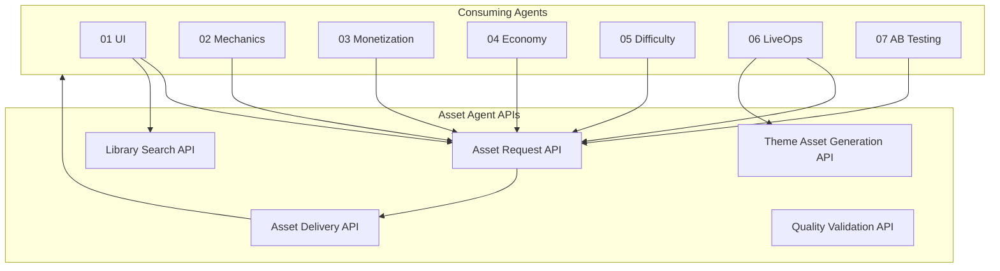
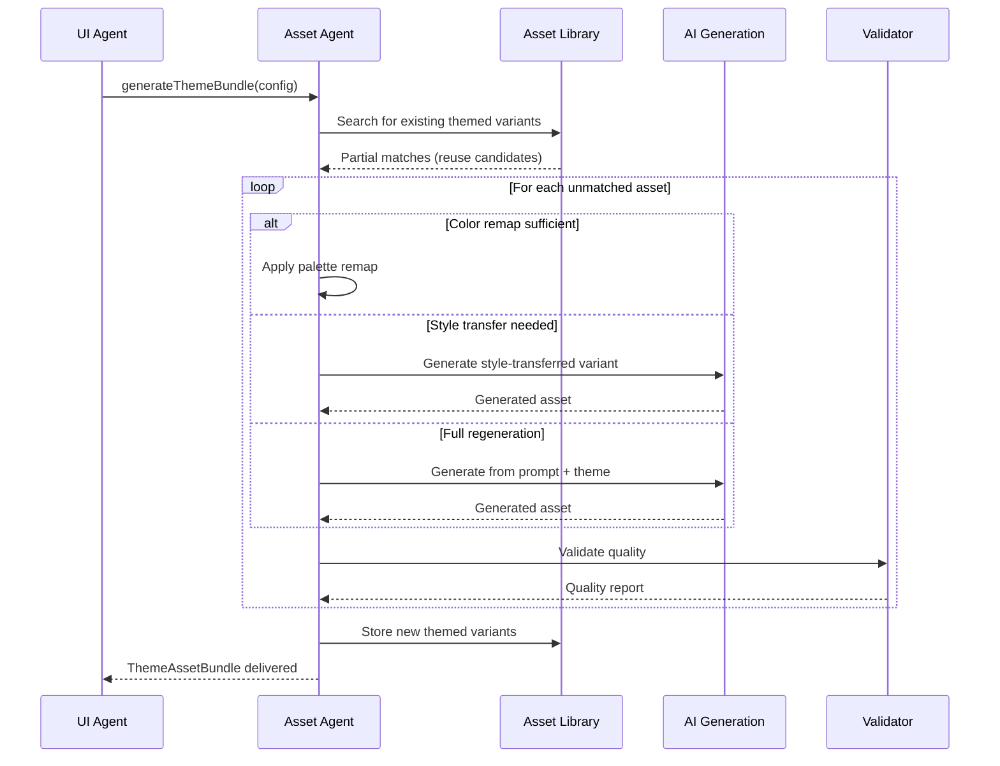

# Assets Vertical -- Interfaces

API contracts exposed by the Asset Agent for consumption by all other verticals. These interfaces define how agents request, receive, search for, validate, and theme assets.

> All interfaces reference the shared `AssetRef` and `AssetRequest` types defined in [SharedInterfaces](../00_SharedInterfaces.md).

---

## Interface Overview



---

## 1. Asset Request API

Submit a structured request for one or more assets. The Asset Agent processes requests asynchronously and delivers results via the Asset Delivery API.

```typescript
// Submit a single asset request
interface AssetRequestAPI {
  submit(request: AssetRequest): Promise<AssetRequestReceipt>;
  submitBatch(requests: AssetRequest[]): Promise<AssetBatchReceipt>;
  cancel(requestId: string): Promise<CancelResult>;
  getStatus(requestId: string): Promise<AssetRequestStatus>;
}

// Receipt returned immediately on submission
interface AssetRequestReceipt {
  requestId: string;
  estimatedDeliveryMs: number;        // Estimated time to fulfillment
  sourcingChannel: 'library' | 'ai_generated' | 'purchased' | 'commissioned' | 'pending';
  priority: AssetRequest['priority'];
}

interface AssetBatchReceipt {
  batchId: string;
  receipts: AssetRequestReceipt[];
  totalEstimatedMs: number;
}

interface AssetRequestStatus {
  requestId: string;
  state: 'queued' | 'sourcing' | 'validating' | 'delivered' | 'failed' | 'cancelled';
  progress: number;                   // 0.0 - 1.0
  sourcingChannel?: string;
  deliveredAsset?: AssetRef;
  failureReason?: string;
  updatedAt: ISO8601;
}

type CancelResult =
  | { success: true }
  | { success: false; reason: 'already_delivered' | 'already_cancelled' | 'not_found' };
```

### Request Priority Handling

| Priority | Target Delivery | Channel Preference |
|----------|----------------|--------------------|
| `critical` | < 2 minutes | Library lookup only; AI generation if not found |
| `high` | < 30 minutes | Library, then AI generation |
| `medium` | < 4 hours | Library, AI, or marketplace |
| `low` | < 48 hours | Any channel including commission |

### Usage Example

```typescript
// UI Agent requests a menu background
const receipt = await assetRequestAPI.submit({
  requestId: 'req_menu_bg_001',
  requestedBy: 'ui_agent',
  type: 'texture',
  description: 'Main menu background, fantasy forest theme, soft lighting, 16:9 aspect ratio',
  constraints: {
    maxResolution: { width: 1920, height: 1080 },
    maxFileSizeKB: 512,
    format: ['png', 'webp'],
  },
  priority: 'high',
});
```

---

## 2. Asset Delivery API

Retrieve delivered assets, download binaries, and manage client-side caching. Consuming agents use this API after receiving a delivery notification.

```typescript
interface AssetDeliveryAPI {
  getManifest(gameId: string): Promise<AssetManifest>;
  getAsset(assetId: string): Promise<AssetDeliveryResult>;
  downloadAsset(assetId: string, options?: DownloadOptions): Promise<AssetBinary>;
  getDeliveryStatus(gameId: string): Promise<ManifestDeliveryStatus>;
  prefetch(assetIds: string[]): Promise<PrefetchResult>;
}

interface AssetDeliveryResult {
  asset: AssetRef;
  metadata: AssetMetadata;
  downloadUrl: string;                // CDN URL, time-limited
  downloadSizeBytes: number;
  cachedLocally: boolean;
}

interface DownloadOptions {
  quality: 'full' | 'reduced';       // Reduced = minimum-tier variant
  format?: string;                    // Override format if multiple available
  cachePolicy: 'force_cache' | 'cache_first' | 'network_first' | 'no_cache';
}

interface AssetBinary {
  assetId: string;
  data: ArrayBuffer;
  format: string;
  sizeBytes: number;
  checksum: string;                   // SHA-256 for integrity verification
}

interface ManifestDeliveryStatus {
  gameId: string;
  totalAssets: number;
  deliveredAssets: number;
  pendingAssets: number;
  failedAssets: number;
  completionPercent: number;
  estimatedRemainingMs: number;
}

interface PrefetchResult {
  requested: number;
  alreadyCached: number;
  downloading: number;
  failed: string[];                   // Asset IDs that failed to prefetch
}
```

### Delivery Events

```typescript
// Events published by the Asset Delivery system
interface AssetDeliveryEvents {
  onAssetDelivered: GameEvent<{
    requestId: string;
    asset: AssetRef;
    metadata: AssetMetadata;
  }>;
  onAssetFailed: GameEvent<{
    requestId: string;
    reason: string;
    fallbackAsset?: AssetRef;
  }>;
  onManifestComplete: GameEvent<{
    gameId: string;
    manifest: AssetManifest;
  }>;
  onDownloadProgress: GameEvent<{
    assetId: string;
    bytesDownloaded: number;
    totalBytes: number;
  }>;
}
```

---

## 3. Asset Library Search API

Find existing assets in the shared collateral library before requesting new ones. All agents should search the library first to maximize reuse.

```typescript
interface AssetLibrarySearchAPI {
  search(query: AssetSearchQuery): Promise<AssetSearchResult>;
  getById(assetId: string): Promise<AssetLibraryEntry | null>;
  getSimilar(assetId: string, limit?: number): Promise<AssetLibraryEntry[]>;
  getTags(): Promise<TagHierarchy>;
  getRecentlyAdded(limit?: number): Promise<AssetLibraryEntry[]>;
  getMostUsed(type?: AssetRef['type'], limit?: number): Promise<AssetLibraryEntry[]>;
}

interface AssetSearchQuery {
  // Text search
  text?: string;                      // Natural language description
  tags?: string[];                    // Must match ALL tags (AND)
  tagsAny?: string[];                 // Must match ANY tag (OR)
  excludeTags?: string[];             // Must NOT match these tags

  // Type filters
  type?: AssetRef['type'];            // sprite, texture, mesh, animation, audio, font
  subType?: string;                   // e.g., 'icon', 'background', 'sfx', 'music'

  // Style filters
  style?: string[];                   // 'cartoon', 'realistic', 'pixel', 'low_poly'
  colorPalette?: string[];            // Hex colors -- find assets matching palette

  // Constraint filters
  maxResolution?: { width: number; height: number };
  maxFileSizeKB?: number;
  formats?: string[];

  // License filters
  licenseType?: ('royalty_free' | 'per_project' | 'subscription' | 'exclusive')[];
  commercialUse?: boolean;

  // Pagination
  offset?: number;
  limit?: number;                     // Default 20, max 100
  sortBy?: 'relevance' | 'usage_count' | 'created_at' | 'file_size';
  sortOrder?: 'asc' | 'desc';
}

interface AssetSearchResult {
  results: AssetLibraryEntry[];
  totalCount: number;
  offset: number;
  limit: number;
  searchTimeMs: number;
}

interface TagHierarchy {
  categories: TagCategory[];
}

interface TagCategory {
  name: string;                       // 'character', 'environment', 'ui', 'audio'
  tags: string[];
  subcategories?: TagCategory[];
}
```

### Search Example

```typescript
// LiveOps Agent searches for reusable holiday-themed assets
const results = await assetLibrarySearchAPI.search({
  text: 'winter holiday snowflake',
  type: 'sprite',
  style: ['cartoon'],
  tags: ['seasonal', 'winter'],
  maxFileSizeKB: 256,
  licenseType: ['royalty_free'],
  sortBy: 'usage_count',
  sortOrder: 'desc',
  limit: 10,
});
```

---

## 4. Asset Quality Validation API

Validate assets against performance budgets, format requirements, and style guidelines. Used internally by the Asset Agent and available to other agents for pre-flight checks.

```typescript
interface AssetQualityValidationAPI {
  validate(asset: AssetValidationInput): Promise<AssetQualityReport>;
  validateBatch(assets: AssetValidationInput[]): Promise<AssetQualityReport[]>;
  getValidationRules(type: AssetRef['type']): Promise<ValidationRuleSet>;
  checkBudgetImpact(
    currentManifest: AssetManifest,
    newAsset: AssetMetadata
  ): Promise<BudgetImpactReport>;
}

interface AssetValidationInput {
  assetId: string;
  type: AssetRef['type'];
  data: ArrayBuffer;                  // Raw asset binary
  metadata: Partial<AssetMetadata>;
  targetConstraints?: AssetRequest['constraints'];
}

interface ValidationRuleSet {
  type: AssetRef['type'];
  rules: ValidationRule[];
}

interface ValidationRule {
  ruleId: string;
  description: string;
  severity: 'error' | 'warning' | 'info';
  check: string;                      // Human-readable check description
  threshold?: number | string;
}

interface BudgetImpactReport {
  withinBudget: boolean;
  budgetCategory: string;             // 'texture', 'audio', 'mesh'
  currentUsageBytes: number;
  assetSizeBytes: number;
  projectedUsageBytes: number;
  budgetLimitBytes: number;
  percentUsed: number;
  recommendation?: string;            // e.g., 'Compress texture to WebP to save 40%'
}
```

### Validation Rule Summary

| Asset Type | Key Rules |
|-----------|-----------|
| `sprite` / `texture` | Max 2048x2048, PNG or WebP, < 512 KB per sprite, power-of-two dimensions preferred |
| `mesh` | Max 10K triangles (target tier), glTF 2.0, < 2 MB per model |
| `animation` | Max 60 fps, Spine or glTF, < 1 MB per clip |
| `audio` (SFX) | OGG or AAC, < 500 KB, sample rate 44.1 kHz or 22.05 kHz |
| `audio` (music) | OGG or AAC, streaming-ready, < 5 MB per track |
| `font` | TTF or OTF, < 200 KB, must include ASCII + extended Latin |

---

## 5. Theme Asset Generation API

Create themed variants of base assets to match a game's visual identity. Uses AI generation, color remapping, and style transfer to produce cohesive asset bundles.

```typescript
interface ThemeAssetGenerationAPI {
  generateThemeBundle(config: ThemeBundleConfig): Promise<ThemeBundleReceipt>;
  generateVariant(request: ThemeVariantRequest): Promise<AssetRef>;
  previewVariant(request: ThemeVariantRequest): Promise<PreviewResult>;
  getBundleStatus(bundleId: string): Promise<ThemeBundleStatus>;
  listAvailableBaseAssets(): Promise<BaseAssetCatalog>;
}

interface ThemeBundleConfig {
  gameId: string;
  theme: Theme;                       // From UI Agent ThemeSpec
  baseAssets: string[];               // Asset IDs to create variants of
  additionalRequests: AssetRequest[]; // New assets needed for this theme
  qualityTier: 'prototype' | 'production' | 'premium';
}

interface ThemeBundleReceipt {
  bundleId: string;
  estimatedDeliveryMs: number;
  assetCount: number;
  generationPlan: ThemeGenerationStep[];
}

interface ThemeGenerationStep {
  assetId: string;
  method: 'color_remap' | 'style_transfer' | 'ai_regenerate' | 'manual_edit';
  estimatedMs: number;
}

interface ThemeVariantRequest {
  baseAssetId: string;
  theme: Theme;
  method?: 'color_remap' | 'style_transfer' | 'ai_regenerate';
  outputConstraints?: AssetRequest['constraints'];
}

interface PreviewResult {
  previewUrl: string;                 // Temporary URL for low-res preview
  previewExpiresAt: ISO8601;
  estimatedFinalSizeKB: number;
}

interface ThemeBundleStatus {
  bundleId: string;
  state: 'generating' | 'validating' | 'complete' | 'partial_failure';
  totalAssets: number;
  completedAssets: number;
  failedAssets: AssetFailure[];
  deliveredBundle?: ThemeAssetBundle;
}

interface AssetFailure {
  assetId: string;
  reason: string;
  fallbackUsed: boolean;
  fallbackAssetId?: string;
}

interface BaseAssetCatalog {
  categories: {
    name: string;
    baseAssets: {
      assetId: string;
      description: string;
      supportedMethods: ThemeVariantRequest['method'][];
      previewUrl: string;
    }[];
  }[];
}
```

### Theme Bundle Workflow



---

## Error Handling

All API methods follow a consistent error pattern:

```typescript
interface AssetAPIError {
  code: AssetErrorCode;
  message: string;
  requestId?: string;
  retryable: boolean;
  retryAfterMs?: number;
}

type AssetErrorCode =
  | 'ASSET_NOT_FOUND'
  | 'BUDGET_EXCEEDED'
  | 'INVALID_FORMAT'
  | 'LICENSE_VIOLATION'
  | 'GENERATION_FAILED'
  | 'VALIDATION_FAILED'
  | 'DOWNLOAD_FAILED'
  | 'RATE_LIMITED'
  | 'SERVICE_UNAVAILABLE'
  | 'REQUEST_CANCELLED';
```

| Error Code | Retryable | Recommended Action |
|-----------|-----------|-------------------|
| `ASSET_NOT_FOUND` | No | Check asset ID, search library |
| `BUDGET_EXCEEDED` | No | Reduce asset size, compress, or remove other assets |
| `INVALID_FORMAT` | No | Re-request with supported format |
| `LICENSE_VIOLATION` | No | Choose differently-licensed asset |
| `GENERATION_FAILED` | Yes | Retry with modified prompt |
| `VALIDATION_FAILED` | No | Fix asset and re-submit |
| `DOWNLOAD_FAILED` | Yes | Retry download |
| `RATE_LIMITED` | Yes | Wait `retryAfterMs` then retry |
| `SERVICE_UNAVAILABLE` | Yes | Retry with exponential backoff |
| `REQUEST_CANCELLED` | No | Re-submit if still needed |

---

## Related Documents

- [SharedInterfaces](../00_SharedInterfaces.md) -- AssetRef, AssetRequest, Theme types
- [Spec](./Spec.md) -- Vertical scope and constraints
- [DataModels](./DataModels.md) -- Full schema definitions for all data types
- [AssetLibrary](./AssetLibrary.md) -- Library search and reuse patterns
- [SourcingStrategy](./SourcingStrategy.md) -- Channel selection informing delivery estimates
- [PerformanceBudgets](../../Architecture/PerformanceBudgets.md) -- Size and memory constraints
