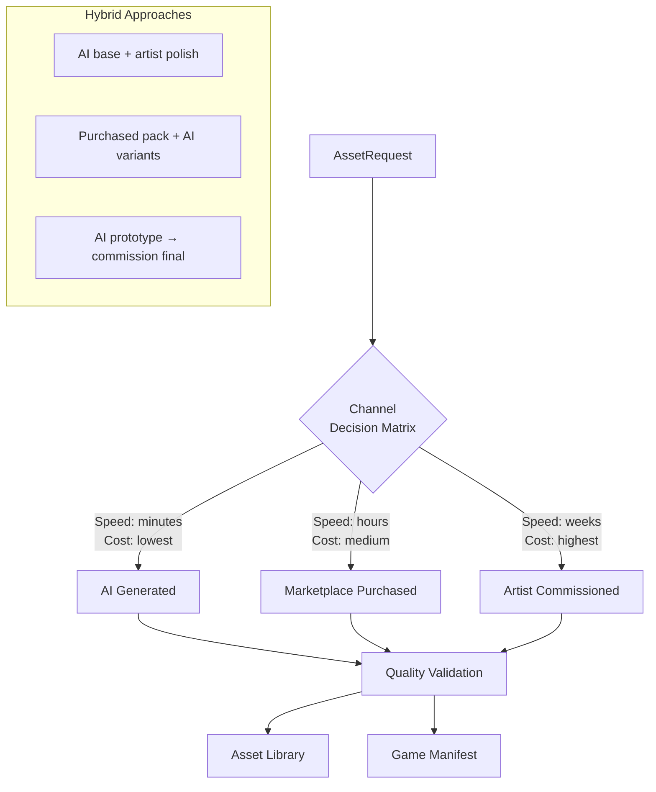
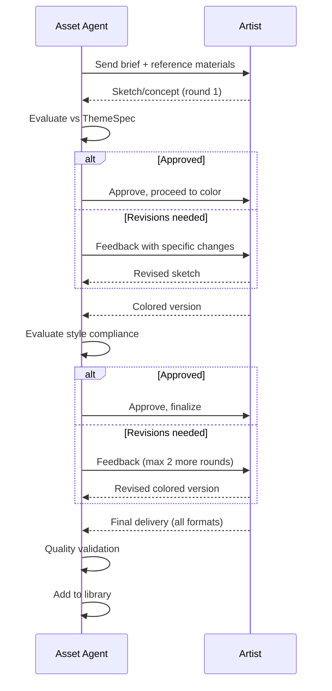
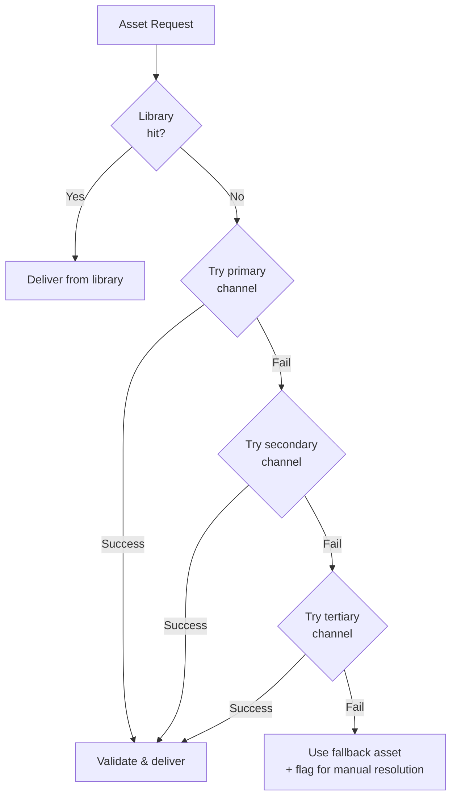

# Assets Vertical -- Sourcing Strategy

Detailed breakdown of the three asset sourcing channels: AI-generated, purchased from marketplaces, and commissioned from artists. This document defines when to use each channel, expected cost and speed, quality expectations, and the decision matrix for channel selection.

---

## Channel Overview



---

## Channel 1: AI-Generated

Assets created by prompt-driven generative AI services. Best for rapid iteration, prototyping, and production-quality assets where style consistency can be controlled via prompt engineering.

### Tools and Providers

| Provider | Type | Best For | Quality Level | Cost per Asset |
|----------|------|----------|---------------|---------------|
| DALL-E 3 | Image | Icons, UI elements, concept art | High | $0.04 - $0.12 |
| Stable Diffusion XL | Image | Backgrounds, textures, sprites | High | $0.01 - $0.05 |
| Midjourney | Image | Stylized art, character concepts | Very High | $0.05 - $0.10 |
| Suno | Audio | Background music, ambient tracks | Medium-High | $0.05 - $0.20 |
| ElevenLabs | Audio | UI sounds, vocal effects | High | $0.01 - $0.10 |
| Stable Audio | Audio | SFX, short clips | Medium | $0.02 - $0.08 |

### When to Use

| Use Case | Suitability | Notes |
|----------|-------------|-------|
| Prototyping and mockups | Excellent | Fastest path to visual feedback |
| Background art and textures | Good | Consistent quality for non-hero assets |
| UI icons and elements | Good | Works well with clear prompts |
| Particle effects and small sprites | Good | Simple shapes render reliably |
| SFX and UI sounds | Good | Short clips generate well |
| Background music | Fair | Acceptable for casual games |
| Hero character art | Fair | May need artist polish for consistency |
| 3D models | Poor | Current AI 3D is not production-ready |
| Animation sequences | Poor | Frame-to-frame consistency is weak |
| Voice acting | Fair | Acceptable for minor characters |

### Quality Expectations

| Metric | Expectation |
|--------|-------------|
| First-attempt success rate | 60-75% (may need prompt refinement) |
| Average attempts to acceptable output | 1.5 - 3 |
| Style consistency across batch | Variable -- requires seed locking and prompt templates |
| Artifact frequency | 5-15% of outputs have visible artifacts |
| Resolution | Up to 2048x2048 (most providers) |

### Limitations

- **Style drift**: Multiple generation calls produce subtly different styles. Mitigate with seed pinning, reference images, and LoRA/fine-tuned models.
- **Artifacts**: Hands, text, fine details often have errors. AI-generated assets should avoid text-heavy content.
- **Licensing ambiguity**: Some AI providers have evolving TOS regarding commercial use. Only use providers with clear commercial licenses.
- **Reproducibility**: Identical prompts may produce different results across model versions. Pin model versions for production.
- **Content safety**: AI models may occasionally generate inappropriate content. All AI outputs pass through a content safety filter before entering the library.

### Cost Model

| Volume | Cost Range | Example |
|--------|-----------|---------|
| 1-10 assets | $0.01 - $0.12 each | Single icon generation |
| 10-50 assets (batch) | $0.50 - $5.00 total | UI icon set |
| 50-200 assets (full game prototype) | $5.00 - $25.00 total | Complete prototype art |
| Production art set | $10.00 - $50.00 total | Final game assets (non-hero) |

### Speed

| Phase | Duration |
|-------|----------|
| Prompt engineering | 5-15 minutes (amortized across batch) |
| Generation per asset | 10-60 seconds |
| Validation and retry | 1-5 minutes per asset |
| Total for batch of 50 | 30-90 minutes |

---

## Channel 2: Marketplace Purchased

Pre-made asset packs from established marketplaces. Best for production-ready 3D models, animations, audio packs, and consistent art sets.

### Marketplaces

| Marketplace | Speciality | Price Range | License Model |
|-------------|-----------|-------------|---------------|
| Unity Asset Store | 3D models, animations, VFX, tools | $5 - $200 per pack | Per-seat, royalty-free |
| itch.io | 2D sprites, pixel art, indie packs | $0 - $50 per pack | Varies (check each) |
| Synty Studios | Low-poly 3D model packs | $20 - $80 per pack | Royalty-free |
| Kenney.nl | 2D/3D game assets | Free - $10 | CC0 / Public Domain |
| Artlist | Music, SFX | $10 - $25/month subscription | Subscription, royalty-free |
| Epidemic Sound | Music, SFX | $15 - $50/month subscription | Subscription, royalty-free |
| Freesound | SFX, ambient audio | Free | CC licenses (check each) |
| Google Fonts | Typography | Free | Open Font License |
| Adobe Fonts | Typography | $10 - $55/month subscription | Subscription |
| Mixamo | Character animations | Free with Adobe account | Royalty-free |

### When to Use

| Use Case | Suitability | Notes |
|----------|-------------|-------|
| 3D character models | Excellent | Consistent quality, rigged, animated |
| 3D environment props | Excellent | Large packs with matching styles |
| Animation packs (walk, run, idle) | Excellent | Motion capture quality |
| Music tracks and packs | Good | Professional production quality |
| SFX libraries | Good | Comprehensive, well-organized |
| 2D sprite sheets | Good | Consistent style within pack |
| UI kits | Good | Themed sets with all standard elements |
| Fonts | Excellent | Extensive selection, clear licensing |
| Hero character art | Fair | May not match unique game vision |
| Unique/custom assets | Poor | Generic by nature |

### Quality Expectations

| Metric | Expectation |
|--------|-------------|
| Production-ready rate | 85-95% (may need minor adjustments) |
| Style consistency within pack | High (single artist/studio per pack) |
| Cross-pack style consistency | Low -- requires careful curation |
| Format compliance | Usually good; occasional conversion needed |
| Performance optimization | Variable -- check polygon counts and texture sizes |

### Licensing Deep Dive

| License Type | Permissions | Restrictions | Common Sources |
|-------------|------------|--------------|----------------|
| **Royalty-free** | Use in unlimited projects, modify freely | Cannot resell the asset itself | Unity Store, Synty |
| **Per-project** | Use in one project only | Cannot share across games | Some premium packs |
| **Subscription** | Use while subscribed | Assets may not be usable after cancellation | Artlist, Epidemic Sound |
| **CC0 / Public Domain** | No restrictions | None | Kenney, some Freesound |
| **CC-BY** | Use freely | Must credit the creator | Many Freesound entries |
| **CC-BY-NC** | Non-commercial only | **Cannot use in commercial games** | Avoid for production |

**Critical rule**: The Asset Agent must verify that every purchased asset has a license permitting commercial use in mobile games before adding it to the library. CC-BY-NC assets are flagged and rejected automatically.

### Cost Model

| Asset Type | Typical Pack Cost | Assets per Pack | Cost per Asset |
|-----------|------------------|----------------|---------------|
| 3D model pack | $20 - $80 | 20 - 100 models | $0.50 - $4.00 |
| Animation pack | $15 - $60 | 10 - 50 clips | $1.00 - $6.00 |
| 2D sprite sheet | $5 - $30 | 50 - 500 sprites | $0.01 - $0.60 |
| Music pack | $10 - $50 | 5 - 20 tracks | $0.50 - $10.00 |
| SFX library | $10 - $40 | 50 - 500 sounds | $0.02 - $0.80 |
| UI kit | $10 - $40 | 30 - 100 elements | $0.10 - $1.30 |
| Font | $0 - $25 | 1 font family | $0 - $25 |

### Speed

| Phase | Duration |
|-------|----------|
| Search and evaluation | 30 minutes - 2 hours |
| Purchase and download | 5 - 30 minutes |
| Format conversion and validation | 15 - 60 minutes |
| Integration testing | 30 minutes - 2 hours |
| Total for a pack | 1 - 4 hours |

---

## Channel 3: Artist-Commissioned

Custom artwork created by freelance artists or studios. Best for hero visuals, unique characters, key art, and assets that define the game's identity.

### When to Use

| Use Case | Suitability | Notes |
|----------|-------------|-------|
| Hero character art | Excellent | Unique, ownable, high impact |
| Key visuals (app icon, store art) | Excellent | Critical for conversion |
| Unique character designs | Excellent | Cannot get from other channels |
| Splash screens and loading art | Good | Sets first impression |
| Custom music themes | Good | Memorable, unique to game |
| Style guide and reference sheets | Excellent | Guides all other asset production |
| Bulk background art | Poor | Too expensive for volume |
| UI icons | Poor | Overkill for small elements |
| SFX | Fair | Usually better from libraries |

### Cost Ranges

| Asset Type | Price Range | Factors Affecting Cost |
|-----------|------------|----------------------|
| Character concept sheet | $100 - $500 | Complexity, artist tier |
| Character full illustration | $200 - $2,000 | Detail level, background, effects |
| App icon | $50 - $500 | Iterations, style complexity |
| Store screenshots (set of 5) | $200 - $1,000 | Custom vs template |
| Background illustration | $100 - $800 | Complexity, resolution |
| Animation (per character, set of states) | $500 - $3,000 | Frame count, style |
| Original music track (2-4 min) | $200 - $2,000 | Production quality, instruments |
| Style guide document | $300 - $2,000 | Depth, examples, variations |
| Full game art direction package | $2,000 - $5,000 | All of the above |

### Speed

| Phase | Duration |
|-------|----------|
| Brief preparation | 1 - 3 days |
| Artist search and selection | 2 - 5 days |
| Initial sketches / concepts | 3 - 7 days |
| Revision rounds (2-3 rounds typical) | 5 - 14 days |
| Final delivery and format prep | 1 - 3 days |
| **Total typical timeline** | **2 - 4 weeks** |

### Brief Format

A commission brief sent to artists must include:

```
1. OVERVIEW
   - Game name and genre
   - Target audience (age, platform)
   - Art style reference (mood board, reference images)

2. ASSET SPECIFICATION
   - What to create (character, scene, icon, etc.)
   - Dimensions and resolution
   - File format required
   - Color mode (RGB for digital)

3. STYLE DIRECTION
   - Reference images (3-5 examples)
   - Color palette (hex values from ThemeSpec)
   - Mood and tone keywords
   - What to avoid

4. TECHNICAL REQUIREMENTS
   - Maximum file size
   - Layer structure (if PSD/AI needed)
   - Transparency requirements
   - Animation-ready requirements (if applicable)

5. DELIVERABLES AND TIMELINE
   - Milestone schedule (sketch → color → final)
   - Number of revision rounds included
   - Final file formats
   - Deadline

6. LICENSING
   - License type (exclusive / work-for-hire)
   - Usage scope (mobile games, all platforms)
   - Attribution requirements (if any)
```

### Revision Process



---

## Decision Matrix

The Asset Agent uses this matrix to select the optimal sourcing channel for each request.

### Primary Selection Criteria

| Factor | AI Generated | Purchased | Commissioned |
|--------|-------------|-----------|--------------|
| **Speed** | Minutes | Hours | Weeks |
| **Cost** | $0.01 - $0.50 | $0.10 - $10.00 | $50 - $5,000 |
| **Uniqueness** | Low-Medium | Low | High |
| **Consistency** | Variable | High (within pack) | High (single artist) |
| **Quality ceiling** | Medium-High | High | Very High |
| **Scalability** | Excellent | Good (limited by catalog) | Poor |
| **License clarity** | Provider-dependent | Generally clear | Fully controlled |

### Asset Type to Channel Mapping

| Asset Type | Primary Channel | Secondary Channel | Notes |
|-----------|----------------|-------------------|-------|
| UI icons | AI Generated | Purchased | AI handles variety well |
| UI backgrounds | AI Generated | Purchased | Good for unique feels |
| Menu buttons/panels | Purchased (UI kit) | AI Generated | Kits give consistency |
| Player character (hero) | Commissioned | -- | Must be unique |
| Player character (variants) | AI Generated | Purchased | Base from commission, variants from AI |
| NPC characters | Purchased | AI Generated | Packs have variety |
| Environment tiles | Purchased | AI Generated | Packs ensure tilability |
| Background scenes | AI Generated | Commissioned | AI for standard, commission for key art |
| Item/weapon sprites | AI Generated | Purchased | High volume, medium quality |
| Particle effects | Purchased | AI Generated | Tested performance |
| 3D models | Purchased | Commissioned | AI 3D not ready |
| Character animations | Purchased | Commissioned | Mocap quality from stores |
| UI animations | Purchased (Lottie/Spine) | AI Generated | Proven, performant |
| Music (main theme) | Commissioned | Purchased | Identity-defining |
| Music (background) | Purchased | AI Generated | Volume over uniqueness |
| SFX | Purchased | AI Generated | Libraries are comprehensive |
| Ambient audio | Purchased | AI Generated | Standard loops work |
| Fonts | Purchased (free/licensed) | -- | Established foundries |
| App icon | Commissioned | -- | Highest-impact asset |
| Store screenshots | Commissioned | AI Generated | Conversion-critical |

### Quality Tiers

```mermaid
graph LR
    subgraph Prototype["PROTOTYPE TIER"]
        P1["AI-generated assets"]
        P2["Free marketplace assets"]
        P3["Placeholder art"]
    end

    subgraph Production["PRODUCTION TIER"]
        PR1["Purchased asset packs"]
        PR2["AI-generated + polished"]
        PR3["Stock audio libraries"]
    end

    subgraph Premium["PREMIUM TIER"]
        PM1["Artist-commissioned hero art"]
        PM2["Custom music composition"]
        PM3["Professional voice acting"]
    end

    Prototype -->|"Upgrade path"| Production
    Production -->|"Upgrade path"| Premium
```



| Tier | Use Case | Cost per Game | Timeline |
|------|----------|--------------|----------|
| **Prototype** | Internal testing, concept validation | $5 - $50 | Hours |
| **Production** | Soft launch, standard release | $200 - $2,000 | Days to weeks |
| **Premium** | Featured release, high-value IP | $2,000 - $15,000 | Weeks to months |

---

## Hybrid Approaches

Combining channels produces better results than any single channel alone.

### AI Base + Artist Polish

1. Generate initial asset via AI (minutes, $0.05).
2. Send AI output to artist for cleanup and style refinement ($50 - $200, 2-5 days).
3. Result: unique, high-quality art at 30-50% of full commission cost.

**Best for**: Character portraits, key scene art, marketing materials.

### Purchased Pack + AI Variants

1. Purchase a cohesive asset pack ($20 - $80).
2. Use AI style transfer to create themed variants of each asset (minutes, $0.50 - $5.00).
3. Result: large, consistent, themed asset set at pack price + minimal AI cost.

**Best for**: Environment tiles, UI elements, NPC characters.

### AI Prototype to Commission Final

1. Generate prototype assets via AI to establish the visual direction (hours, $5 - $25).
2. Use AI prototypes as reference material in artist briefs.
3. Commission final versions from artist ($200 - $2,000, 2-4 weeks).
4. Result: faster artist alignment, fewer revision rounds, clearer communication.

**Best for**: Any commissioned work -- AI prototypes reduce brief ambiguity.

---

## Cost Comparison Summary

| Game Type | Prototype Cost | Production Cost | Premium Cost |
|-----------|---------------|----------------|-------------|
| Simple casual (match-3, runner) | $10 - $30 | $300 - $800 | $3,000 - $8,000 |
| Mid-core (strategy, RPG-lite) | $20 - $60 | $800 - $2,500 | $5,000 - $15,000 |
| Narrative-heavy (adventure) | $30 - $80 | $1,500 - $4,000 | $8,000 - $20,000 |

---

## Channel Failure and Fallback



| Failure Scenario | Fallback Order |
|-----------------|----------------|
| AI generation produces artifacts | Retry with new seed -> Purchased -> Commission |
| Marketplace pack unavailable | Alternative pack -> AI generation -> Commission |
| Artist misses deadline | Extend -> AI-generate placeholder -> Find alternative artist |
| Budget exhausted | Library reuse only -> AI (cheapest) -> Defer non-critical |

---

## Related Documents

- [Spec](./Spec.md) -- Vertical scope and constraints
- [Interfaces](./Interfaces.md) -- Request and delivery APIs
- [DataModels](./DataModels.md) -- AssetMetadata.sourceDetails schema
- [AgentResponsibilities](./AgentResponsibilities.md) -- Channel selection authority
- [AssetLibrary](./AssetLibrary.md) -- Library-first sourcing pattern
- [PerformanceBudgets](../../Architecture/PerformanceBudgets.md) -- Size constraints affecting channel choice
