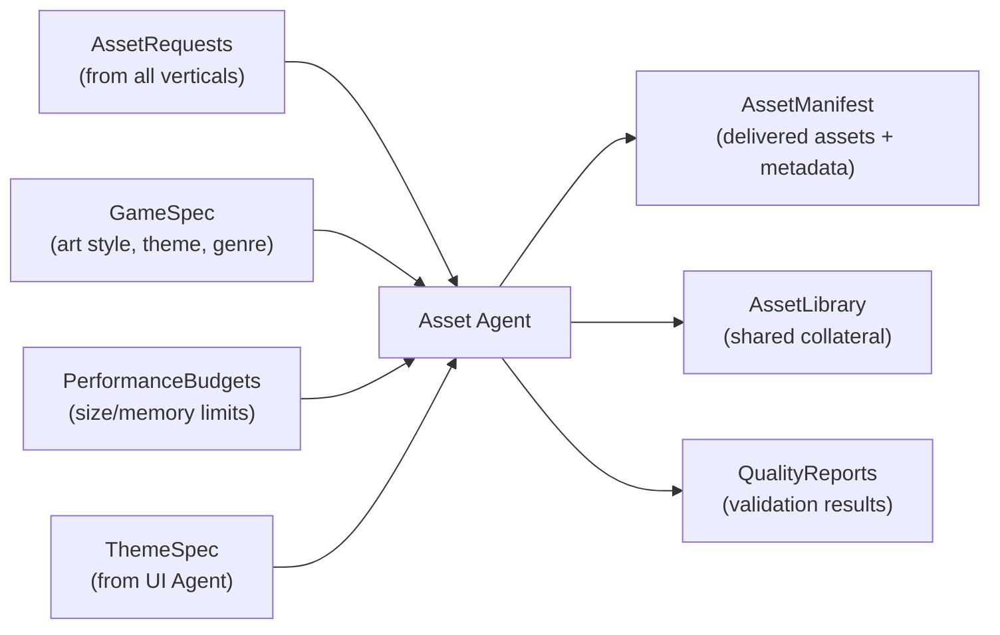
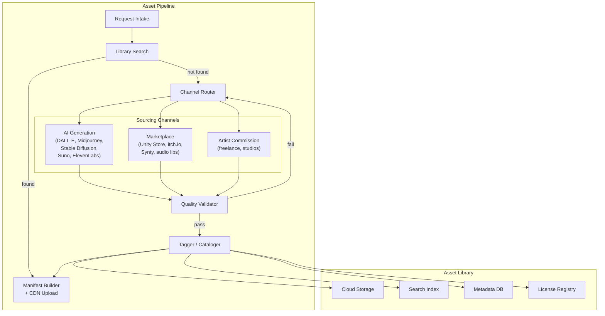
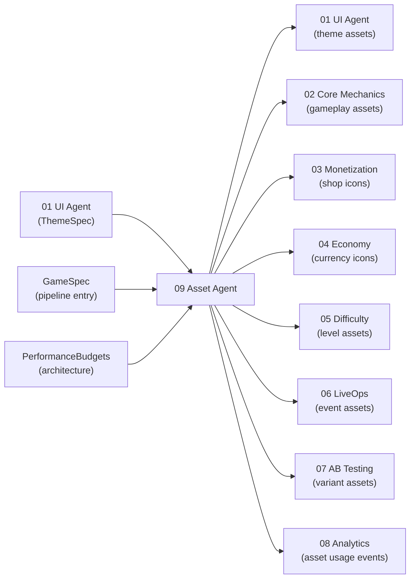

# Assets Vertical Specification

The Assets vertical owns **sourcing, managing, and delivering** all visual and audio assets across every game produced by the AI Game Engine. Assets arrive through three channels -- AI-generated, purchased from marketplaces, or commissioned from artists -- and enter a shared collateral library tagged for reuse.

---

## Purpose

Centralize asset acquisition and delivery so that every vertical receives correctly formatted, performance-compliant, and style-consistent art, audio, and animation without duplicating sourcing effort. By maintaining a shared library with aggressive reuse targets, we reduce per-game asset cost and production time while keeping visual and audio quality high.

---

## Scope

### In Scope

| Area | Description |
|------|-------------|
| **AI Generation** | Prompt-driven image, audio, and animation generation via external APIs |
| **Marketplace Purchasing** | Sourcing packs from Unity Asset Store, itch.io, Synty Studios, audio libraries |
| **Artist Commissioning** | Briefing, revision management, and delivery for freelance/studio work |
| **Asset Library** | Centralized storage, tagging, search, and reuse tracking |
| **Quality Validation** | Resolution, file size, format, and style compliance checks |
| **Delivery** | Packaging assets into manifests, CDN upload, cache management |
| **License Tracking** | Per-asset license type, usage rights, expiration monitoring |
| **Theme Variants** | Generating themed asset bundles from base assets |

### Out of Scope

| Area | Owner |
|------|-------|
| Theme definition (palette, typography) | UI Agent (01) |
| In-game rendering and draw calls | Core Mechanics Agent (02) |
| Ad creative assets | Monetization Agent (03) |
| Economy icon semantics (what currency looks like conceptually) | Economy Agent (04) |
| Level layout and scene composition | Difficulty Agent (05) |
| Event-specific UI layout | LiveOps Agent (06) |

---

## Inputs and Outputs

### Inputs

| Input | Source | Description |
|-------|--------|-------------|
| `AssetRequest` | All verticals | Structured request with type, description, constraints, priority |
| `GameSpec` | Pipeline entry | Genre, target audience, art style preference, theme brief |
| `PerformanceBudgets` | [PerformanceBudgets.md](../../Architecture/PerformanceBudgets.md) | Texture < 150 MB, audio < 50 MB, initial download < 100 MB |
| `ThemeSpec` | UI Agent (01) | Color palette, typography, icon style for visual consistency |

### Outputs

| Output | Consumer | Description |
|--------|----------|-------------|
| `AssetManifest` | All verticals | Complete manifest of delivered assets with paths, metadata, fallbacks |
| `AssetLibrary` updates | Future games | New assets tagged and stored for cross-game reuse |
| `QualityReport` | Pipeline orchestrator | Validation results per asset (pass/fail with reasons) |
| `ThemeAssetBundle` | UI Agent, Core Mechanics | Themed variant set ready for game integration |

---

## Architecture

---

## Sourcing Channel Selection

The Asset Agent selects a channel based on asset type, urgency, quality tier, and budget. See [SourcingStrategy.md](./SourcingStrategy.md) for the full decision matrix.

| Signal | AI Generated | Purchased | Commissioned |
|--------|-------------|-----------|--------------|
| **Speed needed** | Minutes | Hours | Weeks |
| **Quality tier** | Prototype / Production | Production | Premium |
| **Budget** | Low ($0.01-0.50/asset) | Medium ($5-200/pack) | High ($50-5000/piece) |
| **Best for** | Icons, backgrounds, UI textures, SFX | 3D models, animation packs, music | Hero art, key visuals, characters |

---

## Performance Budgets

All budgets reference the target device tier defined in [PerformanceBudgets.md](../../Architecture/PerformanceBudgets.md).

| Category | Budget | Enforcement |
|----------|--------|-------------|
| Texture memory | < 150 MB | Quality validator rejects oversized textures |
| Audio memory | < 50 MB | Audio compressed to OGG/AAC, streamed for music |
| Mesh/animation memory | < 50 MB | Polygon count limits per LOD tier |
| Initial download | < 100 MB | Critical assets only; rest via CDN on-demand |
| Post-install assets | < 200 MB | Background download, non-blocking |
| Total installed size | < 500 MB | Library pruning for unused assets |
| Individual texture | Max 2048x2048 (target), 1024x1024 (minimum tier) | Format-specific size caps |
| Individual audio clip (SFX) | < 500 KB compressed | Reject or re-compress on violation |
| Music track | < 5 MB compressed (streaming) | OGG/AAC, never loaded fully into memory |

---

## Constraints

1. **Budget compliance is non-negotiable.** No asset may cause the game to exceed the memory budgets in [PerformanceBudgets.md](../../Architecture/PerformanceBudgets.md). The quality validator blocks delivery of any oversized asset.
2. **License cleanliness.** Every delivered asset must have a tracked license permitting commercial use in mobile games. No asset with ambiguous or missing license data may enter the manifest.
3. **Style consistency.** All visual assets for a single game must align with the `ThemeSpec` from the UI Agent. The Asset Agent validates color palette adherence and style coherence before delivery.
4. **Library-first sourcing.** Before requesting new assets through any channel, the agent must search the existing library. Target reuse rate: > 60%.
5. **Fallback assets.** Every `AssetRef` must include a `fallback` pointing to a guaranteed-available default asset. Games must never show a missing-asset placeholder to players.
6. **Format standards.** Textures: PNG or WebP. Audio: OGG (Android), AAC (iOS), WAV for editor only. Meshes: glTF 2.0. Animations: Spine or glTF.
7. **Minimum tier support.** Every texture must ship with a half-resolution variant for minimum-tier devices. Audio quality tiers are not required (compression handles it).

---

## Success Criteria

| Criterion | Measurement |
|-----------|-------------|
| Asset reuse rate > 60% | `(library_hits / total_requests) * 100` per game |
| All assets within performance budgets | Zero budget violations in quality report |
| AI-generated assets delivered in < 5 minutes | Timestamp delta from request to manifest entry |
| Purchased assets delivered in < 4 hours | Timestamp delta including download and validation |
| Commissioned assets delivered within brief timeline | Contract milestone tracking |
| Style consistency score > 85% | Automated palette/style diff against ThemeSpec |
| Zero license violations | License audit pass rate = 100% |
| Fallback coverage = 100% | Every AssetRef has a valid fallback |
| Library growth rate positive | Net new assets per game > 0 |
| Manifest completeness = 100% | All AssetRequests resolved before game build |

---

## Dependencies

| Dependency | Direction | What Flows |
|-----------|-----------|------------|
| UI Agent (01) | Upstream to Assets | ThemeSpec for style consistency |
| UI Agent (01) | Assets to downstream | Theme assets (icons, backgrounds, fonts) |
| Core Mechanics (02) | Assets to downstream | Sprites, meshes, animations, SFX |
| Monetization (03) | Assets to downstream | Shop item icons, offer banners |
| Economy (04) | Assets to downstream | Currency icons, reward celebration art |
| Difficulty (05) | Assets to downstream | Level environment art, obstacle sprites |
| LiveOps (06) | Assets to downstream | Event-themed asset bundles |
| AB Testing (07) | Assets to downstream | Variant assets for visual experiments |
| Analytics (08) | Assets to downstream | Asset usage tracking events |
| External APIs | Upstream to Assets | AI-generated content (images, audio) |
| Marketplaces | Upstream to Assets | Purchased asset packs |
| Artists | Upstream to Assets | Commissioned artwork and audio |

---

## Related Documents

- [SharedInterfaces](../00_SharedInterfaces.md) -- AssetRef and AssetRequest contracts
- [Interfaces](./Interfaces.md) -- Asset API for other verticals
- [DataModels](./DataModels.md) -- AssetManifest, AssetMetadata, library schemas
- [AgentResponsibilities](./AgentResponsibilities.md) -- What the Asset Agent decides vs coordinates
- [SourcingStrategy](./SourcingStrategy.md) -- Channel selection, cost, and quality tiers
- [AssetLibrary](./AssetLibrary.md) -- Library organization, tagging, and reuse
- [PerformanceBudgets](../../Architecture/PerformanceBudgets.md) -- Device tiers and memory budgets
- [SystemOverview](../../Architecture/SystemOverview.md) -- Full system architecture
- [UI Spec](../01_UI/Spec.md) -- Theme definition that Assets must follow
